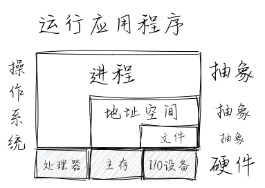

<!-- theme: gaia -->
<!-- _class: lead -->

## Lecture 1 Operating System Overview
### Section 2 What is an Operating System

 
 

Xiang Yong Chen Yu Li Guoliang

 
 

Fall 2022

---

## The Definition of OS 

There is no accepted precise definition

   The operating system is a kind of system **software** that **manages hardware resources**, controls the operation of programs, improves the man-machine interface, and **provides support for application software**
 
<!--bg right 100%--> 

An operating system that connects the past and the future

---

## The operating system is a control program
- A system software
- Execute the program, **provide services to the program**
- Control program execution process, **prevent errors**
- **User-friendly** computer system

---

## The operating system is a resource management program
- **Middle layer** between application and hardware
- **Manage** various hardware and software resources
- **Service** for accessing hardware and software resources
- **Resolve Access Violations** to ensure fair usage

---

## Software classification in the operating system

- Shell - command line interface
- GUI – Graphical User Interface
- Kernel – the internals of the operating system

---
## uCore/rCore teaching operating system kernel

---
## Abstraction of operating system kernel

---
## Abstraction of operating system kernel

---
## Characteristics of the operating system kernel

- **Concurrency**: There are multiple running programs in the computer system at the same time
- **Sharing**: "Simultaneous" access to mutual exclusion between programs to share various resources
- **Virtual**: Each program "owns" an entire computer
- **Asynchronous**: The completion time of the service is uncertain and may fail

---
## Your understanding of the operating system kernel

### User/application requirements for the operating system?

---
## Your understanding of the operating system kernel

### User/application requirements for the operating system?
- Efficient -- Easy to use
- Powerful operating system services -- Simple interface ?
- Flexibility - Security ?

---
## Why study this course

- Can understand how the software and hardware behind the computer case work
- Can learn software and hardware infrastructure
- Can find and fix difficult bugs

<!-- 如果你花费大量时间来开发，维护并调试应用程序，你最终还是要知道大量操作系统的知识 -->