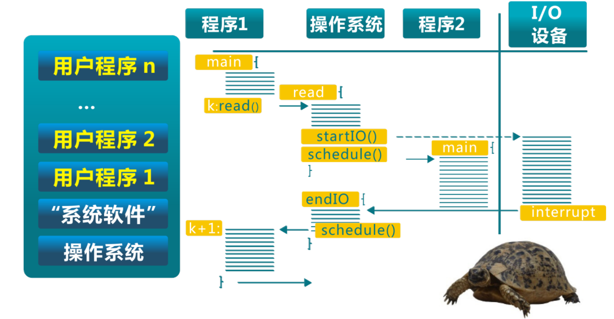
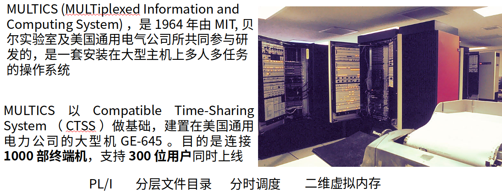

<!-- theme: gaia -->
<!-- page_number: true -->
<!-- _class: lead -->

## Lecture 1 Operating System Overview

### Section 3 Historical evolution of the operating system

 
 

Xiang Yong Chen Yu Li Guoliang

 
 

Fall 2022

---

## Single User System

Single User Systems (1945-1955)

- **Manual** wire/tape transfer for program entry
- The machine cost is much greater than the labor **cost**
- **OS = loader + libraries**
- Problem: **Low utilization** of expensive components

---

## Batch processing system

Batch systems (1955-1965)

- **TAPE/DISK TRANSFER** for program input
- Machine cost is greater than labor cost
- Operating System = Loader + **Program Controller + Output Processor**
- Problem: Increased utilization compared to before

---

## Batch processing system

**Batch Processing** Systems (1955-1965)

- Tape/disk transfer for program input
- Machine cost is greater than labor cost
- Operating system = loader + program controller + output processor
- Problem: Increased utilization compared to before

---

## Multiprogramming system

**Multi-channel** programming system (1955-1980)

- multiple programs reside in **memory**
- Multiple programs take turns using **CPU**
- OS = loader + **program scheduling + memory management** + output management
- Evolution: Increased utilization compared to previous

---

## Time Sharing System

Time Sharing System (1970-present)
- Multiple programs reside in memory
- Multiple programs time-sharing use of the CPU
- Operating system = loader + program scheduling + memory management + **interrupt handling** +...
- Evolution: Compared with the previous utilization rate, the interaction delay with the outside world is shortened

---
## Multics OS

---
## Multics OS

---
## Open UNIX

---
## Linux family

---
## Personal computer

Personal computer (1981- )
- Single user
- **Computer costs drop** so that CPU utilization is no longer a top concern
- Focus on **User Interface and Multimedia Features**
- Operating system = loader + program scheduling + memory management + interrupt handling +...
- Evolution: **to the public**, old services and features don't exist, more and more security issues

---
## MacOS Family

---
## MacOS Family

---
## Windows family

---
## Distributed Systems

**Distributed** System (1990- )
- Distributed multi-user
- Distributed system utilization is a concern
- The focus is on network/storage/compute efficiency
- OS = distributed (loader + program/OS scheduling + memory management)
- Evolution: to the public, towards **Internet**, new challenges (unreliable/uncertain)

---
##Android OS
- Cross-platform: supports Java applications
- Runtime (runtime): Android virtual machine
- Application Framework: Simplifies application development

---
## AIoT operating system

AIoT system (2000- )
- Distributed **multi-device**
- Distributed system utilization/availability is a concern
- The focus is on network/storage/compute efficiency
- OS = distributed (program/OS scheduling + memory management + security/updates)
- Evolution: towards device, towards network, new challenges (unreliable/big data)

---
## Fuchsia OS

