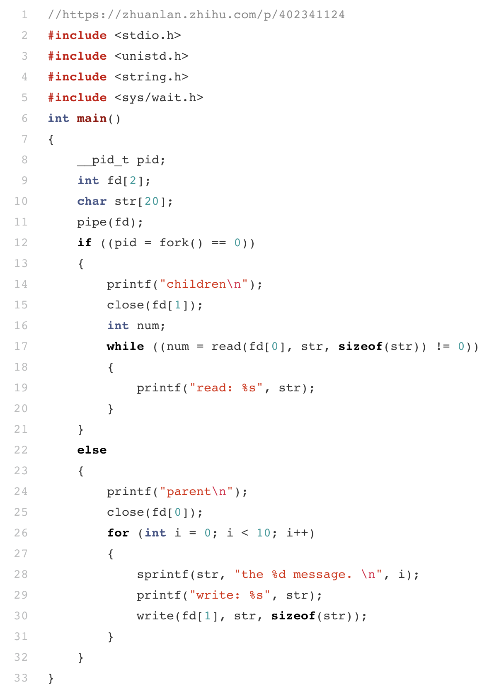
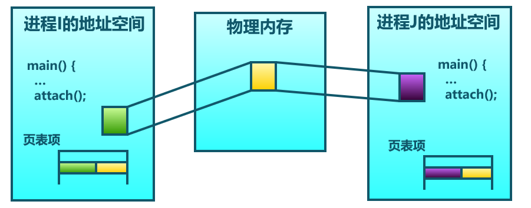
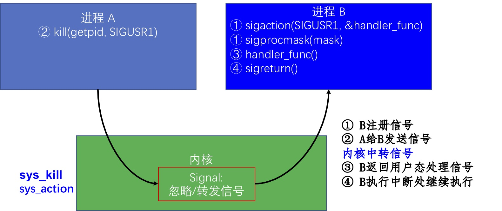
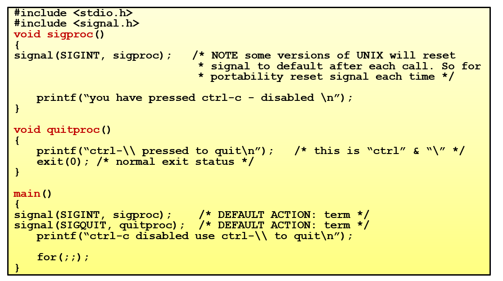

<!-- theme: gaia -->
<!-- _class: lead -->

# Lecture 10 Inter-process communication
Inter Process Communication, IPC
## Section 1 Overview of Inter-Process Communication (IPC)


<br>
<br>

Xiang Yong Chen Yu Li Guoliang

Fall 2022

---

**Outline**

### 1. Overview of interprocess communication
2. Pipeline
3. Message Queue
4. Shared memory
5. Signal

---
<style scoped>
{
  font-size: 28px
}
</style>
#### Requirements for interprocess communication

- Challenge: limited functionality of a single program
- The goal of IPC: multi-process collaboration to complete complex application requirements
   - Functional modularity
   - Programs can be relatively isolated
   - Cooperation of multiple programs to accomplish complex things

**Definition of inter-process communication**: the behavior of **interaction** between processes through data exchange (shared or passed)


---
<style scoped>
{
  font-size: 30px
}
</style>
#### Interaction between processes

- Independent process: no interaction with other processes
- Cooperative processes: there is interaction between two or more processes
    - Sender Receiver / Client Server

```
❯ cat README.md | grep rcore
$ git clone https://github.com/rcore-os/rCore-Tutorial-v3.git
...
* [x] expand the fs image size generated by `rcore-fs-fuse` to 128MiB
```
- `grep` depends on `cat`
   - The output produced by `cat` such as `grep` is used as its input to match strings

---

#### Process communication method

- **Direct communication**: Two processes can transfer information to each other without going through the kernel transfer
- **Indirect communication**: Two processes pass messages to each other through system calls and kernel transfers


---
<style scoped>
{
  font-size: 28px
}
table {
  font-size: 20px;
}

</style>
#### IPC mechanism
The ability to share or transfer data between processes is considered inter-process communication.

| IPC mechanism | Meaning | Communication method |
| ------------------------ | ---- |---- |
| Pipe (Pipe) | One-way transmission of byte streams | Indirect communication |
| Message Queue (Message Queue) | Receive/send messages through the queue | Indirect communication |
| Signal (Signal) | Send a signal to the process asynchronously | Indirect communication |
| Socket (Socket) | Multi/single machine inter-process network communication | Indirect communication |
| Shared Memory | Multiple processes share a piece of physical memory | Direct communication |
| File (File) | Multiple processes can access the same file | Indirect communication |

---
#### Typical IPC mechanism of UNIX

The ability to share or transfer data between processes is inter-process communication.


---

#### Basic interface for message passing
- Send a message
- Receive (recv) messages
- Remote Procedure Call (RPC)
- Reply message

Remote Procedure Call, RPC = send + recv


---
#### Blocking or non-blocking communication

- Blocking communication:
   - Block send, block receive
- Non-blocking communication
   - Non-blocking send, non-blocking receive


---
#### IPC buffer mode

- **UNLIMITED CAPACITY**: The sender does not need to wait
- **Limited Capacity**: When the communication link buffer queue is full, the sender must wait
- **0 capacity**: sender has to wait for receiver


---

**Outline**

1. Overview of interprocess communication
### 2. Pipeline (pipe)
3. Message Queue
4. Shared memory
5. Signal

---

#### Pipe

A pipe is an inter-process communication mechanism, also known as an anonymous pipe.

- A **Byte Queue** of a certain size with read and write ends
- **Reader** can only be used to read from the pipe
- **Write port** can only be used to write data to the pipe
- The read/write end is represented by a **different file descriptor**


---
#### Create pipeline

`int pipe(int pipefd[2])`
- A pipe can be represented as two file descriptors plus a piece of memory in kernel space
- When creating a pipe, two file descriptors are returned
   - Read pipe
   - Write pipe


---
#### Pipeline (pipe) application scenarios

- Support for relational interprocess communication
   - Parent and child processes, sibling processes, etc.
- The parent process creates the pipe (two file descriptors)
   - The child process will inherit the file descriptor and execute the read and write pipeline


---
<style scoped>
{
  font-size: 30px
}
</style>

#### Pipeline (pipe) application scenarios

- Usually the processes at both ends of the pipe will each close a file descriptor of the pipe, such as
   - The parent process closes the read descriptor and can only write data to the pipe**
   - The child process closes the write descriptor and can only read data from the pipe **.


---
#### Pipeline Implementation Mechanism


 
---
<style scoped>
{
  font-size: 30px
}
</style>

#### Pipe [example](https://gitee.com/chyyuu/os-usrapp-lab/blob/main/c/ipc/pipe/ex1.c)

```
$ gcc -o ex1 ex1.c
$ ./ex1
parents
write: the 0 message.
write: the 1 message.
...
children
read: the 0 message.
read: the 1 message.
...
```
Suggestion: Students can practice in their own development environment after class



---
#### Pipes in the Shell

Just connect the two commands with a vertical bar "**|**"

```
rCore-Tutorial-v3 on ch7
❯ cat README.md | grep rcore
$ git clone https://github.com/rcore-os/rCore-Tutorial-v3.git
...
* [x] expand the fs image size generated by `rcore-fs-fuse` to 128MiB
```
- Very handy for writing flexible command-line scripts
- Does not support communication between any two processes

---
<style scoped>
{
  font-size: 28px
}
</style>

#### Named pipe
The mkfifo command can be used in the shell to create named pipes, also known as FIFOs.

Both anonymous pipes and named pipes are one-way communication mechanisms. The difference between the two is:
- Named pipes can support communication between any two processes
- Anonymous pipes only support communication between parent-child processes and sibling processes

Named pipes are blocking one-way communication pipes
- Either party can read and write
- Data will be written and read only when the named pipe is opened at both the read and write ends

---

#### Named Pipes

shell A
```
$ mkfifo name.fifo
$ echo README > name.fifo #The file type is p, and the write named pipe is blocked
```
shell B
```
$ cat name.fifo
```

But: byte stream form, does not support two-way communication between any two processes
Named Pipes [Example](https://www.cnblogs.com/52php/p/5840229.html)

---

**Outline**

1. Overview of interprocess communication
2. Pipeline
### 3. Message Queue
4. Shared memory
5. Signal

---
<style scoped>
{
  font-size: 30px
}
</style>

#### Message Queue
The message queue is an indirect communication mechanism maintained by the operating system with structural data as the basic unit
- Each message (Message) is a sequence of bytes with its own **type identifier**
- Messages with the same type of identification form a message queue in **first in, first out** order


---
#### Message queue implementation mechanism


---
#### Message queue implementation mechanism


---
#### Message queue system call
<!-- https://zhuanlan.zhihu.com/p/268389190 Linux Interprocess Communication——Message Queue -->
- System calls for message queues
   - msgget ( key, flags) //Get message queue ID
   - msgsnd ( QID, buf, size, flags ） //send message
   - msgrcv ( QID, buf, size, type, flags ） //Receive message
   - msgctl( ... ) // message queue control

Message structure
```
struct msgbuf {
long mtype; /* message type */
char mtext[1]; /* message text */
};
```

---
#### Create a message queue
```
#include <sys/types.h>
#include <sys/ipc.h>
#include <sys/msg.h>

int msgget(key_t key, int msgflg);
```
Parameter:
- key: the name of a message queue
- msgflg: Consists of nine permission flags, the usage is the same as the mode flag used when creating a file, IPC_CREAT or IPC_EXCL, etc.


---
#### Create a message queue
```
#include <sys/types.h>
#include <sys/ipc.h>
#include <sys/msg.h>

int msgget(key_t key, int msgflg);
```
Return value:

- Success: msgget will return a non-negative integer, which is the identification code of the message queue;
- Failure: "-1" is returned


---
#### Create a message queue
```
#include <sys/types.h>
#include <sys/ipc.h>
#include <sys/msg.h>

int msgget(key_t key, int msgflg);
```
So how to get the key value?

- Define the key value by macro
- Generate key value through ftok function


---
<style scoped>
{
  font-size: 30px
}
</style>

#### Send messages
```
int msgsnd(int msgid, const void *msg_ptr, size_t msg_sz, int msgflg);
```
Parameter:
- msgid: the message queue identifier returned by the msgget function
- msg_ptr: is a pointer to the data to be sent
- msg_sz: is the data length pointed to by msg_ptr
- msgflg: Controls the behavior when the current message queue is full or reaches the upper limit of the system

For example: IPC_NOWAIT indicates whether the queue is full or not, and returns an EAGAIN error


---
#### send messages

```
int msgsnd(int msgid, const void *msg_ptr, size_t msg_sz, int msgflg);
```
- Returns 0 on success
- Returns -1 on failure


---
<style scoped>
{
  font-size: 30px
}
</style>

#### Receive messages
```
int msgrcv(int msgid, void *msg_ptr, size_t msgsz, long int msgtype, int msgflg);
```

- msgid: the message queue identifier returned by the msgget function
- msg_ptr: is a pointer to the message to be received
- msgsz: is the length of the message pointed to by msg_ptr
- msgtype: it implements a simple form of receive priority
     - msgtype=0 returns the first message in the queue
     - msgtype>0 returns the first message in the queue whose type is equal to msgtype
     - msgtype<0 returns the first message in the queue whose type is less than or equal to the absolute value of msgtype


---
<style scoped>
{
  font-size: 30px
}
</style>

#### Receive messages
```
int msgrcv(int msgid, void *msg_ptr, size_t msgsz, long int msgtype, int msgflg);
```
- msgflg: controls the behavior when there is no message of the corresponding type in the queue to receive
   - IPC_NOWAIT, there is no readable message in the queue, do not wait, return ENOMSG error
   - MSG_NOERROR, message truncated when size exceeds msgsz

return value:
- Success: returns the number of characters actually placed in the receive buffer
- Failure: return -1


---
#### Message queue [sample program](https://gitee.com/chyyuu/os-usrapp-lab/blob/main/c/ipc/message-queues/ex1.c)
```
$ gcc ex1.c
$ ./a.out
Parent: input message type:
1
Parent: input message to be sent:
test
Parent: input message type:
Child: read msg:test
0
```
Suggestion: Students can practice in their own development environment after class

---

**Outline**

1. Overview of interprocess communication
2. Pipeline
3. Message Queue
### 4. Shared memory
5. Signal

---
<style scoped>
{
  font-size: 28px
}
</style>

#### Shared memory (shared memory, shmem)

Shared memory is a communication mechanism that maps the same physical memory area to the memory address space of multiple processes at the same time
- The memory address space of each process needs to explicitly set the shared memory segment
- Pros: Quick and easy data sharing
- Disadvantage: Synchronization mechanism is required to coordinate data access


 

---
#### System calls for shared memory
<!-- https://zhuanlan.zhihu.com/p/147826545 Interprocess Communication of Linux System Programming: Shared Memory -->
- shmget( key, size, flags) // Create a shared segment
- shmat( shmid, *shmaddr, flags) //map the shared segment to the process address space
- shmdt(*shmaddr)//Unmap the shared segment to the process address space
- shmctl(...) //shared segment control

Note: Synchronization mechanisms such as semaphores are required to coordinate shared memory access conflicts

---
#### Shared memory implementation mechanism


---
<style scoped>
{
  font-size: 30px
}
</style>

#### Create shared memory
```
#include <sys/ipc.h>
#include <sys/shm.h>
int shmget(key_t key, size_t size, int shmflg);
```
- key: Interprocess communication key value, the return value of ftok().
- size: The length (bytes) of the shared storage segment.
- shmflg: identifies the behavior of the function and the permission of the shared memory, and its values are as follows:
   - IPC_CREAT: Create if not present
   - IPC_EXCL: returns failure if already exists
- Return value: success: shared memory identifier; failure: -1.


---
<style scoped>
{
  font-size: 30px
}
</style>

#### Shared memory mapping
```
#include <sys/types.h>
#include <sys/shm.h>
void *shmat(int shmid, const void *shmaddr, int shmflg);
```
Maps a shared memory segment into the data segment of the calling process. That is: Let the process establish a relationship with the shared memory, and let a pointer of the process point to the shared memory.

return value:
- Success: shared memory segment mapping address (equivalent to this pointer pointing to this shared memory)
- Failed: -1

---
#### Shared memory mapping
```
void *shmat(int shmid, const void *shmaddr, int shmflg);
```
- shmid: shared memory identifier, the return value of shmget().
- shmaddr: Shared memory mapping address, if it is NULL, it will be automatically assigned by the system
- shmflg: access rights and mapping conditions of the shared memory segment, the values are as follows:
   - 0: Shared memory has read and write permissions.
   - SHM_RDONLY: read-only.
   - SHM_RND: (valid only when shmaddr is not empty)


---
#### Shared memory [sample program](https://gitee.com/chyyuu/os-usrapp-lab/blob/main/c/ipc/shared-memory/)

```
$ gcc writer.c -o w
$ gcc reader.c -o r
$ ./w
  Writer: copy data to shared-memory
```

---
#### Shared memory example

```
$ ./r
------------ Shared memory segment --------------
Key shmid Owner Permission Bytes Connections Status
0xdf20482b 1 chyyuu 666 512 0

data = [ How are you, mike: from Writer ]
deleted shared-memory

------------ Shared memory segment --------------
Key shmid Owner Permission Bytes Connections Status
```
Suggestion: Students can practice in their own development environment after class

---

**Outline**

1. Overview of interprocess communication
2. Pipeline
3. Message Queue
4. Shared memory
### 5. Signal

---
<style scoped>
{
  font-size: 30px
}
</style>

#### Signal
- A **signal** is an asynchronous message or event that interrupts a running process
- **Signal mechanism** is an asynchronous notification mechanism between processes

Question:
- Why can `Ctrl+C` end the process?
- How does the kill command end the process?


---
#### Signal sending and response process


---
#### Signal Naming
- The signal is an **integer number**, these integer numbers all define the corresponding macro name, and the macro name starts with SIG, such as SIGABRT, SIGKILL, SIGSTOP, SIGCONT


---
#### Signal sending
- The process sends a signal through the kernel
   - The shell sends a signal to a process through the kill command to terminate it
- the kernel sends a signal directly
   - A process reads data from the pipe, but the read permission of the pipe is closed, the kernel will send a SIGPIPE signal to the process, prompting an error in reading the pipe


---
#### Signal sending
- Peripheral issues via the core
   - For example, when the Ctrl+C button is pressed, the kernel receives a peripheral interrupt containing the Ctrl+C button, and will send a SIGINT signal to the running process to terminate it abnormally


---
#### The processing method of the signal receiving process
- ignore: the signal has not occurred
- Capture: The process will call the corresponding processing function for processing
- Default: If not ignored or captured, the process will use the kernel's default processing method to handle the signal
   - The kernel's default signal handling: in most cases, it is to kill the process or ignore the signal directly


---
#### Linux Signals
What are the signals for Linux? -- 62


---
#### Linux Signals

Why so many signals?
   - Each signal represents a certain event. Generally, when a process receives a signal, it means that the event represented by the signal has occurred.
   - For the commonly used signals in 1~34, the requirement is understanding, not memorization. When you forget the signal name, you can check it with kill -l.

---
#### Linux Common Signals
-SIGKILL
- SIGINT
-SIGSEGV


---
#### Signal Implementation Mechanism


<!-- Ref: Understanding the Linux Kernel
Signals and Inter-Process Communication https://compas.cs.stonybrook.edu/~nhonarmand/courses/fa14/cse506.2/slides/ipc.pdf -->


---
#### Signal Implementation Mechanism


---
<style scoped>
{
  font-size: 28px
}
</style>

#### Signal Implementation Mechanism
- Register the user mode signal processing function sig_handler;
- The kernel finds that there is a signal to be processed before returning to user mode;
- The kernel pushes the sig_handler function stack information into the user stack;
   - Simulate user code calling sig_handler function
- The kernel modifies the user mode return address in the trapped context;
- The kernel returns to user mode and jumps directly to sig_handler;
- The sig_handler function returns to the old code location to continue execution


---

#### Signal application programming



---
### Summary
- The mechanism and implementation principle of the pipeline
- Mechanism and implementation principle of message queue
- The mechanism and implementation principle of shared memory
- Signal mechanism and implementation principle
- Relationship of the above mechanisms to process control and management