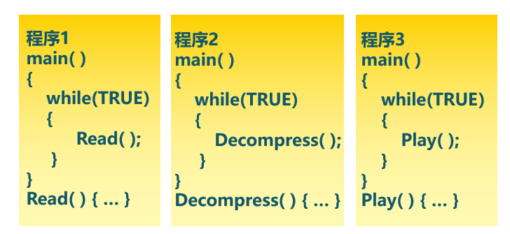
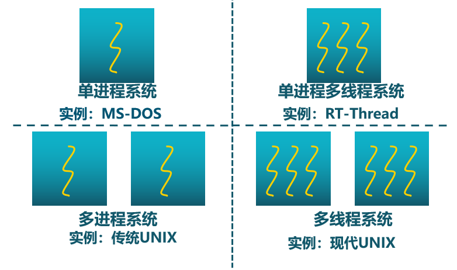
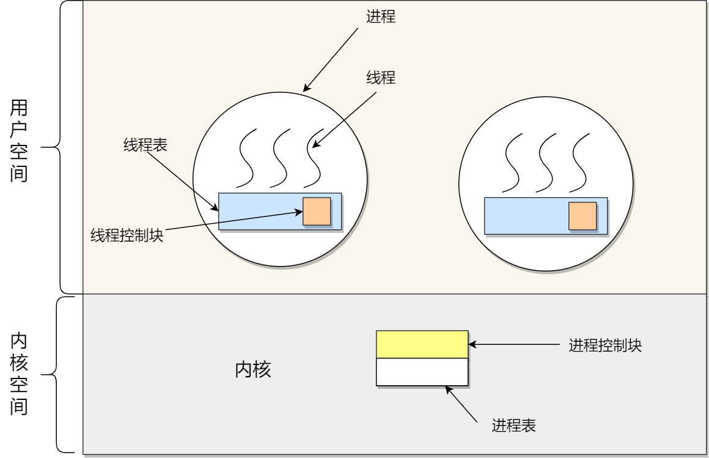

<!-- theme: gaia -->
<!-- _class: lead -->

# Lecture 11 Threads and coroutines

## Section 1 Thread


<br>
<br>

Xiang Yong Chen Yu Li Guoliang

Fall 2022

---

**Outline**

### 1. Why do we need threads?
2. The concept of thread
3. Using threads
4. Thread design and implementation

---
<style scoped>
{
  font-size: 32px
}
</style>

#### Deficiencies in the process

   - Difficulty with parallel/concurrent processing
   - Address space isolation between processes
   - Inconvenient to share/exchange data via IPC
   - Management process overhead is high
      - create/delete/switch


---
<style scoped>
{
  font-size: 30px
}
</style>

#### Deficiencies in the process

   - Difficulty with parallel/concurrent processing
   - Address space isolation between processes
   - Inconvenient to share/exchange data via IPC
   - Management process overhead is high
      - create/delete/switch



---
#### Why do we need threads?

Multiple activities may occur simultaneously in an application, and some activities may be blocked. Decomposing a **program into multiple sequential control flows** that can run in parallel can improve execution **efficiency**, and the program design model will become **simpler**.


<!--

-->

---
<style scoped>
{
  font-size: 30px
}
</style>

#### Why do we need threads?
Ever-present user needs -- **Performance**!
- Parallel entities (multiple sequential control flows) share the same address space and all available data
   - Easy access to data and shared resources
   - Toggle control flow lightweight
   - Easy to manage different control flows


---

#### Threads vs Processes
- A process is a unit for resource allocation (including memory, open files, etc.), and a thread is a unit for CPU scheduling;
- The process has a complete resource platform, while the thread only enjoys the essential resources, such as registers and stacks;
- Threads also have three basic states of ready, blocked, and executing, and also have transition relationships between states;
- Threads can reduce the time and space overhead of concurrent execution;

---
#### Threads vs Processes
- Multiple threads can exist in one process at the same time;
- Each thread can be executed concurrently;
- Resources such as address space and files can be shared between threads;
- When a thread in the process crashes, it will cause all threads of the process it belongs to to crash (this is for the C/C++ language, and the thread crash in the Java language will not cause the process to crash).

---

**Outline**

1. Why do we need threads?
### 2. The concept of thread
3. Using threads
4. Thread design and implementation

---
#### Thread definition

A thread is a **part** of a process that describes the **execution state** of a stream of instructions. It is the basic unit of the instruction execution flow in the process and the **basic unit** of CPU scheduling.


---
<style scoped>
{
  font-size: 30px
}
</style>

#### The role of processes and threads

- The **resource allocation** role of the process
   - A process consists of a set of related resources, including address space (code segment, data segment), open files, and other resources

- Thread's **Handler Scheduling** role
   - The thread describes the execution state of the instruction stream in the process resource environment


---
#### Support for threads in different operating systems



---
<style scoped>
{
  font-size: 30px
}
</style>

#### The relationship between processes and threads

**thread = process - shared resource**
- Multiple threads can exist in a process
- Threads share the address space of the process
- Threads share process resources
- A thread crash will cause the process to crash

A thread is a scheduling entity Scheduling Entry
User-SE v.s. Kernel-SE


---
<style scoped>
{
  font-size: 30px
}
</style>

#### Comparison of threads and processes
- A process is a resource allocation unit, and a thread is a CPU scheduling unit
- The process has a complete resource platform, while the thread only exclusively enjoys the necessary resources for instruction stream execution, such as registers and stacks
- Thread has three basic states of ready, waiting and running, and the transition relationship between states
- Threads can reduce the time and space overhead of concurrent execution
   - Thread creation/termination/switching time is shorter than process
   - Share memory and file resources between threads of the same process, and communicate directly without going through the kernel


---

#### Threads managed by user mode and threads managed by kernel mode




---

#### Thread Control Block (TCB, Thread Control Block)
```c
typedef struct
{
        int detachstate; // thread detach state
        int schedpolicy; // thread scheduling policy
        structsched_param schedparam; // thread scheduling parameters
        int inherited; // thread inheritance
        int scope; // the scope of the thread
        size_t guardsize; // size of the guard buffer at the end of the thread stack
        int stackaddr_set; // Thread stack settings
        void* stackaddr; // thread stack location
        size_t stacksize; // thread stack size
} pthread_attr_t;
```
---
<style scoped>
{
  font-size: 30px
}
</style>

#### Create thread API
Create thread: returns zero on success, non-zero otherwise
```c
#include <pthread.h>
int pthread_create( pthread_t * thread,
                const pthread_attr_t * attr,
                      void * (*start_routine)(void*),
                      void * arg);
```
- thread is a pointer to the pthread_t structure type
- attr is used to specify any attributes this thread may have
- start_routine is the function pointer for the thread to start running
- arg is the argument to be passed to the function the thread starts executing


---

#### Waiting Thread API

Waiting thread: Block the thread that calls it until the execution of the target thread ends
```c
#include <pthread.h>
int pthread_join(pthread_t thread, void **retval);
```
- thread is a pointer to the pthread_t structure type
- retval is a pointer to the return value

---

**Outline**

1. Why do we need threads?
2. The concept of thread
### 3. Using threads
4. Thread design and implementation

---

#### Thread Example

```c
1 void *mythread(void *arg) {
2 printf("%s\n", (char *) arg);
3 return NULL;
4}
5 int main(int argc, char *argv[]) {
6 pthread_t p1, p2;
7 int rc;
8 printf("main: begin\n");
9 rc = pthread_create(&p1, NULL, mythread, "A"); assert(rc == 0);
10 rc = pthread_create(&p2, NULL, mythread, "B"); assert(rc == 0);
11 // join waits for the threads to finish
12 rc = pthread_join(p1, NULL); assert(rc == 0);
13 rc = pthread_join(p2, NULL); assert(rc == 0);
14 printf("main: end\n");
15 return 0;
16}
```

---
#### Thread example output

A program that creates two threads, each of which does some independent work, in this case printing "A" or "B".

```
❯ ./t0
main: begin
A
B
main: end
```

---

**Outline**

1. Why do we need threads?
2. The concept of thread
3. Using threads
### 4. Thread design and implementation
- User threads (threads managed by user mode)
- Kernel threads (threads managed by kernel mode)
- light process


---
<style scoped>
{
  font-size: 28px
}
</style>

### Thread design and implementation
- Several implementations of threads
   - Threads managed by user mode and run in user mode (user threads invisible to the kernel)
     - Thread managed&running in User-Mode
   - Threads managed by the kernel and run in user mode (user threads visible to the kernel)
     - Thread managed in Kernel-Mode&running in User-Mode
   - Threads managed by kernel mode and running in kernel mode (kernel thread)
     - Thread managed&running in Kernel-Mode
   - mixed managed and running threads (lightweight processes, mixed threads)
     - Thread managed&running in Mixed-Mode
---
<style scoped>
{
  font-size: 30px
}
</style>

### Thread design and implementation
- Threads managed by user mode and run in user mode
   - Realize the management and operation of threads in user mode, and the operating system cannot perceive the existence of such threads
      - POSIX Pthreads, Mach C-threads, Solaris threads
      - Aliases: User-level Thread, Green Thread, Stackful Coroutine, Fiber


---
### Thread design and implementation

- Threads managed by user mode and run in user mode
    - Thread management is accomplished by a set of user-level thread library functions, including thread creation, termination, synchronization and scheduling, etc.


---
### Thread design and implementation
- Disadvantages of threads managed by user mode and run in user mode
    - When a thread initiates a system call and blocks, the entire process enters the wait
    - Does not support thread-based processor preemption
    - Can only allocate CPU time by process


---
<style scoped>
{
  font-size: 30px
}
</style>

### Thread design and implementation
- Threads managed by kernel mode and run in user mode
   - The thread mechanism implemented by the kernel through system calls, and the kernel completes the creation, termination and management of threads
   - The thread control block TCB is maintained by the kernel, implemented in the kernel
   - Threads executing system calls are blocked without affecting other threads


---
<style scoped>
{
  font-size: 32px
}
</style>

### Thread design and implementation
- Threads managed by kernel mode and run in user mode
   - A process can include multiple threads
      - Windows kernel design
      - Design of rCore/uCore core
   - Only one thread is included in a process
     - Design of the Linux kernel


---
<style scoped>
{
  font-size: 30px
}
</style>

### Thread design and implementation
- Disadvantages of threads managed in kernel mode and run in user mode
   - In general, the thread switching overhead is not much different from the process switching overhead, which is greater than the thread switching overhead managed by user mode and allowed by user mode
   - There will be some contradictions with the traditional process management mechanism, and the implementation function/semantics of some system calls will be inconsistent
     - fork(), signal()...


---
<style scoped>
{
  font-size: 30px
}
</style>

### Thread design and implementation
- Threads managed by kernel mode and running in kernel mode (abbreviation: kernel thread)
   - The thread mechanism is implemented by the kernel, and the creation, termination and management of threads are completed by the kernel
   - TCB is maintained by the kernel and implemented in the kernel
   - Threads execute in the kernel
      - Such as: Linux kernel thread


---
<style scoped>
{
  font-size: 30px
}
</style>

### Thread design and implementation
- Threads managed by kernel mode and running in kernel mode (abbreviation: kernel thread)
   - The kernel thread is the avatar of the kernel, and an avatar can process a specific thing in time/parallel
   - The scheduling of kernel threads is the responsibility of the kernel. When a kernel thread is blocked, it does not affect other kernel threads, because it is the basic unit of scheduling.


---
<style scoped>
{
  font-size: 30px
}
</style>

### Thread design and implementation
- The role of threads managed by kernel mode and running in kernel mode (abbreviation: kernel thread)
   - Execute periodic tasks
     - Write the Buffer-Cache back to the storage device regularly
     - Perform virtual memory swap operations when few physical memory pages are available
     - Implements a transaction log for the file system
   


---
### Thread design and implementation
- Two-state managed threads

A lightweight process (Light-Weight Process, LWP) is a user thread supported by the kernel. A process can have one or more LWPs. Each LWP is mapped one-to-one with a kernel thread, that is, LWPs are created by a kernel thread. Thread support. User threads are also available on top of the LWP.

---
<style scoped>
{
  font-size: 28px
}
</style>

### Thread design and implementation
- Two-state managed threads

There are three types of correspondence between LWP and user threads:

- 1 : 1, that is, one LWP corresponds to one user thread: Linux, JVM
   - Cancellation of user mode management, kernel management thread
- N : 1, that is, one LWP corresponds to multiple user threads: OS-independent Green Thread
   - Kernel mode only manages processes that contain multiple threads, and user mode threads manage threads when they run
- M : N, that is, multiple LWPs correspond to multiple user threads: Solaris OS, Go runtime
   - The user-mode thread runs in coordination with the kernel for management

---

### Thread design and implementation
- Two-state managed threads
   - M : N threading model
   - Solaris operating system + C thread runtime library
   - Go language + Go runtime library + OS


---
<style scoped>
{
  font-size:28px
}
</style>

### Thread design and implementation
- Two-state managed threads
   - Programmers decide the multiplexing relationship between kernel threads and user-level threads
   - User-level threads are managed by the user thread management library
   - The kernel only recognizes kernel-level threads/processes and schedules them
   - The kernel interacts with the user-mode thread management library
   - with maximum flexibility and implementation complexity


---
### Thread context switching

Thread is the basic unit of scheduling, and process is the basic unit of resource ownership.

- Thread switching in different processes: process context switching
- Thread switching in the same process: virtual memory is shared. When switching, resources such as virtual memory will remain unchanged, and only private data, registers and other data that are not shared by threads need to be switched**

---

### Summary

1. Why do we need threads?
2. The concept of thread
3. Using threads
4. Thread design and implementation