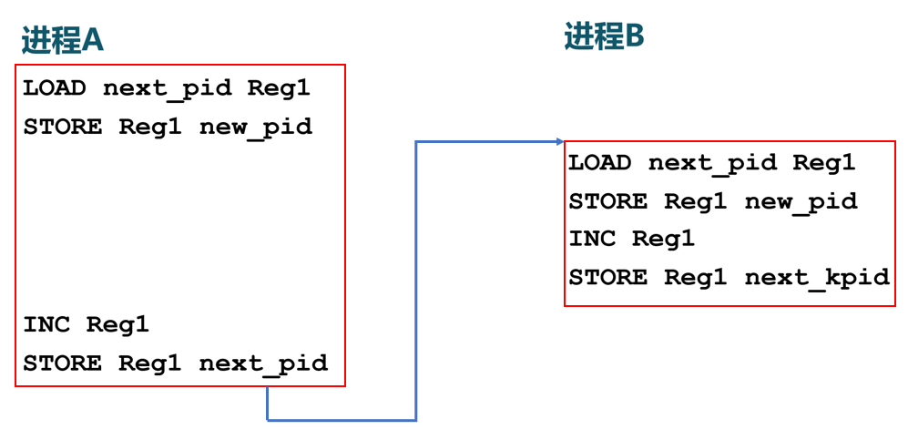
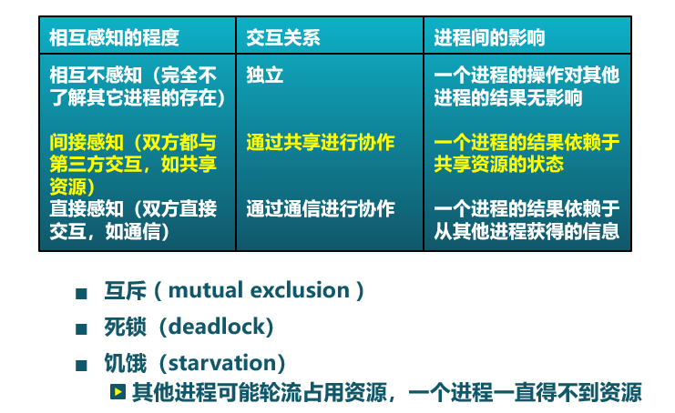
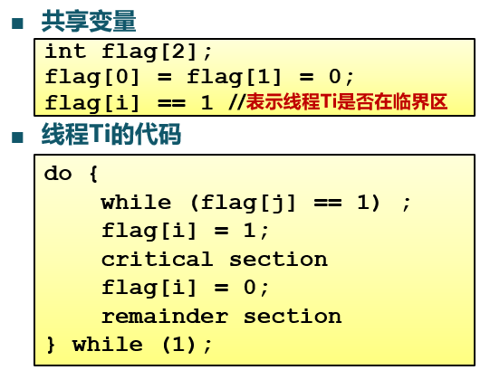
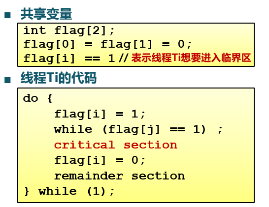
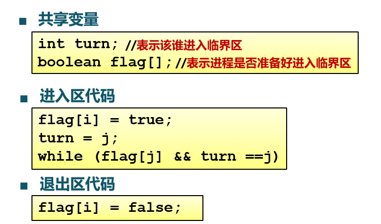
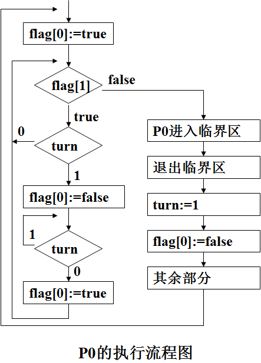
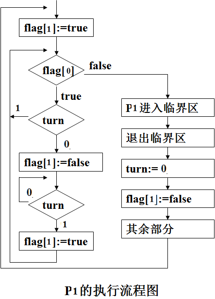
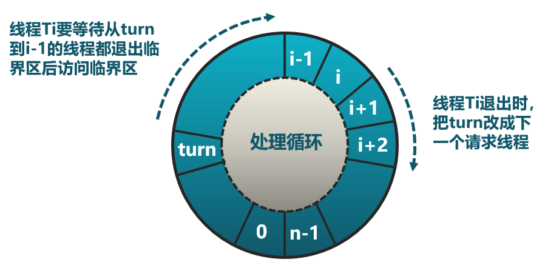

<!-- theme: gaia -->
<!-- _class: lead -->

# Lecture 12 Synchronization and mutual exclusion
## Section 1 Overview

<br>
<br>

Xiang Yong Chen Yu Li Guoliang

<br>
<br>

Fall 2022

---
<style scoped>
{
  font-size: 28px
}
</style>

### Background
- Independent entry/thread
   - Does not share resources or state with other processes/threads
   - Deterministic => input state determines result
   - Reproducible => able to reproduce the starting conditions
   - Scheduling order does not matter

- In/Thread if there is resource sharing
   - There is uncertainty
   - Exist non-reproducible
   - Hard-to-reproduce bugs may occur


---
### Background
- Possible error when fork is executed by thread/thread with resource sharing


---
### Background -- Atomic Operation

- An atomic operation is one that does not have any interruptions or failures
   - Either the operation completed successfully
   - or the operation was not performed
   - Partially executed state will not occur

The operating system needs to use the synchronization mechanism to ensure that some operations are atomic operations while executing concurrently



---
### Synchronous Mutexes in Real Life
Example: Home Purchase Coordination (using real life problems to help understand OS sync issues)
   - Note, the difference between computer and human


---
<style scoped>
{
  font-size: 28px
}
</style>

### Synchronous Mutexes in Real Life
- How to ensure the success and efficiency of home purchase coordination
   - When you need to purchase, someone goes to buy bread
   - at most one person goes to buy bread
- possible workarounds
   - Set a lock and key on the refrigerator (lock&key)
   - Lock the refrigerator and take the key before going to buy bread
- New problems caused by locking
   - When there are other foods in the refrigerator, others cannot get them


---
### Synchronous Mutex in Real Life -- Solution 1
- Use sticky notes to avoid buying too much bread
   - Leave a note before purchasing
   - Remove the note after purchase
   - People don't buy bread when they see the sticky note
```
  if (nobread) {
     if (noNote) {
         leave Note;
         buy bread;
         remove Note;
     }
}
```


---
<style scoped>
{
  font-size: 30px
}
</style>

### Synchronous mutual exclusion in real life -- scheme one -- analysis
- Occasionally buys too much bread - Repeat
   - Check bread and sticky notes before posting notes, have someone else check bread and sticky notes

- The solution just fails intermittently
   - Problems are hard to debug
   - must consider what the scheduler does


---
### Synchronous mutual exclusion in real life -- scheme two
- Leave notes first, then check bread and notes
```
leave Note;
if (nobread) {
   if (noNote) {
        buy bread;
     }
}
remove note;
```
- what happens?
    - no one will buy bread


---
<style scoped>
{
  font-size: 30px
}
</style>

### Synchronous mutual exclusion in real life -- scheme three
- Add tags to sticky notes to distinguish different people's sticky notes
    - It is now possible to leave sticky notes before inspections
```
leave note_2;
if (no note_1) {
    if (no bread) {
      buy bread;
    }
}
remove note_2;
```


---
<style scoped>
{
  font-size: 30px
}
</style>

### Synchronous mutual exclusion in real life -- scheme three
- Add tags to sticky notes to distinguish different people's sticky notes
   - It is now possible to leave sticky notes before inspections
```
leave note_1;
if (no note_2) {
    if (no bread) {
      buy bread;
    }
}
remove note_1;
```


---
<style scoped>
{
  font-size: 30px
}
</style>

### Synchronous mutual exclusion in real life -- scheme three
- Add tags to sticky notes to distinguish different people's sticky notes
   - It is now possible to leave sticky notes before inspections

  - what happens?
    - may cause no one to buy bread
    - Everyone thinks the other one goes to buy bread
 


---

### Synchronous mutual exclusion in real life -- scheme four
Two people use different processes


---
<style scoped>
{
  font-size: 30px
}
</style>

### Synchronous mutual exclusion in real life -- scheme four
Two people use different processes
- Does it work now?
   - It works, but is too complicated
- A and B have different codes
   - What if there are more threads?
- While A is waiting, nothing else can be done
   - Busy-waiting


---
<style scoped>
{
  font-size: 30px
}
</style>

### Synchronous mutual exclusion in real life -- scheme five
- Use two atomic operations to implement a lock (lock)
   - Lock. Acquire()
      - wait until the lock is released, then acquire the lock
      - If two threads are waiting for the same lock and find that the lock is released at the same time, only one can acquire the lock
   - Lock. Release()
      - Unlock and wake up any waiting threads


<!--
---
### Interaction between progress/thread: degree of mutual awareness


---
### Interaction between progress/thread: degree of mutual awareness


---
### Interaction between progress/thread: degree of mutual awareness

  -->


---
<style scoped>
{
  font-size: 30px
}
</style>

### Critical Section
```
entry section
    critical section
exit section
    remainder section
```
- Entry section
   - A piece of code that checks whether a critical section can be entered
   - If accessible, set the corresponding "Accessing critical section" flag
- Critical section
   - A piece of code that requires mutual exclusion to access critical resources in a thread


---
### Critical Section
```
entry section
    critical section
exit section
    remainder section
```
- Exit section
    - clear "Accessing critical section" flag
- Remainder section
    - the rest of the code

---
<style scoped>
{
  font-size: 30px
}
</style>

### Critical Section -- Access Rules
```
entry section
    critical section
exit section
    remainder section
```
- 1 Enter if idle: when no thread is in the critical section, any thread can enter
- 2 Wait while busy: When a thread is in the critical section, other threads cannot enter the critical section
- 3 bounded waits: threads waiting to enter a critical section **cannot** wait indefinitely
- 4 Right to wait (optional): Threads that cannot enter the critical section should release the CPU (such as switching to a blocked state)


---
### Method of synchronizing mutex
- Method 1: Disable hardware interrupts
- Method 2: Software-based workaround
- Method 3: Higher level abstraction method


---
<style scoped>
{
  font-size: 30px
}
</style>

### Method 1: Disable hardware interrupts
- No interrupts, no context switches, thus no concurrency
    - Hardware defers interrupt processing until after the interrupt is enabled
    - Modern computer architectures provide instructions to disable interrupts

           local_irq_save(unsigned long flags);
               critical section
           local_irq_restore(unsigned long flags);
- Enter critical section: disable all interrupts, and save flags
- Leaving critical section: enable all interrupts, and restore flags
 

---
<style scoped>
{
  font-size: 30px
}
</style>

### Method 1: Disable hardware interrupts
- Shortcoming
   - When interrupts are disabled, the thread cannot be stopped
      - the whole system will stop for this
      - May starve other threads
   - Critical sections can be very long
      - Unable to determine how long it takes to respond to an interrupt (there may be a hardware impact)
   - not suitable for multi-core
- **Use with care**


---
### Method 2: Software-based workaround


---
<style scoped>
{
  font-size: 30px
}
</style>

### Method 2: Software-Based Workaround -- Try One

- Satisfy "wait when busy", but sometimes not satisfy "enter when idle"
    - Ti is not in the critical section, Tj wants to continue running, but must wait for Ti to enter the critical section
    - turn = 0;
      - T0 does not require access
      - T1 needs access -> has been waiting


---
<style scoped>
{
  font-size: 30px
}
</style>

### Method 2: Software-Based Workaround -- Attempt Two

- Mutual dependencies (thread blindness, etc.)
- Does not satisfy "wait while busy"
   - flag[i]=flag[j]=0
```c
// thread Tj
do {
    while (flag[i] == 1) ;
    flag[j] = 1;
    critical section
    flag[j] = 0;
    remainder section
} while(1)
```


---
<style scoped>
{
  font-size: 30px
}
</style>

### Method 2: Software-Based Workaround -- Attempt Three

- Satisfy "wait if busy", but not "enter if idle"
   - flag[i]=flag[j]=1
```c
// thread Tj
do {
    flag[j] = 1;
    while (flag[i] == 1) ;
    critical section
    flag[j] = 0;
    remainder section
} while(1)
```

---
### Method 2: Software-based solution -- Peterson algorithm


- Classic software-based solution to satisfy mutual exclusion between threads Ti and Tj (1981)
- Kong Rong let the pears


---
<style scoped>
{
  font-size: 30px
}
</style>

### Method 2: Software-based solution -- Peterson algorithm


```
flag[i] = True;
turn = j;
while(flag[j] && turn == j);
critical section;
flag[i] = False;
remainder section;
```
```
flag[j] = True;
turn = i;
while(flag[i] && turn == i);
critical section;
flag[j] = False;
remainder section;
```


---
### Method 2: Software-based solution -- Dekkers algorithm


```
do {
   flag[0] = true;// First, P0 raises his hand to indicate that I want to visit
   while(flag[1]) {//Check if P1 has raised his hand
      if(turn==1){// If P1 also raises his hand, then see whose turn it is
          flag[0]=false;// If it is indeed P1's turn, then P0 puts his hand down first (let P1 go first)
          while(turn==1);// As long as it is still time for P1, P0 will not raise its hand and keep waiting
          flag[0]=true;// Wait until P1 is used up (it's P0's turn), and P0 raises its hand again
      }
      flag[1] = false; // As long as you can jump out of the loop, it means that P1 is used up, and you should jump out of the outermost circle of while
   }
   critical section;// access critical section
   turn = 1;// After P0 visits, give the turn to P1, so that P1 can visit
   flag[0]=false;// P0 put down
   remainder section;
} while(true);
```


---
### Method 2: Software-based solution -- Dekkers algorithm

 vs 

---
<style scoped>
{
  font-size: 30px
}
</style>

### Method 2: Software-based solution -- N threads
Eisenberg and McGuire
- A shared turn variable, several threads are arranged in a ring
- Each ring has a flag, and if you want to enter the critical area, fill in the flag
- There are multiple people who want to enter the critical section, go from front to back, execute a thread, and change the turn to the value of the next thread.



---
### Method 2: Software-based solution -- N threads
```c
INITIALIZATION:

enum states flags[n -1]; //{IDLE, WAITING, ACTIVE}
int turn;
for (index=0; index<n; index++) {
    flags[index] = IDLE;
}
```

---
### Method 2: Software-based solution -- N threads
```c
ENTRY PROTOCOL (for Process i):
repeat {//Whether there is a request process from turn to i: if it exists, it will continue to loop until there is no such process, and mark the current process as ACTIVE
    flags[i] = WAITING;//Indicate that you need resources
    index = turn;//whose turn is it
    while (index != i) {// from turn to i take turns to find idle threads
       if (flag[index] != IDLE) index = turn;//turn to i has non-idle blocking
       else index = (index+1) mod n; //Otherwise it is i's turn and jump out
    }
    flags[i] = ACTIVE;//Pi active; other threads may be active
    // Make further judgments on all ACTIVE processes, and judge whether there are other ACTIVE processes besides the current process
    index = 0;//Check if there are other active ones
    while ((index < n) && ((index == i) || (flags[index] != ACTIVE))) {
       index = index+1;
    }//If there is no active later, and it's Pi's turn or turn idle, it's i's turn; otherwise continue to loop
} until ((index >= n) && ((turn == i) || (flags[turn] == IDLE)));
turn = i;//get turn and process
```

---
### Method 2: Software-based solution -- N threads
```c
EXIT PROTOCOL (for Process i ):

index = turn+1 mod n;//Find one that is not idle
while (flags[index] == IDLE) {
    index = index+1 mod n;
}
turn = index;//Find the one that is not idle and set it to turn; or set it to yourself
flag[i] = IDLE;//end, become idle
```

---
### Method 3: More advanced abstract methods
- Software based solution
    - Complicated, requires busy waiting

- Higher level abstract methods
    - The hardware provides some synchronization primitives
        - Interrupt disabling, atomic operation instructions, etc.
    - **The operating system provides higher-level programming abstractions to simplify thread synchronization**
        - eg: locks, semaphores
        - Build with hardware primitives

---
<style scoped>
{
  font-size: 32px
}
</style>

### Method 3: More advanced abstract method -- lock (lock)
- A lock is an abstract data structure
    - a binary variable (lock/unlock)
    - Use locks to control critical section access
    - Lock::Acquire()
       - Wait until the lock is released, and then get the lock
    - Lock::Release()
       - Release the lock, waking up any waiting threads


---
<style scoped>
{
  font-size: 30px
}
</style>

### Method 3: More advanced abstract method -- lock (lock)
Modern CPUs provide some special instructions for atomic operations
- Atomic operation instructions
   - Test and Set (Test-and-Set) instructions
      - read value from memory cell
      - Test if the value is 1 (then return true or false)
      - Memory cell value set to 1
        - Enter 0, change to 1, and return to 0;
        - Enter 1, keep 1, return 1;


 

---
### Method 3: More advanced abstract method -- lock (lock)
Modern CPUs provide some special atomic operation instructions
```
do {
   while(TestAndSet(&lock));
   critical section;
   lock = false;
   remainder section;
} while (true)
```


 
---
<style scoped>
{
  font-size: 30px
}
</style>

### Method 3: More advanced abstract method -- lock (lock)
Modern CPUs provide some special atomic operation instructions
```
do {
   while(TestAndSet(&lock));
   critical section;
   lock = false;
   remainder section;
} while (true)
```
```
lock(): while(TestAndSet(&lock));
critical section;
unlock(): lock=false;
```


---
<style scoped>
{
  font-size: 30px
}
</style>

### Method 3: More advanced abstract method -- lock (lock)
- Atomic operation: exchange instruction CaS (Compare and Swap)
```
bool compare_and_swap(int *value, int old, int new) {
    if(*value==old) {
       *value = new;
       return true; }
    return false;
}
```
```
int lock = 0; // Initially the lock is free
while(!compare_and_swap(&lock,0,1)); // lock lock
critical section;
lock=0; // unlock unlock
remainder section;
```

<!-- ---
### Method 3: More advanced abstract method -- lock (lock)
- Atomic operation: exchange instruction CaS (Compare and Swap)
```
bool compare_and_swap(int *value, int old, int new) {
    if(*value==old) {
       *value = new;
       return true;
    }
    return false;
}
```
```
lock(): while(!compare_and_swap(&lock,0,1));
critical section;
unlock(): lock=0;
``` -->

---
<style scoped>
{
  font-size: 30px
}
</style>

### Method 3: More advanced abstract method -- lock (lock)
<!-- What is CAS? How should the ABA problem be understood? https://zhuanlan.zhihu.com/p/139635112
https://www.zhihu.com/question/23281499/answer/24112589
Regarding the ABA problem, I thought of an example: when you are very thirsty, you find a cup full of water, and you drink it up. Then refill the glass with water. Then you leave, and when the real owner of the glass comes back and sees that the glass is still full of water, of course he doesn't know if someone has drunk it and refilled it. One strategy for a solution to this problem is to assume that an automated recorder records each pour, so the owner can tell when she returns if a refill has occurred since she left. This is also the strategy currently used to solve the ABA problem.
-->
- Atomic operation: exchange instruction CaS (Compare and Swap)
- ABA questions:
   - value = 100;
   - Thread1: value - 50; //success value=50
   - Thread2: value - 50; //blocking
   - Thread3: value + 50; //success value=50
   - Thread2: Retry succeeded
- Solution idea: add version number (time stamp)
   - (100,1); (50,2); (100,3)
<!---
### Method 3: More advanced abstract method -- lock (lock)
Modern CPU architectures provide some special atomic operation instructions
- Atomic operation instructions
   - exchange command (exchange)
      - swap two values in memory


-->

---
### Method 3: More advanced abstract method -- lock (lock)
Use the TaS instruction to implement a spin lock (spinlock)
- Threads consume CPU time while waiting


---
### Method 3: More advanced abstract method -- lock (lock)
**Busy Waiting Lock vs. Waiting Lock**


---
<style scoped>
{
  font-size: 28px
}
</style>

### Method 3: More advanced abstract method -- lock (lock)
- Advantage
   - Suitable for synchronization of any number of threads on a single processor or shared memory multiprocessors
   - simple and easy to prove
   - Support for multiple critical sections
- Shortcoming
   - Busy waiting consumes processor time
   - May cause hunger
     - There are multiple waiting threads when the thread leaves the critical section
   - Possible deadlock: threads wait for each other and cannot continue execution

---
### Summary
- Three commonly used synchronization methods
   - Disable interrupts (single processor only)
   - Software approach (complex)
   - Locks are a high-level synchronization abstraction
      - Hardware atomic operation instructions (single processor or multiple processors are acceptable)
      - Mutual exclusion can be implemented using locks