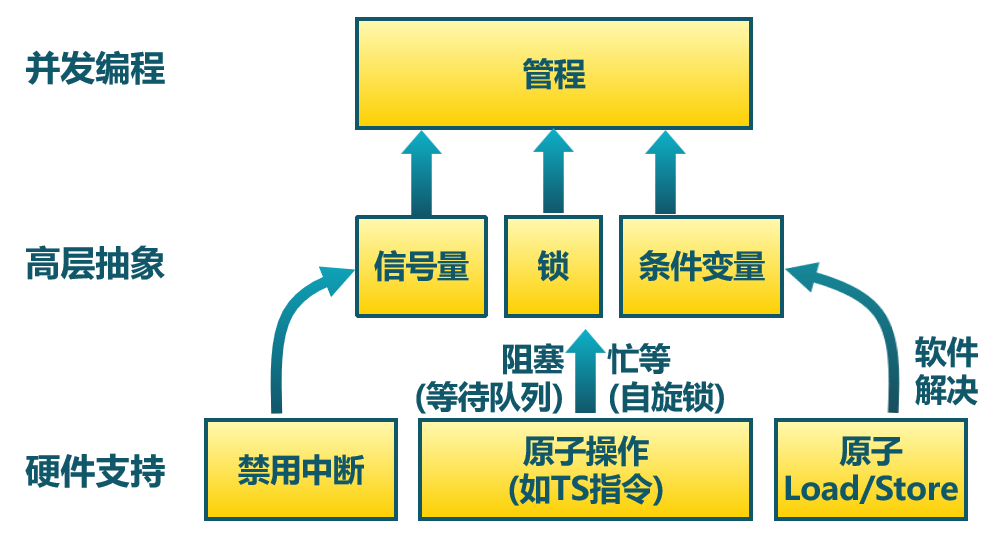
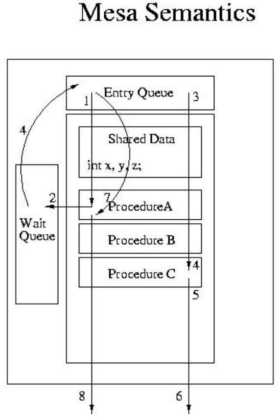
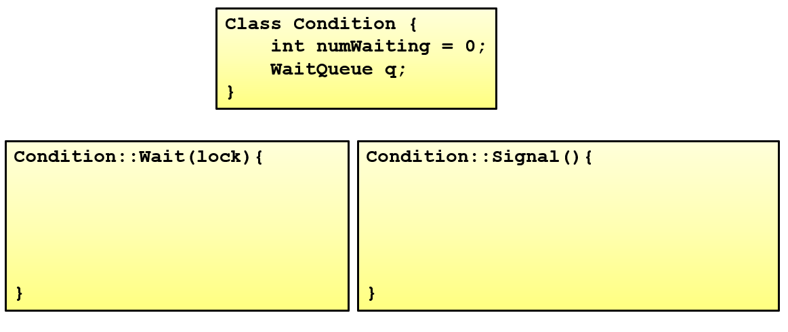
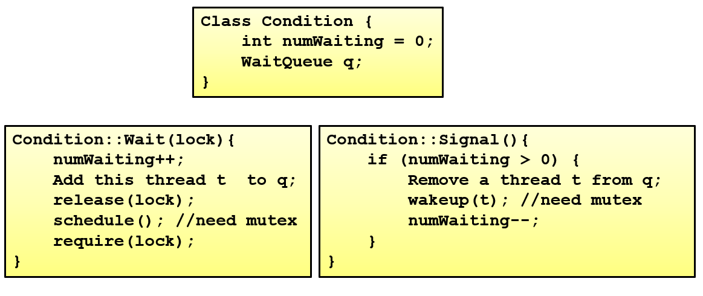

<!-- theme: gaia -->
<!-- _class: lead -->

# Lecture 12 Synchronization and mutual exclusion

## Section 3 Monitor and Condition Variables

  Monitor (Monitor) Condition Variable (Condition Variable)
 
<!--
Gregory Kesden, Monitors and Condition Variables https://cseweb.ucsd.edu/classes/sp16/cse120-a/applications/ln/lecture9.html
Mark Spruiell, The C++ Monitor Class. Apr. 2011 https://doc.zeroc.com/pages/viewpage.action?pageId=5048235
wikipedia, Monitor (synchronization) https://en.wikipedia.org/wiki/Monitor_(synchronization)
Mike Vine, Making a C++ class a Monitor (in the concurrent sense) https://stackoverflow.com/a/48408987
David Rodríguez - dribeas, How arrow-> operator overloading works internally in c++? https://stackoverflow.com/a/10678920
Fruit_初, Monitors, March, 2017. https://www.jianshu.com/p/8b3ed769bc9f
C++ Concurrency Pattern #6: Monitor - monitor http://dengzuoheng.github.io/cpp-concurency-pattern-6-monitor
-->
---
<style scoped>
{
  font-size: 28px
}
</style>

### Monitor
- Motivation: Why is there a monitor? The traditional PV and lock mechanism has the following problems:
   - Poor program readability: To understand whether the operation of a set of shared variables and semaphores is correct, you must read through the entire system or concurrent program.
   - The program is not conducive to modification and maintenance: the locality of the program is very poor, so the modification of any set of variables or a piece of code may affect the whole world.
   - Difficult to guarantee correctness: operating systems or concurrent programs are usually very large, and it is difficult to ensure that a complex system is free from logic errors.
   - Prone to deadlock: If the P and V operations are not used properly, a logical error occurs, which is likely to cause a deadlock.

---
<style scoped>
{
  font-size: 30px
}
</style>

### Monitor
- A monitor is a **program structure** for multi-threaded mutual exclusive access to shared resources
- Adopt **object-oriented method**, which simplifies the synchronization control between threads
- At any one time, at most one thread executes the monitor code
- The thread in the monitor can temporarily give up the mutex access of the monitor, and resume when the event occurs



---
<style scoped>
{
  font-size: 30px
}
</style>

### Monitor
- Modularization, a monitor is a basic program unit that can be compiled separately.

- Abstract data type, monitor is a special data type in which there is not only data, but also code to operate on the data.

- Information concealment, the monitor is translucent, and the process (function) in the monitor implements certain functions, but it is invisible outside it.


---
<style scoped>
{
  font-size: 26px
}
</style>

### Monitor -- condition variable
- The shared variables in the monitor are invisible outside the monitor, and the outside can only indirectly access the shared variables in the monitor by calling the external procedure (function) described in the monitor
   - Mutual exclusion: There can only be one active process in the monitor at any one time, and enter the monitor through lock competition
   - Waiting: The thread entering the monitor enters the waiting state **due to the resource being occupied**
     - Each condition variable represents a waiting reason, corresponding to a waiting queue
     - The entry queue manages threads/processes that have not entered the monitor
   - Wake up: threads waiting in the monitor can be woken up (other threads release resources)
   - Synchronization: wait and wakeup operations
   - Monitor operation: enter enter, leave leave, wait for wait, wake up signal

<!--


---
### monitor -- condition variable

-->


<!-- https://blog.csdn.net/Carson_Chu/article/details/104223122 [Operating System] Synchronization Mutual Exclusion Mechanism (2): Monitor and Inter-Process Communication Mechanism (IPC)

https://zhuanlan.zhihu.com/p/465751547 This article is enough for learning process mutual exclusion and process synchronization!
https://www.cnblogs.com/uestcliming666/p/13224545.html "Modern Operating System" - Chapter 6 Synchronization Mutual Exclusion Mechanism (2), Inter-process Communication Mechanism

https://yangzhaoyunfei.github.io/monitors/ Monitors -->


---
<style scoped>
{
  font-size: 28px
}
</style>

### Monitor -- condition variable
- The composition of the monitor: a collection composed of procedures (functions), variables and data structures, etc.
    - A lock: Controlling exclusive access to monitor code
    - 0 or more condition variables: manage concurrent access to shared data, each condition variable has a waiting (emergency) queue
    - Entry waiting queue
    - Urgent waiting queue
    - Condition variable queue


---
<style scoped>
{
  font-size: 26px
}
</style>

### Monitor -- condition variable
- Entry waiting queue: waiting queue at the entrance of the monitor
- Conditional waiting queue: a waiting queue for a condition variable (waiting for resource occupation)
- Urgent Waiting Queue: Wake up the used Urgent Queue
    - When the T1 thread executes the wake-up operation to wake up T2, if T1 gives the access right to T2, T1 is suspended; T1 is put into the emergency waiting queue
    - Urgent wait queue priority is higher than condition variable wait queue
    - Queue waiting for mutual exclusion


---
<style scoped>
{
  font-size: 26px
}
</style>

### Monitor -- Process (T can be a thread or a process)
- T.enter process: thread T must obtain exclusive access (lock) before entering the monitor
- T.leave process: When thread T leaves the monitor, if the emergency queue **is not empty**, wake up the thread in the emergency queue and assign the lock held by T to the awakened thread; if **urgent queue is empty* *, release the lock, wake up the entry waiting queue for a thread
- T.wait(c): 1) Block thread T itself, and hang t itself to the waiting queue of condition variable c;
   - 2) Release the lock held; 3) Wake up one or more threads in the entry waiting queue;
<!--Release the power of the monitor, enter the conditional waiting queue of c; wake up the first thread in the emergency waiting queue // allocate some type of resource for the process entering the monitor, if this resource is available at this time, then the process Use, otherwise the process is blocked and enters the conditional waiting queue -->
- T.signal(c): 1) wake up a thread in the waiting queue of the condition variable c;
   - 2) Give the lock held by thread T to the awakened thread;
   - 3) Hang thread T itself in the emergency waiting queue
<!--Wake up the process that enters the conditional waiting queue due to waiting for this resource (c’s conditional waiting queue) The first thread enters the process of the monitor to release a certain resource. At this time, the process will wake up and enter the conditional waiting queue due to waiting for this resource Waiting for the first process in the queue -->

<!--
---
### monitor -- condition variable
- Synchronization: Condition Variables (Condition Variables) and related two operations: wait and signal, handle the waiting mechanism.
- Wait() operation
    - Block yourself in the waiting queue
    - Release the mutex access of the monitor
    - Call in a process waiting outside the monitor
- Signal() operation
    - Wake up a thread in the waiting queue
    - Equivalent to a no-op if the wait queue is empty


-->


---
<style scoped>
{
  font-size: 30px
}
</style>

### Monitor -- Implementation
<!-- https://blog.csdn.net/qq_34666857/article/details/103189107 Java concurrent programming simulation tube (Hoare tube, Hansan tube, MESA tube) -->
The release processing method of the condition variable in the monitor

- If thread T1 is blocked because condition A is not met, then when thread T2 satisfies condition A and executes the signal operation to wake up T1, threads T1 and T2 are not allowed to be in the monitor at the same time, so how to determine which one to execute/Which wait?
- Can be processed in one of the following ways:

   - 1: (Hoare): T1 executes/T2 waits until T1 leaves the monitor, then T2 continues execution
   - 2: (MESA/Hansen): T2 executes/T1 waits until T2 leaves monitor, then T1 may continue execution


---
<style scoped>
{
  font-size: 30px
}
</style>

### Monitor -- Implementation
<!-- https://blog.csdn.net/qq_34666857/article/details/103189107 Java concurrent programming simulation tube (Hoare tube, Hansan tube, MESA tube) -->
The release processing method of the condition variable in the monitor
- The signal of thread T2, when the condition for thread T1 to wait is met
   - Hoare: After T2 notifies T1, T2 blocks, and T1 executes immediately; after T1 finishes executing, wake up T2 to execute
   - Hansen: After T2 notifies T1, T2 will continue to execute. After T2 is executed (regulation: the last operation is signal), then T1 will execute again (the lock will be directly given to T1)
   - MESA: After T2 notifies T1, T2 will continue to execute, T1 will not execute immediately, but will re-compete for access rights

---
### Monitor
The release processing method of the condition variable in the monitor
<!-- https://cseweb.ucsd.edu/classes/sp17/cse120-a/applications/ln/lecture8.html -->
<!-- https://juejin.cn/post/6925331537365843981 Synchronized principle analysis -->


---
### Monitor
<!-- The release processing method of the condition variable in the monitor -->


---
### Monitor
<!-- The release processing method of the condition variable in the monitor -->
Two options for waking up a thread: **Directly granting the lock** vs **Re-fairly competing for the lock**


---
### Monitor - Hoare
<!-- https://www.cnblogs.com/upnote/p/13030741.html Theoretical Basis of Java Synchronized - Monitor -->
```
- 1. T1 enters the monitor
- 2. T1 waits for resources (enters the wait queue)
- 3. T2 enters the monitor
- 4. T2 resources are available, notify T1 to resume execution,
      and transfer yourself to the urgent waiting queue
- 5. T1 re-enters the monitor and executes
- 6. T1 leaves the monitor
- 7. T2 re-enters the monitor and executes
- 8. T2 leaves the monitor
- 9. Other threads in the entry queue pass the competition
      Enter the monitor monitor
```


---
### Monitor
<!-- The release processing method of the condition variable in the monitor -->
Two options for waking up a thread: **Directly granting the lock** vs **Re-fairly competing for the lock**


---
### Monitor - Hoare
<!-- https://www.cnblogs.com/upnote/p/13030741.html Theoretical Basis of Java Synchronized - Monitor -->
```
- 1. T1 enters the monitor
- 2. T1 waits for resources (enters the wait queue)
- 3. T2 enters the monitor
- 4. T2 resources are available, notify T1 to resume execution,
      and transfer yourself to the urgent waiting queue
- 5. T1 re-enters the monitor and executes
- 6. T1 leaves the monitor
- 7. T2 re-enters the monitor and executes
- 8. T2 leaves the monitor
- 9. Other threads in the entry queue pass the competition
      Enter the monitor monitor
```


---
### Monitor - Mesa
<!-- https://www.cnblogs.com/upnote/p/13030741.html Theoretical Basis of Java Synchronized - Monitor -->
```
- 1. T1 enters the monitor
- 2. T1 waits for resources
     (Enter the wait queue and release the monitor)
- 3. T2 enters the monitor
- 4. T2 resources are available, notify T1
     (T1 is transferred to the entey queue and competes on an equal footing again)
- 5. T2 continues execution
- 6. T2 leaves the monitor
- 7. T1 obtains the execution opportunity from the entry queue
      Dequeue, resume execution
- 8. T1 leaves the monitor
- 9. Other threads in the entry queue pass the competition
      enter monitor
```


---
### Monitor - Hansen:
<!-- https://www.cnblogs.com/upnote/p/13030741.html Theoretical Basis of Java Synchronized - Monitor -->
```
- 1. T1 enters the monitor
- 2. T1 waits for resource c
- 3. T2 enters the monitor
- 4. T2 leaves Monitor and waits for notification
      The thread of resource c, the resource is available
- 5. T1 re-enters the monitor
- 6. T1 leaves the monitor
- 7. Other threads pass the competition from the entry queue
      enter monitor
```


---
### Monitor -- Implement condition variables


---
### Monitor -- Implement condition variables


---
### Monitor -- Implement condition variables


---
### Monitor -- Implement condition variables


---
### Monitor -- Implement condition variables


---
### Monitor -- Implement condition variables


---
### Monitor -- Implement condition variables


---
### Monitor -- Implement condition variables


---
### Monitor -- Implement condition variables



---
### Monitor -- producer-consumer problem


---
### Monitor -- producer-consumer problem


---
### Monitor -- producer-consumer problem


---
### Monitor -- producer-consumer problem
