<!-- theme: gaia -->
<!-- _class: lead -->

# Lecture 13 Device Management
## Section 1 Device interface

 
 

Xiang Yong Chen Yu Li Guoliang

 
 

Spring 2022

---
### I/O subsystem -- problem to be solved
- Why do devices vary so much?
- Why manage devices?
- How to unify the access interface to the equipment?
- Why create an abstraction over the device?
- How to perceive the status of the device and manage the device?
- How to improve CPU and device access performance?
- How to guarantee the reliability of I/O operations?

---
### I/O subsystem -- Common device interface types
- The history of the development of the equipment
    - Simple device: the CPU can directly control the I/O device through the I/O interface
    - Multi-device: A layer of I/O controller and bus BUS are added between CPU and I/O devices
    - Devices that support interrupts: improve CPU utilization
    - High throughput devices: DMA support
    - Various other devices: GPU, sound card, SmartNIC, RDMA
    - Connection method: direct connection, (device/interrupt) controller, bus, distributed

---
### I/O subsystem -- Kernel I/O structure
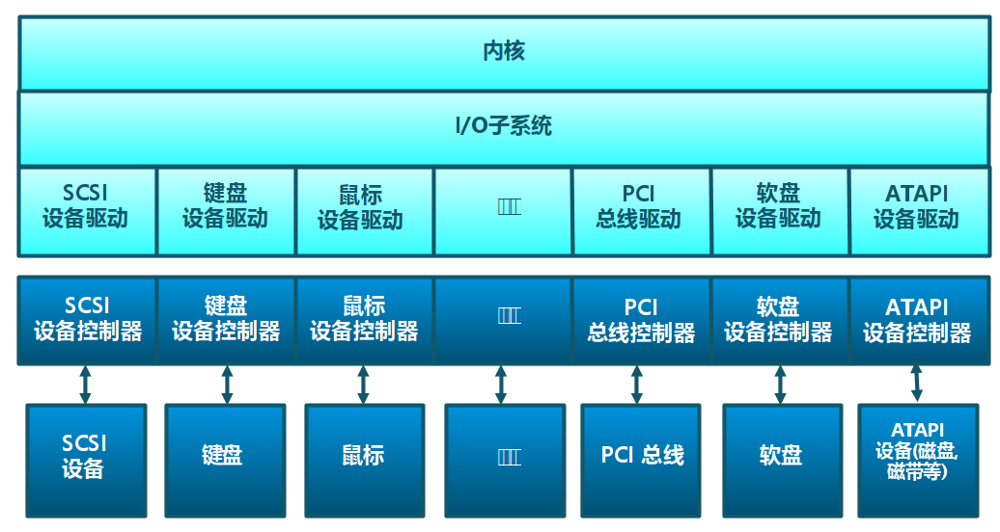

---
### I/O subsystem -- Common device interface types
- Common devices: character devices block devices network devices

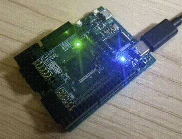
Embedded development boards that include the above peripherals

---
### I/O subsystem -- Common device interface types
Character devices: such as GPIO, keyboard/mouse, serial port, etc.

GPIO LED light

---
### I/O subsystem -- Common device interface types
Character devices: such as GPIO, keyboard/mouse, serial port, etc.

keyboard

---
### I/O subsystem -- Common device interface types
Character devices: such as GPIO, keyboard/mouse, serial port, etc.

UART serial communication

---
### I/O subsystem -- Common device interface types
Block devices: such as: disk drives, tape drives, optical drives, etc.

  Disk

 
---
### I/O subsystem -- Common device interface types
Network equipment: such as ethernet, wifi, bluetooth, etc.

Network card

 
---
### I/O Subsystem -- Device Access Features
Character device
- Sequential access in bytes
- I/O commands: get(), put(), etc.
- typically use the file access interface and semantics

 
---
### I/O Subsystem -- Device Access Features
Block device
- Uniform data block access
- I/O commands: raw I/O or file system interface, memory mapped file access
- Typically use the file access interface and semantics

 
---
### I/O Subsystem -- Device Access Features
Network equipment
- Formatted message exchange
- I/O commands: send/receive network packets, support multiple network protocols through the network interface
- Typically uses socket access interface and semantics

 
---
### I/O subsystem -- device transmission mode
- Programmed I/O (PIO, Programmed I/O)
- Interrupt based I/O
- Direct Memory Access (DMA)

  
 
---
### I/O subsystem -- device transmission mode
**Programmed I/O(PIO, Programmed I/O)**
- Port-mapped PIO (PMIO): via CPU in/out instruction
- Memory-mapped PIO (MMIO): transfer all data via load/store
- Simple hardware and easy programming
- CPU time consumed is proportional to the amount of data
- Ideal for simple, small device I/O
- I/O device notifies CPU: PIO polling

 
---

### I/O subsystem -- device transmission mode
**Interrupt transmission method**
- The I/O device wants to notify the CPU, it will send an interrupt request signal
- Interruptable devices and interrupt types gradually increased
- In addition to the need to set the CPU, also need to set the interrupt controller
- Programming is cumbersome
- High CPU utilization
- Suitable for more complex I/O devices
- I/O device notifies CPU: Reminder of interrupt mode

 
---
### I/O subsystem -- device transmission mode
**Interrupt transmission method**

 
---
### I/O subsystem -- device transmission mode
DMA transfer method
- The device controller has direct access to the system bus
- The controller directly transfers data to and from the memory
- In addition to the need to set the CPU, also need to set the interrupt controller
- Programming is cumbersome and requires CPU to participate in the settings
- The device transfers data without affecting the CPU
- Suitable for high-throughput I/O devices
 
---
### I/O subsystem -- CPU and device connection

---
### I/O Subsystem -- Example of reading data from disk
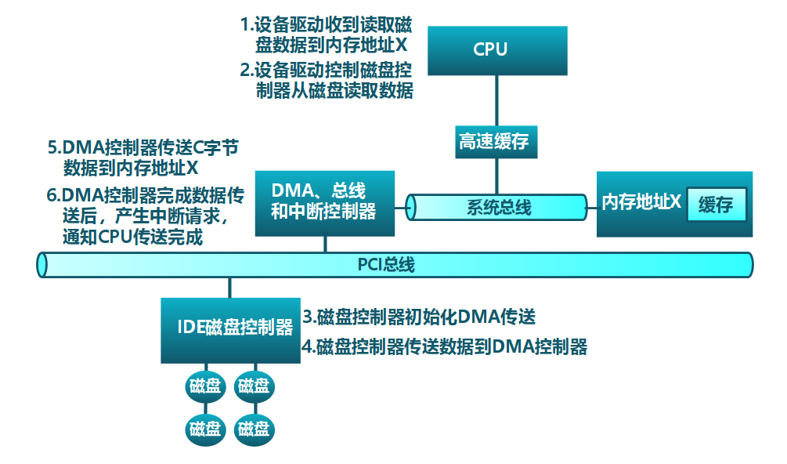

---
### I/O subsystem -- I/O request life cycle

---
### I/O Subsystem -- I/O Execution Model -- Interaction Protocol of I/O Interface
Polling-based abstract device interface: status command data
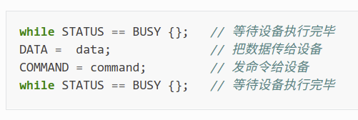

---
### I/O Subsystem -- I/O Execution Model -- Interaction Protocol of I/O Interface
Interrupt-based abstract device interface: status command data interrupt
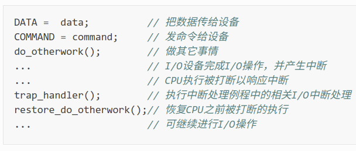

---
### I/O Subsystem -- I/O Execution Model -- Device Abstraction
**File-based I/O device abstraction**
- Access interface: open/close/read/write
- Special system calls: ioctl: input/output control
- The ioctl system call is very flexible, but it is too flexible, and the definition of the request code has no rules to follow
- The interface of the file is too user-oriented and not enough to cover the process of OS managing the device

---

### I/O Subsystem -- I/O Execution Model -- Device Abstraction
**Stream-based I/O device abstraction**
- A stream is a full-duplex connection between a user process and a device or pseudo-device
- Special system calls: ioctl: input/output control
- The ioctl system call is very flexible, but it is too flexible, and the definition of the request code has no rules to follow
- Dennis M. Ritchie wrote "A Stream Input-Output System", 1984

---

### I/O Subsystem -- I/O Execution Model -- Device Abstraction
**virtio-based I/O device abstraction**
- Rusty Russell proposed the general I/O device abstraction – virtio specification in 2008
- The virtual machine provides the implementation of the virtio device, and the virtio device has a unified virtio interface
- As long as the OS can implement these common interfaces, it can manage and control various virtio devices

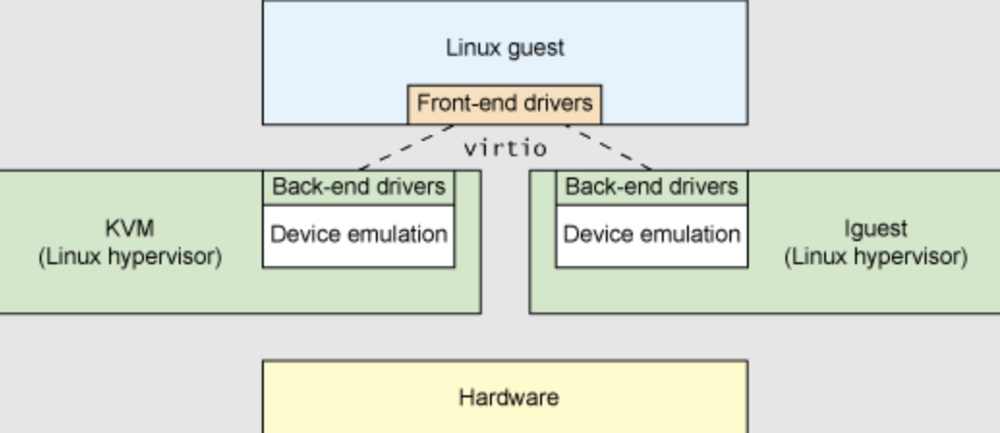

---

### I/O Subsystem -- I/O Execution Model -- Classification
When a user process issues a read I/O system call, it mainly goes through two stages:
1. Wait for the data to be ready;
2. Copy the data from the kernel to the user process

- Process execution status: blocking/non-blocking: the process will be blocked/non-blocking after executing the system call
- Message communication mechanism:
   - Synchronization: The operation between the user process and the operating system is coordinated by both parties and in step
   - Asynchronous: There is no need for coordination between the user process and the operating system, and they can perform their own operations at will

---
### I/O Subsystem -- I/O Execution Model -- Classification
- Blocking I/O
- Nonblocking I/O
- I/O multiplexing
- Signal driven I/O
- Asynchronous I/O

---
### I/O Subsystem -- I/O Execution Model -- Blocking I/O
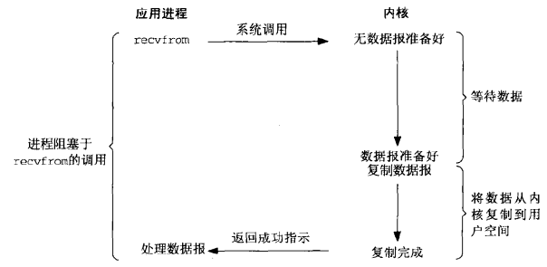

---

### I/O Subsystem -- I/O Execution Model -- Blocking I/O
The execution process of the file reading system call-read based on the blocking I/O (blocking I/O) model is:
1. The user process issues a read system call;
2. The kernel finds that the required data is not in the I/O buffer, and needs to issue an I/O operation to the disk driver, and keep the user process in a blocked state;
3. After the disk driver transfers the data from the disk to the I/O buffer, it notifies the kernel (usually through the interrupt mechanism), the kernel will copy the data from the I/O buffer to the buffer of the user process, and wake up the user process ( That is, the user process is in the ready state);
4. The kernel returns from the kernel mode to the user mode process, and the read system call is completed at this time.

---
### I/O subsystem -- I/O execution model -- non-blocking I/O
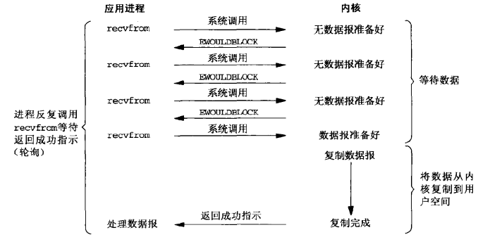

---

### I/O subsystem -- I/O execution model -- non-blocking I/O
The execution process of the file reading system call –read based on the non-blocking IO (non-blocking I/O) model:
1. The user process issues a read system call;
2. The kernel finds that the required data is not in the I/O buffer, and needs to issue an I/O operation to the disk driver, which does not block the user process, but immediately returns an error;
3. When the user process judges that the result is an error, it knows that the data is not ready, so it can send the read operation again (this step can be repeated multiple times);

---

### I/O subsystem -- I/O execution model -- non-blocking I/O

4. After the disk driver transfers the data from the disk to the I/O buffer, it notifies the kernel (usually through the interrupt mechanism).
Copy from the I/O buffer to the buffer of the user process;
5. The kernel returns from the kernel mode to the user mode process of the user mode, and the read system call is completed at this time.

Therefore, the characteristic of non-blocking I/O is that the user process will not be blocked by the kernel, but needs to constantly actively ask the kernel whether the required data is ready.

---
### I/O Subsystem -- I/O Execution Model -- Multiplexed I/O
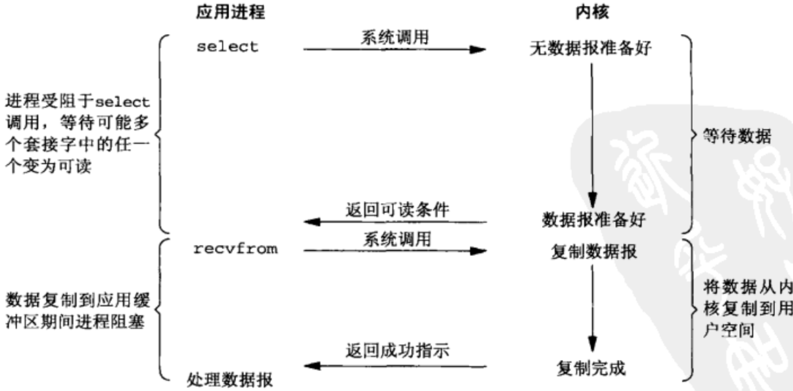

---

### I/O Subsystem -- I/O Execution Model -- Multiplexed I/O
Multiplexed I/O (I/O multiplexing) file read system call –read execution process:
1. The corresponding I/O system calls are select and epoll etc.
2. Continuously poll all file handles or sockets concerned by the user process through the select or epoll system call. When a certain file handle or socket has data, the select or epoll system call will return to the user process, and the user process will Call the read system call to let the kernel copy data from the kernel's I/O buffer to the buffer of the user process.

---
### I/O subsystem -- I/O execution model -- signal driven I/O (signal driven I/O)
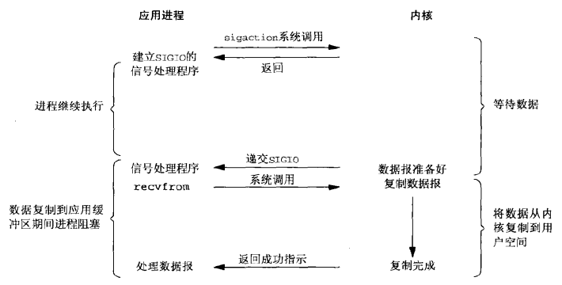

---

### I/O subsystem -- I/O execution model -- signal driven I/O (signal driven I/O)

1. When a process issues a read system call, it will register a signal processing function with the kernel, and then the system call returns, and the process will not be blocked, but will continue to execute.
2. When the IO data in the kernel is ready, a signal will be sent to the process, and the process will call the IO to read the data in the signal processing function.

The characteristic of this model is that a callback mechanism is used, which makes it more difficult to develop and debug applications.

---
### I/O Subsystem -- I/O Execution Model -- Asynchronous I/O (Asynchronous I/O)
1. After the user process initiates the read asynchronous system call, it can immediately start to do other things.
2. From the perspective of the kernel, when it receives a read asynchronous system call, it will return immediately first, so there will be no blocking of the user process.
3. The kernel will wait for the data preparation to be completed, and then copy the data to user memory.
4. When all this is done, the kernel notifies the user process that the read operation is complete.

---
### I/O Subsystem -- I/O Execution Model -- Comparison
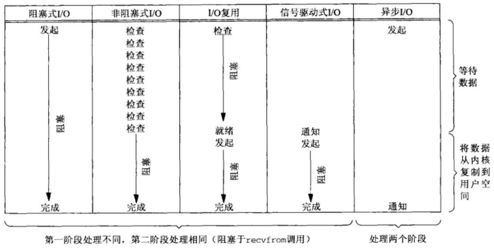

---

### I/O Subsystem -- I/O Execution Model -- Comparison

1. Blocking I/O: After the user process issues an I/O system call, the process will wait for the IO operation to complete, making other operations of the process impossible to perform.
2. Non-blocking I/O: After the user process issues an I/O system call, if the data is not ready, the I/O operation will return immediately, and then the process can perform other operations; if the data is ready, the user process will Data copying is done through system calls and then data processing is performed.
3. Multiplexing I/O: Combine the polling operations of multiple non-blocking I/O requests into one select or epoll system call.
4. Signal-driven I/O: Use the signal mechanism to complete the event notification from the kernel to the application process.
5. Asynchronous I/O: It will not cause the requesting process to block.