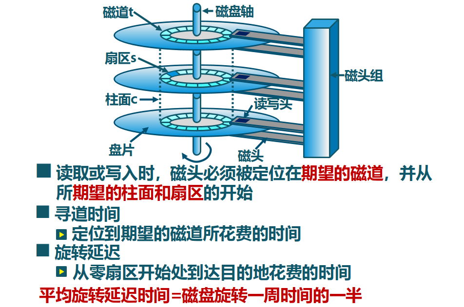
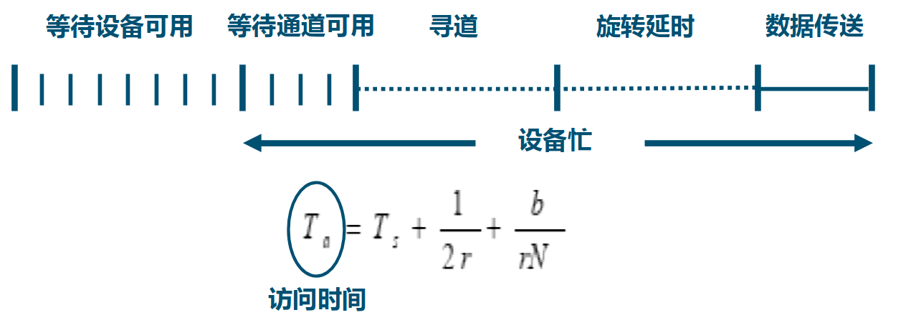
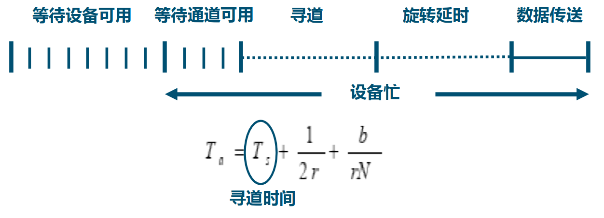
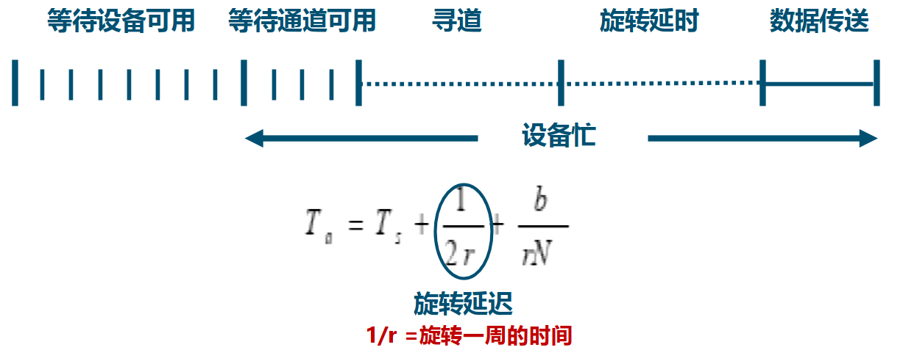
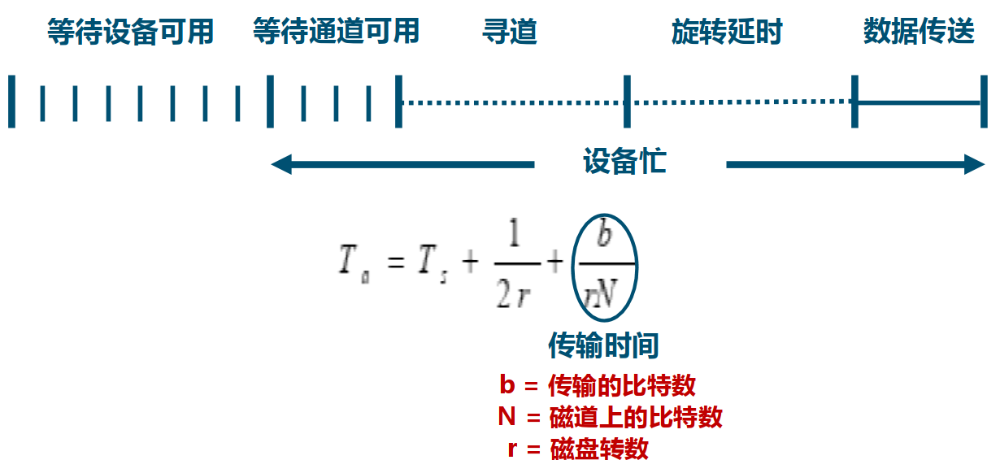
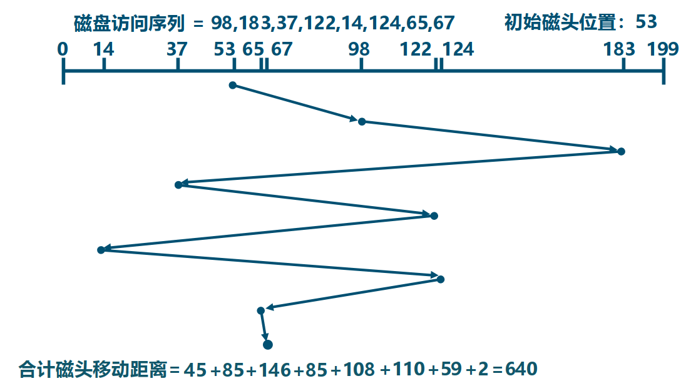
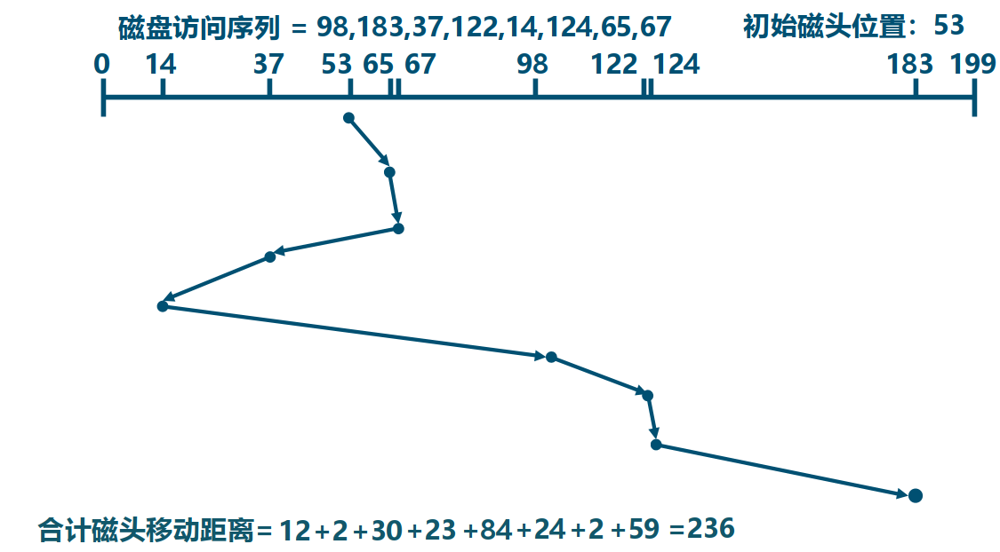

<!-- theme: gaia -->
<!-- _class: lead -->

# Lecture 13 Device Management
## Section 2 Disk Subsystem

---
### Disk -- Overview
Disk working mechanism and performance parameters

---
### Disk -- Overview
Disk I/O transfer time

---
### Disk -- Overview
Disk I/O transfer time

---
### Disk -- Overview
Disk I/O transfer time

---
### Disk -- Overview
Disk I/O transfer time

---
### Disk --disk scheduling algorithm
Improve disk access performance by optimizing the order of disk access requests
- Seek time is the most time-consuming part of disk access
- There will be multiple I/O requests on the same disk at the same time
- Poor performance with random disk access requests

---
### Disk --disk scheduling algorithm -- FIFO

---
### disk --disk scheduling algorithm -- FIFO
- First in first out (FIFO) algorithm
- Process requests sequentially
- Fair treatment of all processes
- Near random scheduling performance with many processes

---
### Disk -- Disk Scheduling Algorithm -- Shortest Service Time First (SSTF)
- Choose the I/O request that requires the least movement from the arm's current position
- Always choose the shortest seek time
  

 
---
### Disk --disk scheduling algorithm -- scanning algorithm (SCAN)
  

---
### Disk --disk scheduling algorithm -- scanning algorithm (SCAN)
- The magnetic arm moves in one direction, accessing all outstanding requests
- Until the arm reaches the last track in that direction, reverse direction
- Also known as elevator algorithm (elevator algorithm)

---
### Disk --Disk Scheduling Algorithm -- Cyclic Scanning Algorithm (C-SCAN)
- Restricted to scan in one direction only
- When the last track has been accessed, the magnetic arm returns to the other end of the disk to perform the C-LOOK algorithm again
- The magnetic arm goes to the last request in that direction first, then immediately reverses, instead of first going to all requests on the path of the last point

----
### Disk --disk scheduling algorithm -- cycle scanning algorithm (N-step-SCAN)
- Arm Stickiness phenomenon
    - In algorithms such as SSTF, SCAN and CSCAN, the magnetic head may stay in a certain place
- N-step scanning algorithm
    - Divide the disk request queue into subqueues of length N
    - Process all subqueues sequentially according to FIFO algorithm
    - The scanning algorithm processes each queue

----
### Disk --Disk Scheduling Algorithm -- Double Queue Scanning Algorithm (FSCAN)

FSCAN algorithm
- Divide disk I/O requests into two queues
- Alternately use the scanning algorithm to process a queue
- Newly generated disk I/O requests are placed in another queue
- All new requests will be deferred until the next scan

The FSCAN algorithm is a simplification of the N-step scan algorithm
FSCAN only splits the disk request queue into two subqueues