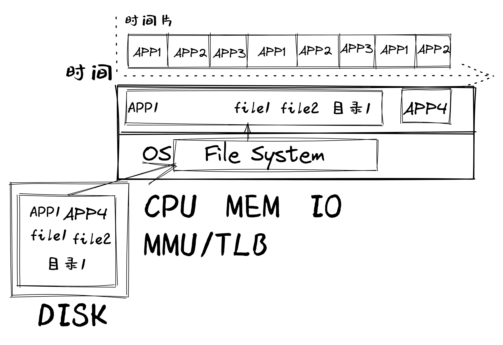
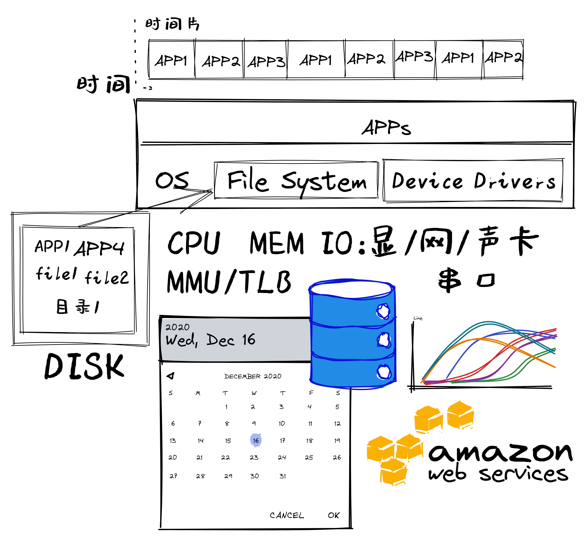

<!-- theme: gaia -->
<!-- _class: lead -->

# Lecture 2 Introduction to Practice and Experiments
## Section 1 Brief Analysis of Practice and Experiment

 
 

Xiang Yong Chen Yu Li Guoliang

 
 

Fall 2022

---
Outline

### 1. Principle, practice and experiment introduction
2. Step-by-step OS experimentation
3. Experimental arrangement

---

##### Meet the increasing demands of the application
* LibOS
* Batch OS
* Multiprogramming and time-sharing multitasking OS

---

##### Gradually reflect the conceptual abstraction of the operating system

* Address space abstract OS
* Process abstraction OS
* File abstraction OS
---

##### Gradually reflect the key capabilities of the operating system

* OS capable of inter-process communication
* Concurrent OS
* OS that manages I/O devices
---
Outline

1. Introduction to Principles, Practice and Experiments
### 2. Step-by-step operating system experiments
3. Experimental arrangement

---

#### LibOS

- The prototype of the ancient operating system
- Modern simple embedded operating system

##### Related Knowledge Points
- Function call: the cooperation between the compiler and the operating system
- Hardware start and software start
- Write/debug bare metal programs

Bare Metal Program: an OS-type program that has nothing to do with the operating system

---

#### Batch OS
- Support system calls

##### Related Knowledge Points

- Privileged level/privileged operation
- RISC-V privilege level/privileged operation
- system calls/exceptions
- Load & Execute & Switch Apps
- Privilege level switching

---

#### Multiprogramming OS
- Support multiple programs **resident in memory at the same time**
- Support multiple programs **sequence execution**
##### Related Knowledge Points
- Memory space division and management
- Collaborative Scheduling

---

#### Time-sharing multitasking OS
- Support multiple programs **take turns**

##### Related Knowledge Points
- **Interrupt handling**
- context switching
- Preemptive scheduling

---
#### OS address space abstraction
- Support **memory space isolation** between programs

##### Related Knowledge Points
- Address space abstraction
- static memory allocation
- Dynamic memory allocation
- Page storage management

---
#### OS address space abstraction
- **Virtual storage beyond physical memory**
##### Related Knowledge Points
- Principle of locality
- Page fault exception
- Virtual page storage
- Permutation algorithm

---

#### OS Process Abstraction

- Support **dynamic creation** program execution

##### Related Knowledge Points

- Process abstraction
- Process management
- Scheduling mechanism
  

---

#### OS Process Abstraction

- Supports multi-processor **parallelism**

##### Related Knowledge Points
- Multi-processor/multi-core architecture
- Multiprocessor scheduling
- Actual OS scheduling
  

---
#### OS file abstraction
- **Convenient persistent storage** for processing data

##### Related Knowledge Points
- Document abstraction
- File organization
- File system design and implementation

---

#### An OS capable of interprocess communication
- Explicit/implicit **interaction** information between processes
##### Related Knowledge Points
- Signals, pipes
- Message queue, shared memory
- I/O redirection

---
#### Concurrent OS
- Improve CPU **utilization**
##### Related Knowledge Points
- Thread: user/kernel thread
- Coroutines
- The relationship between processes, threads and coroutines

---

#### Concurrent OS
- Reasonable **shared resources**
- Synchronization and mutual exclusion
##### Related Knowledge Points
- Mechanism for synchronizing mutual exclusion
- Synchronized mutual exclusion solves concurrency problems
- Problems such as deadlock

---
#### OS for managing I/O devices
- Support various peripherals
##### Related Knowledge Points
- Device abstraction
- Device Execution Model
- Synchronous/Asynchronous I/O
- I/O device management

---
Outline

1. Introduction to Principles, Practice and Experiments
2. Step-by-step OS experimentation
### 3. Experimental arrangement

---

#### Experiment 1: Basic support of the operating system
##### Override content
* LibOS, batch OS, multiprogramming and time-sharing multitasking OS
##### Knowledge Point: Privilege Level and Switching
- Computer/OS startup
- Privilege level switching, system calls, privilege level related exceptions, task switching
- Application/library/kernel relationship

---

#### Experiment 2: Address Space
##### Override content
* Address space abstract OS
##### Knowledge point: page table
- Address space
- Data interaction/control interaction between application and kernel in different address spaces
- Memory/address-related exceptions (such as page fault exceptions)

---

#### Experiment 3: Process Management and Scheduling
##### Override content
* Process abstraction OS
##### Knowledge point: process control block PCB
- Process management
- Scheduling Algorithm

---

#### Experiment 4: Communication between file system and process
##### Override content
* File-abstract OS, OS with inter-process communication
##### Topics: Files
- File system implementation
- Inter-process communication mechanism

---
#### Experiment 5: Synchronizing Mutex
##### Override content
* Concurrent OS
##### Knowledge points
- Thread
- The mechanism of synchronous mutual exclusion, solving the problem of synchronous mutual exclusion and deadlock
- Priority inversion problem

---

#### Reference implementation of teaching experiments

* Reference implementation
     * [uCore](https://github.com/uCore-RV-64/uCore-RV-64-answer)
     * [rCore](https://github.com/zflcs/rCore)
     * [Modular rCore](https://github.com/YdrMaster/rCore-Tutorial-in-single-workspace/)
* Suggestions for the content of the experiment report
     * Experiment start time, completion time and number of code submissions
     * The main problems and solutions you encountered in the experiment
     * How does your answer differ from the reference implementation?

---

#### Extended experiment (ie big experiment, course design)

After completing the basic experiment 1~5 within 4 weeks, negotiate with the teacher: choose to complete the extended experiment instead of the exam

**Complete the basic experiment early, and start the extended experiment earlier**

Implement support for new features (multi-core, new peripherals, new processors, new functions)

Such as supporting games, Raspberry Pi/SiFive, network, USB, AI, etc.

Participate in the National Undergraduate OS Competition