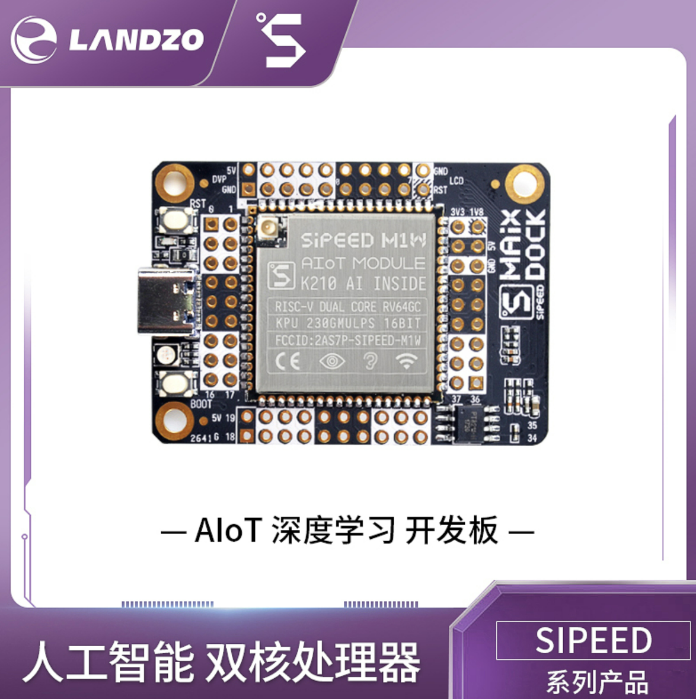
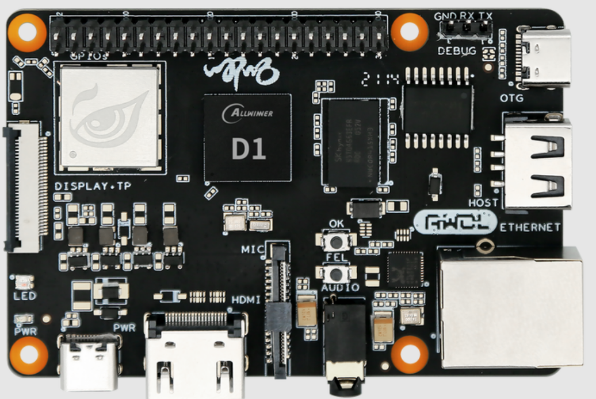

<!-- theme: gaia -->
<!-- _class: lead -->

# Lecture 2 Introduction to Practice and Experiments
## Section 3 Hardware Startup and Software Startup

<br>
<br>

Xiang Yong Chen Yu Li Guoliang

<br>
<br>

Fall 2022

---
Outline

### 1. RISC-V development board
2. QEMU startup parameters and process
3. x86 boot process

---
#### K210 Development Board
- Based on RISC-V 64 multi-core processor


---
#### Nezha D1 development board
- Based on RISC-V 64 single-core processor


---
#### HiFive Unmatched Development Board (U740)
- Based on RISC-V 64 multi-core processor


---
Outline

1. RISC-V development board
### 2. QEMU startup parameters and processes
3. x86 boot process

---

#### QEMU Emulator

Use the software qemu-system-riscv64 to simulate a 64-bit RISC-V architecture computer, which contains:
- A CPU (adjustable to multi-core)
- A piece of physical memory
- Several I/O peripherals

---
#### QEMU startup parameters
```
qemu-system-riscv64 \
     -machine virt \
     -nographic \
     -bios ../bootloader/rustsbi-qemu.bin \
     -device loader, file=target/riscv64gc-unknown-none-elf/release/os.bin, addr=0x80200000
```
- -machine virt means set up the simulated 64-bit RISC-V machine as a virtual machine named virt
- The default size of physical memory is 128MiB

---
#### QEMU startup parameters
```
qemu-system-riscv64 \
     -machine virt \
     -nographic \
     -bios ../bootloader/rustsbi-qemu.bin \
     -device loader, file=target/riscv64gc-unknown-none-elf/release/os.bin, addr=0x80200000
```
-nographic means that the emulator does not need to provide a graphical interface, but only needs to output character streams externally


---
#### QEMU startup parameters
```
qemu-system-riscv64 \
     -machine virt \
     -nographic \
     -bios ../bootloader/rustsbi-qemu.bin\
     -device loader, file=target/riscv64gc-unknown-none-elf/release/os.bin, addr=0x80200000
```
- -bios can set the bootloader (bootloader) used to initialize the QEMU emulator when it is powered on
- Use precompiled rustsbi-qemu.bin here

---
#### QEMU startup parameters
```
qemu-system-riscv64 \
     -machine virt \
     -nographic \
     -bios ../bootloader/rustsbi-qemu.bin\
     -device loader, file=target/riscv64gc-unknown-none-elf/release/os.bin, addr=0x80200000
```
- The loader parameter of device can load a file on the host into the specified location of QEMU's physical memory before the QEMU emulator starts
- The file and addr parameters can set the path of the file to be loaded and the physical address of the QEMU physical memory where the file is loaded

---
#### QEMU startup process

```
qemu-system-riscv64 \
     -machine virt \
     -nographic \
     -bios ../bootloader/rustsbi-qemu.bin\
     -device loader, file=target/riscv64gc-unknown-none-elf/release/os.bin, addr=0x80200000
```
Generally speaking, the startup process after the computer is powered on can be divided into several stages. Each stage is responsible for a layer of software. The function of each layer of software is to perform the initialization work it should undertake, and then jump to the next stage. The entry address of a layer of software, that is, the control of the computer is handed over to the next layer of software.

---

<style scoped>
{
  font-size: 30px
}
</style>


#### QEMU startup process

```
qemu-system-riscv64 \
     -machine virt \
     -nographic \
     -bios ../bootloader/rustsbi-qemu.bin\
     -device loader, file=target/riscv64gc-unknown-none-elf/release/os.bin, addr=0x80200000
```
The startup process of QEMU simulation can be divided into three stages:
1. [Short piece of assembler program](https: //github.com/LearningOS/qemu/blob/386b2a5767f7642521cd07930c681ec8a6057e60/hw/riscv/virt.c#L536) initialize and jump to execute bootloader;
2. The bootloader is responsible for initializing and loading the OS, and jumping to OS execution;
3. Initialization is performed by the kernel.

---
Outline

1. RISC-V development board
2. QEMU startup parameters and process
### 3. x86 startup process

---

<style scoped>
{
  font-size: 33px
}
</style>


#### The boot process of a real computer (x86)
In fact, the boot process of the startup firmware of the x86-based PC has not changed in essence since the first day of the birth of the IBM PC.

1. Rom Stage: Run the BIOS code directly on the ROM at this stage;
2. Ram Stage: Run code on RAM at this stage, detect and initialize chipset, motherboard, etc.;
3. Bootloader Stage: Find the Bootloader on the storage device, load and execute the Bootloader;
4. OS Stage: Bootloader initializes the peripherals, finds the OS on the storage device, loads and executes the OS.