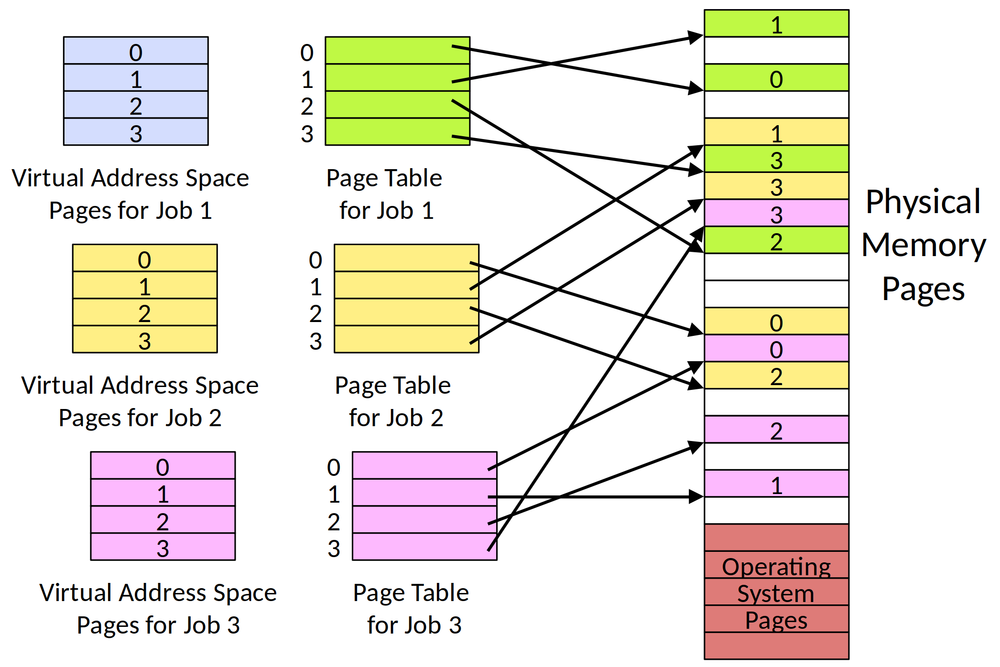
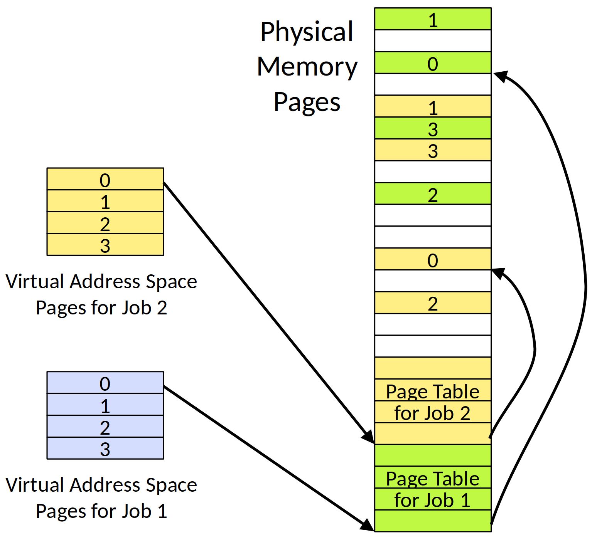
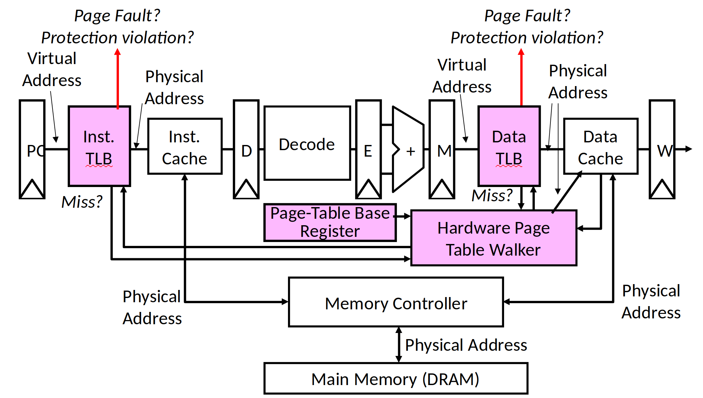

<!-- theme: gaia -->
<!-- _class: lead -->

# Lecture 3 Isolation and batch processing based on privilege level
## The first section looks at the computer system from the perspective of OS

 
 

Xiang Yong Chen Yu Li Guoliang

 
 

Fall 2022

---
**Outline**

### 1. The relationship between OS and hardware
2. The relationship between OS and applications
3. Isolation mechanism

---

#### Computer System

A computer system (computer architecture) is an **level of abstraction** designed** to implement **information processing** applications that make efficient use of **existing manufacturing technologies**.
-- cs-152 berkeley
 
---
#### Computer System Abstraction Level

**HARDWARE** SUPPORTED **OS** SUPPORTED **APPLICATIONS**

* The operating system is located between the hardware (HW) and the application (APP)
* Only by understanding the relationship between OS and HW/APP can you better grasp the OS

---
#### Instruction set: hardware and software interface
**Boundary** between **hardware** and **OS**: instruction set + registers

---
#### OS is the virtualization and abstraction of hardware

---
#### RISC-V processor architecture
 

---
The framework structure of u/rCore

---
**Outline**

1. The relationship between OS and hardware
### 2. The relationship between OS and applications
3. Isolation mechanism

---
#### OS Support for Application Execution
- Provide services
- System calls
- Address space layout
---
#### OS provides services for applications
* Provide services through **system calls**
* **System call**: OS/APP interface (one of the boundaries)

---
#### How to implement the system call?
- What happens when calling `ssize_t read(int fd, void *buf, size_t count);`?
- Can the functions of the kernel be called directly in the application?
- Can I use application normal function calls in the kernel?

---
#### The purpose of introducing system calls is to enhance security and reliability

- Characteristics of function calls
   - Benefits: fast execution;
   - Benefits: flexible - easy to pass and return complex data types;
   - Benefits: Mechanisms familiar to programmers,...
   - Bad: app is unreliable, may be malicious, risk of crashing

<!--
---
  ## Relationship between OS and application -- syscall

---
## Relationship between OS and application -- syscall

 -->

---
#### Process address space
The address space (memory layout) of the process is the **boundary** that defines the OS/APP.

---
#### OS kernel and application process address space division

The address space (memory layout) of the process is the **boundary** that defines the OS/APP.

---
#### Kernel page table isolation (KPTI, kernel page-table isolation)

---
**Outline**

1. The relationship between OS and hardware
2. The relationship between OS and applications
### 3. Isolation mechanism
* Why isolate
* Isolate the problem to be solved
* Method of isolation

---
#### Isolate the problem to be solved
- prevent program X from corrupting or monitor program Y
   - read/write memory, use 100% CPU, change file descriptors
- Prevent processes from interfering with the operating system
- Protection from malicious programs, viruses, trojans and bugs
   - erroneous processes may try to trick the hardware or the kernel

---
#### What is quarantine?
- **Definition** of isolation
   - Applications in the operating system do not **affect** (or disrupt) the normal **execution** or information **disclosure** of other applications or the operating system
- The **Essence of Isolation**
   - Appears only when there is a need to exchange information or share resources
- Quarantine doesn't mean don't share

---
#### Isolation Boundary
Isolation requires a boundary
- Boundaries determine their respective spheres of influence
   - Shared resources with **risk** across borders
- Mandatory isolation
   - Avoid the safety impact of the faulty unit on the whole system
- Isolated unit
   - Usually the program that runs

<!-- https://blog.csdn.net/ceshi986745/article/details/51787424
Ape Science~Six isolation techniques that programmers must know -->

---
#### Isolation method

- Classification of methods of isolation
   - **Software** based isolation
   - **Hardware** based isolation
   - **Network** based isolation
---

#### Classification of OS isolation APP
* Isolation of **Control**: Privileged Level Mechanism
   * User Mode vs Kernel Mode
* Isolation of **data**: address space
   * User address space vs kernel address space
* Isolation for **time**: interrupt handling
   * Interrupt the running user state App at any time
* Handling of destructive isolation: **exception handling**
   * The OS handles the abnormal behavior of the App in the user mode in a timely manner in the kernel mode

---

#### Data Isolation: Virtual Memory

- Virtual Memory
   - Security issues of reading and writing memory
   - Security issues between processes
   - The problem of memory space utilization
   - The efficiency of memory read and write
- Address spaces address spaces
   - A program addresses only its own memory
   - Without permission, **Each program cannot access memory that does not belong to it**

---
#### How virtual memory works

<!-- ---
---
## Isolation mechanism -- the main isolation method -- virtual memory

## Isolation mechanism -- the main isolation method -- virtual memory

---
## Isolation mechanism -- the main isolation method -- virtual memory

---
## Isolation mechanism -- the main isolation method -- virtual memory
 -->

---
#### Control Isolation: Privileged Mode
- Privileged mode in CPU hardware
   - Prevent applications from accessing device and sensitive CPU registers
     - Address Space Configuration Register
     - Shutdown related commands or registers
     -...

---
#### Privileged Mode

- CPU hardware supports different privileged modes
   - Kernel Mode (kernel mode) vs User Mode (user mode)
   - Kernel mode can perform privileged operations that user mode cannot perform
     - Access to **Peripherals**
     - **configure** address space (virtual memory)
     - Read/write special **system-level registers**
- The OS kernel runs in kernel mode
- The application runs in user mode
- Every microprocessor has similar user/kernel mode flags

---
#### Time Isolation: Interrupt/Exception Mechanism
- CPU **hardware support** interrupt/exception handling
- Timely response and handling of **abnormal behavior** of the application
- Interrupt applications that are constantly hogging the CPU
- Interrupts occur **asynchronously** as a result of signals from I/O devices external to the processor.
   - Asynchronous means that the hardware interrupt is not caused by any one dedicated CPU instruction.

---
#### Interrupt handling routine

- Interrupt handler: a handler for hardware interrupts/exceptions
   1. The I/O device triggers an interrupt by signaling a pin on the processor chip and placing the exception number on the system bus;
   2. After the current instruction is executed, the processor reads the exception number from the system bus, saves the scene, and switches to **kernel mode**;
   3. The interrupt handler routine is called, and when the interrupt handler completes, it returns control to the next instruction that would have been executed.

---
#### Clock Interrupt
- Timer can generate interrupts in a stable and regular manner
   - Prevent applications from hogging the CPU
   - Allow the OS kernel to perform resource management periodically

---
### Summary

- Understand the relationship between computer hardware and operating system: interface/boundary
- Understand the relationship between operating systems and applications: interfaces/boundaries
- Understand how the operating system isolates and restricts applications