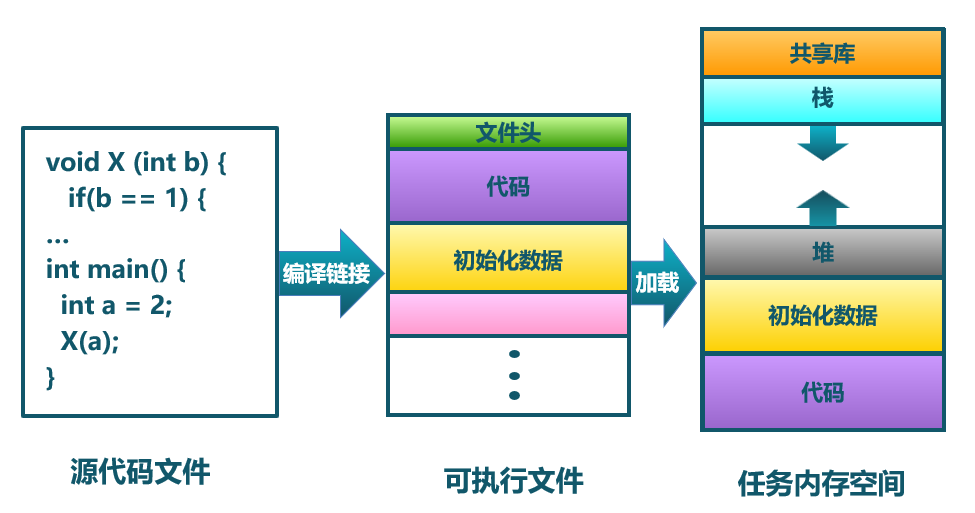
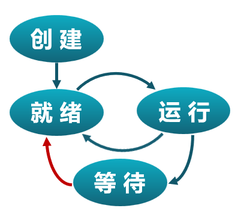
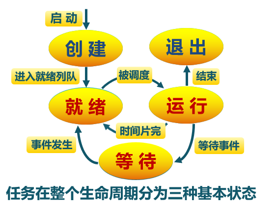

<!-- theme: gaia -->
<!-- _class: lead -->

# Lecture 4 Multiprogramming and time-sharing multitasking
## Section 1 Process and Process Model
 
 

Xiang Yong Chen Yu Li Guoliang

 
 

Fall 2022

---
**Outline**

### 1. Multiprogramming and Cooperative Scheduling
2. Time-sharing multitasking and preemptive scheduling
3. The concept of process
4. Process Model

---

#### History

The widespread use of operating systems began during the transition from mainframes to minicomputers.

- OS/360 is a multi-program batch operating system in the mainframe (System/360) era
- PDP series minicomputers from Digital Equipment Corporation (DEC)
- A group of people within a work unit may have their own computers
- Multiprogramming becomes common

---

#### Multiprogramming

- Existence of multiple executables in memory
- Each executable program shares the processor

##### job
- One **execution process** of the application

Terms that have appeared in history: Job, Multiprogramming
- Job and Multiprogramming are concepts used by IBM for multiprogramming.

---

#### Cooperative scheduling

- Executables voluntarily relinquish processor usage
- The operating system does not interrupt the running program
- The operating system chooses the next processor to use for execution

---
**Outline**

1. Multiprogramming and Cooperative Scheduling
### 2. Time-sharing multitasking and preemptive scheduling
3. The concept of process
4. Process Model

---
#### History

The popularity and widespread use of minicomputers has driven the demand for time-sharing and multitasking, forming a time-sharing operating system that supports multiple users.

- DEC's PDP and VAX minicomputers gradually eroded the mainframe market
- DEC's VMX operating system
- MIT's CTSS operating system
- AT&T's UNIX operating system

---
#### Time-sharing multitasking from the user's perspective

Time sharing multitask: from the user's perspective

- Existence of multiple executable programs in memory
- Each executable program time-shares the processor
- The operating system allocates CPU usage time to each executable program by time slice
- **Process (Process)**: an execution process of the application

---
#### Time sharing multitask from the perspective of OS

- **Process (Process)**: A dynamic **execution process** of a program with certain **independent functions** on a **data collection**. Also known as **Task (Task)**.
- Switching from the process corresponding to one application to the process corresponding to another application is called **process switching**.

---
#### Job, Task and Process

Terms that have appeared in history: Job, Task, Process
- Task and Process are concepts proposed by Multics and UNIX for time-sharing and multi-tasking
- A process is one execution of an application. In operating system context, task and process are synonymous
- A job (goal) is a whole formed by a group of interrelated program execution processes (processes, tasks) around a common goal

Reference: [Difference between Job, Task and Process](https://www.geeksforgeeks.org/difference-between-job-task-and-process/)

---
#### Preemptive scheduling

- Process passively relinquishes processor usage
- The process uses the processor in turn according to the time slice, which is a combination of "pause-continue" execution process
- Based on the clock hardware interrupt mechanism, the operating system can interrupt the program being executed at any time
- The operating system chooses the next processor to use for execution

---
**Outline**

1. Multiprogramming and Cooperative Scheduling
2. Time-sharing multitasking and preemptive scheduling
### 3. The concept of process
4. Process Model

---

#### Process switching

---

#### Process Features
- Dynamic
   - Start execution --> Pause --> Continue --> End the execution process
- Concurrency
   - Multiple processes are executing for a period of time
- Limited independence
   - There is no need to perceive the existence of each other between processes

There are currently no more powerful features
- More thorough isolation, collaborative work between tasks, task creation tasks...

---
#### Composition of processes and programs

---
#### Composition of processes and programs

---

#### Correspondence between processes and programs

- A task is an abstraction of a program in the execution state of the operating system
   - program = file (static executable)
   - task = program in execution = program + execution status
 
- Multiple executions of the same program correspond to different tasks
   - For example, multiple executions of the command "ls" correspond to multiple tasks
 
- Resources required for task execution
   - Memory: holds code and data
   - CPU: execute instructions

---
#### The difference between tasks and programs

- Tasks are dynamic, procedures are static
   - A program is a collection of ordered codes
   - A task is the execution of a program
- Tasks are temporary, programs are permanent
   - A task is a state-changing process
   - Quests can be saved for a long time
- Tasks are composed differently than programs
   - The task consists of program, data and process control blocks

---
#### Process Status
A process contains all state information about a running program
- **Control Flow** for Task Execution
   - Code content and code execution location (code segment)
- **data** accessed by the task
   - Memory read and written by tasks (heap, stack, data segment)
   - Registers read and written by tasks
     - general purpose registers

---
#### Process Status
A process contains all state information about a running program
- OS management task related data (**context** of the task)
     - General purpose registers required for task switching
     - Status registers required for task switching (PC, etc.)
     - Other information: the stack address of the task, etc.
     - Additional resources:  …

---
#### Task Control Block (TCB, Task Control Block)
The core data structure of the operating system management task, also known as the process control block (PCB, Process Control Block)
- The operating system **manages and controls the collection of information used by the process to run**
- The operating system uses TCB to describe the basic situation of the process and the process of running changes
- TCB is the only sign that the process exists
- Each task has a corresponding TCB in the operating system

---
#### Operating system managed process control block

---
**Outline**

1. Multiprogramming and Cooperative Scheduling
2. Time-sharing multitasking and preemptive scheduling
3. The concept of process
### 4. Process Model

---
#### Process status: created and ready
- create --> ready
   - When was it created?
   - How to create?

---
#### Process Status: Running
- Create --> Ready --> Execute
   - The kernel selects a ready task
   - How?

---
#### Process Status: Waiting
- Create --> Ready --> Execute --> Wait
   - Why did the task go into waiting?
     - itself
     - the outside world

---
#### Process state transition: wake up
- Create --> Ready --> Execute --> Wait --> Wake up
   - The reason for waking up the task?
     - Self: wake up naturally?
     - Outside: Woke up?
       

---
#### Process state transition: preemption
- Create --> Ready --> Execute --> Preempt
   - Why is the task preempted?
  

---
#### Process Status: Exited
- Create --> Ready --> Execute --> ...... --> End
   - Why did the task exit?
     - Volunteer?
     - forced?

---
#### Three-state process model

---
#### Process state transition and system call

- Create --> Ready --> Execute --> ...... --> End
- preempt wait wake

What system calls are involved?
- exit
- sleep
-...

---
#### Process state transition and process switching

- Create --> Ready --> Execute --> ...... --> End
- preempt wait wake

During the lifecycle of a task, when does a task switch occur?

---
#### Process switching

