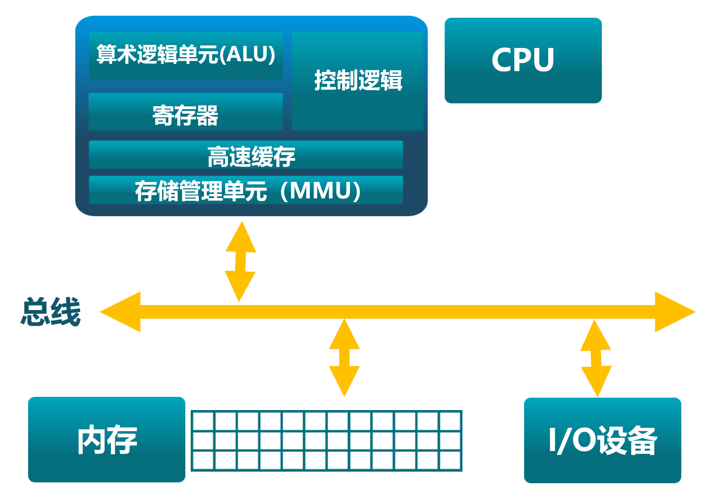

<!-- theme: gaia -->
<!-- _class: lead -->

# Lecture 5 Physical memory management
## Section 1 address space
 
 

Xiang Yong Chen Yu Li Guoliang

 
 

Fall 2022

---
**Outline**

### 1. Computer storage hierarchy
2. Addresses and Address Spaces
3. The role of virtual storage

---

#### Physical address and logical address

- Physical Address (PA, Physical Address): Used for unit addressing at the memory chip level, corresponding to the **address bus** connected to the processor and CPU.
- Logical address (LA, Logical Address): When **CPU executes machine instructions**, it is used to specify an operand or the address of an instruction. It is also the address used by the user when programming.
- Linear address (linear address) or also called virtual address (virtual address): Similar to logical address, it is also an unreal address.
   - The logical address refers to the address of the CPU before segment memory management conversion;
   - The linear address refers to the address of the CPU before the paging memory management conversion.

---
#### The relationship between logical address and physical address

- Logical address to physical address translation
   - Logical Address -> Linear Address (Virtual Address) -> Physical Address

- In the absence of segmented memory management, the logical address is the same as the virtual address
- In the absence of paging memory management, the logical address, virtual address and physical address are all the same

---
#### Computer Storage Hierarchy

---

#### Computer storage multi-layer structure

---
#### The abstraction of memory resources by the operating system

---

#### Memory Management

- **Memory management method** in the operating system
   - Relocation
   - Segmentation
   - Paging
   - Virtual memory/storage
- **The memory management of the operating system is highly dependent on the hardware**
   - Tightly coupled with computer storage architecture
   - MMU (Memory Management Unit): hardware that handles CPU memory access requests

---
**Outline**

1. Computer storage hierarchy
### 2. Address and address space
3. The role of virtual storage

---

#### Definition of address space

- Physical address space: the address space of physical memory
   - Starting address $0$, until $MAX_{phy}$
- Virtual address space: the address space of virtual memory
   - Starting address $0$, until $MAX_{virt}$
- Logical address space: The address space where the program executes
   - Starting address $0$, until $MAX_{prog}$

The **perspectives of the three address spaces are different**

---

#### Logical address generation

---

#### Address Generation Timing

- at compile time
   - Assume starting address **known**
   - must be recompiled if the starting address changes
- while loading
   - If the start address **unknown** at compile time, the compiler needs to generate relocatable code (relocatable code)
   - When loading, the position can not be fixed, and an absolute (virtual) address is generated
- at execution time
   - Code cannot be modified at execution time
   - Requires **address translation (mapping) hardware** support

---

#### Address generation process
- CPU
   - ALU: memory content that requires **logical address**
   - MMU: **Convert** between logical address and physical address
   - CPU control logic: Send **Physical Address** request to the bus
- Memory
   - Send the content of **Physical Address** to the CPU
   - Receive CPU data to physical address
- operating system
   - Establish a mapping between logical address LA and physical address PA

---

#### Address checking

---
**Outline**

1. Computer storage hierarchy
2. Addresses and Address Spaces
### 3. The role of virtual storage

---

#### External memory cache

Virtual memory can be used as a cache for external memory

- **Common data** placed in physical memory
- **Infrequently used data** placed in external storage
- The running program **directly uses the virtual memory address**, no need to pay attention to whether it is placed in physical memory or external memory

---

#### Simplify application compilation and loading and running

Each running program has **independent address space**, regardless of the actual storage of code and data in physical memory, thus simplifying:
- Compiled executable linking process
- Executor loading process of the operating system
- Sharing: dynamic link library, shared memory
- Memory allocation: physically discontinuous, virtual contiguous

---

#### Protecting Data

Virtual memory protects data
- **Separate address space** makes it easy to distinguish the memory of different processes
- Address translation mechanism can perform read/write/executable checks
- Address translation mechanism can perform privilege level check
