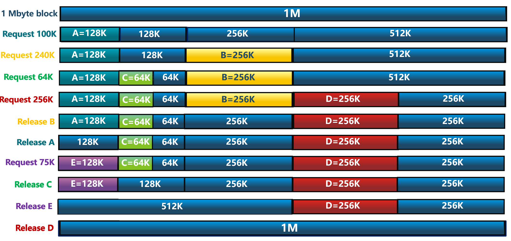
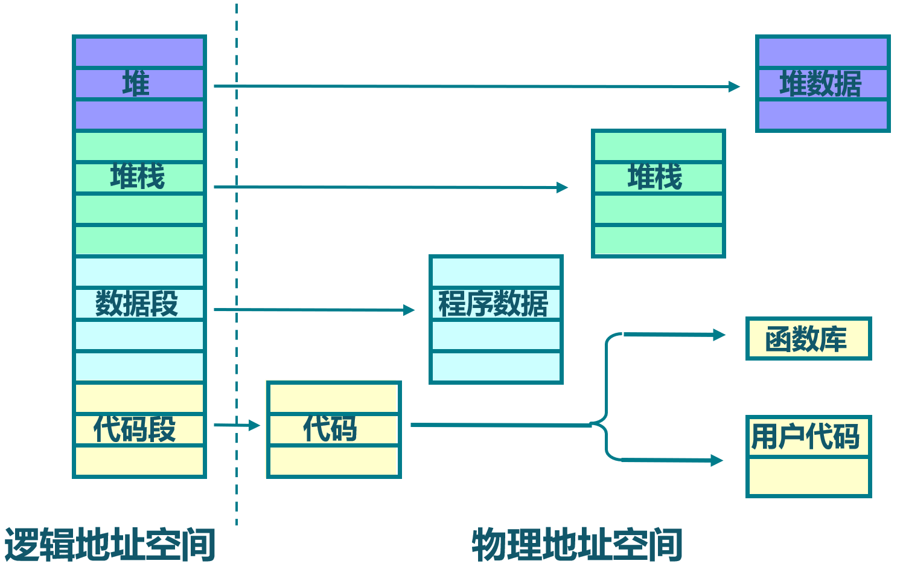
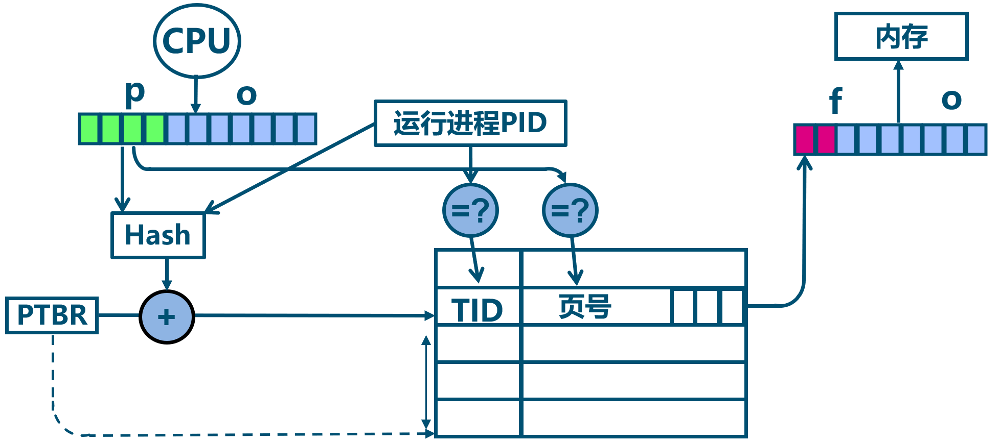
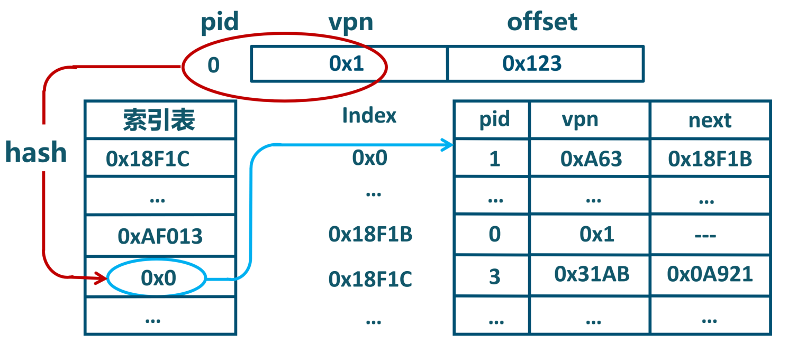
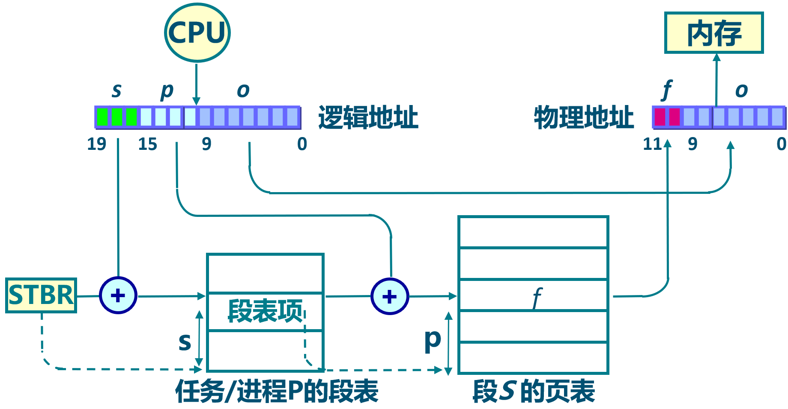
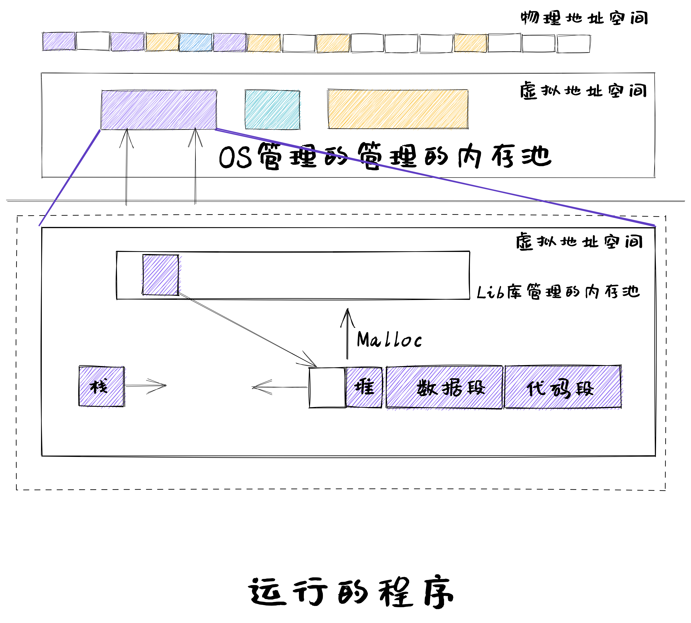
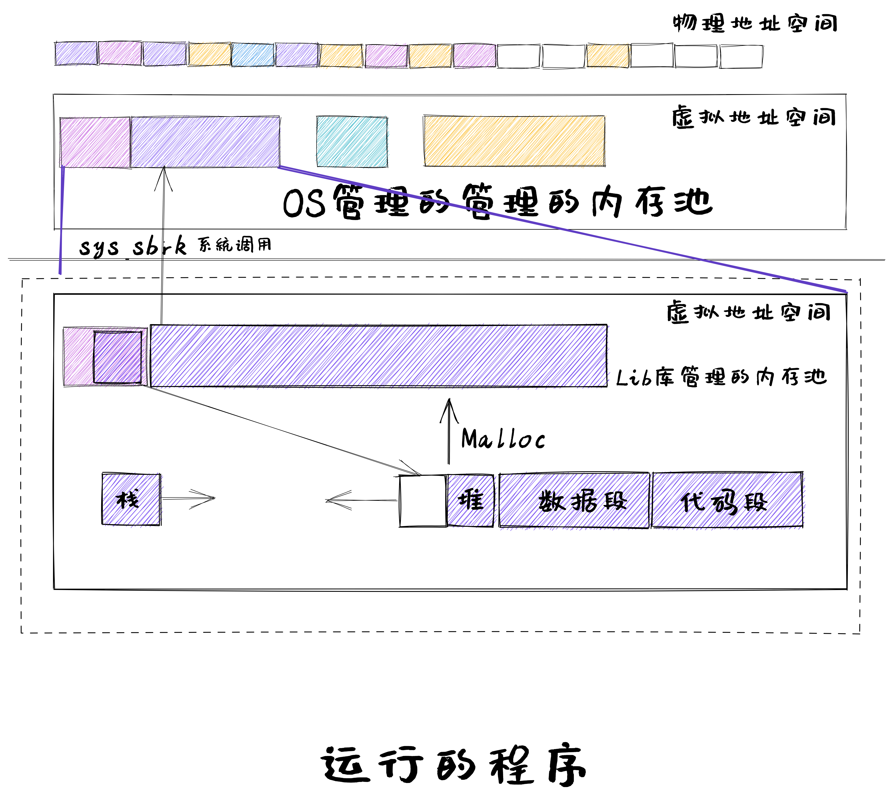

<!-- theme: gaia -->
<!-- _class: lead -->

# Lecture 5 Physical memory management
## Section 2 memory allocation
<br>
<br>

Xiang Yong Chen Yu Li Guoliang

<br>
<br>

Fall 2022

---
**Outline**

### 1. Memory allocation
2. Continuous memory allocation
3. Non-contiguous memory allocation

---
<style scoped>
{
  font-size: 28px
}
</style>

#### Memory allocation method
The memory occupied by the running application is divided into multiple **segments (Segment)** according to the characteristics of the stored data
* Memory allocation method
   - Static memory allocation
   - Dynamic memory allocation
       - contiguous memory allocation
       - non-contiguous memory allocation
* Purpose of memory management
   - Allow applications to use limited memory conveniently/flexibly/efficiently


---

#### Dynamic memory allocation interface


---

#### Static memory allocation

Static memory allocation refers to memory allocation at **compile time**
  - Includes global, static variables and code
  - Located in global/static data segment, constant data segment, code segment


---

#### Dynamic memory allocation
Dynamic memory allocation refers to **runtime** memory allocation
- stack
   - local variables
- heap
   - The `malloc()` function allocates memory
   - The `free()` function releases memory


---
#### Reasons for using dynamic memory allocation
**Unable to determine in advance** the amount of memory required by the program to run.
- Often the size of certain data structures is not known until the program actually runs
- Hardcoding data sizes in large software codes would be a nightmare


---
#### Classification of dynamic memory allocation methods

- **Explicit allocation**(explicit allocation)
   - the application explicitly frees any allocated blocks
- **Implicit allocation**(implicit allocation)
   - The compiler/runtime library automatically frees unused allocated blocks


---
<style scoped>
{
  font-size: 30px
}
</style>

#### Heap and stack memory allocation

Allocation method: dynamic memory allocation
- The stack is managed by the **compiler**: implicitly allocated
- Heap allocation and deallocation is managed by the **programmer**: explicit allocation

Allocation size
- The stack is a data structure that grows from high addresses to low addresses. It is a continuous memory. The memory that can be obtained from the stack is **small**, and the size is determined during compilation;
- The heap is a data structure that grows from low addresses to high addresses. It is a discontinuous storage space. The memory acquisition is more flexible and **larger**.


---
<style scoped>
{
  font-size: 30px
}
</style>

#### Dynamic memory allocation function `malloc()`

- `malloc()` function: `void * malloc (size_ t size);`
   - Apply for a piece of contiguous heap memory of size
   - The return value of the function is a pointer, pointing to the first address of the newly allocated memory
   - If the memory application fails, return a null pointer, that is, the return value is NULL

- The allocation and release of dynamic memory must be **used in pairs**
   - If `malloc()` is more than `free()`, it will cause **memory leak**
   - If `malloc()` is less than `free()`, it will cause secondary deletion, **destroy memory**, and cause the program to crash
---

#### Dynamic memory recovery function `free()`
  
- `free()` function: ``void free (void *ptr)``
   - Release the memory space of the pointer variable on the heap
   - Cannot release the memory space on the stack
   - `free()` should be paired with `malloc()`
---
**Outline**

1. Memory allocation
### 2. Continuous memory allocation
- Dynamic partition allocation
- Buddy System
3. Non-contiguous memory allocation

---
<style scoped>
{
  font-size: 30px
}
</style>

#### Contiguous memory allocation

**Contiguous memory allocation** means to allocate a piece of **contiguous** memory area **not smaller than the specified size** to the application
- **Memory Fragmentation**: Free memory that cannot be utilized
   - **Outer Fragmentation**: Unused memory between allocation units
   - **Inner Fragmentation**: Unused memory inside the allocation unit


---
<style scoped>
{
  font-size: 30px
}
</style>

#### Dynamic Partition Allocation

Dynamic partition allocation refers to the allocation of a partition (memory block) with a variable size specified by a process when the program is loaded for execution or data storage during operation
- The addresses of the partitions are consecutive
- **data structures** that the user library/operating system needs to maintain
   - Assigned Partitions: Partitions that have been assigned to the app
   - Empty-blocks


---
#### The problem to be solved in the design of dynamic partition allocation
- **Free block organization**: How to record free blocks?
- **Placement**: How to choose a suitable free block to allocate?
- **Split**: How to deal with the rest of the unallocated free blocks?
- **Merge**: what to do with a block that has just been freed?


---
#### Dynamic partition allocation strategy
   - First-fit
   - Best-fit
   - Worst-fit


---
#### First Match (First Fit) allocation strategy
- Pros: simple, **large free partitions** in high address space
- Disadvantages: **outer fragmentation**, slower when allocating large chunks
- Example: allocate 400 bytes, use the first free block


---
#### Best Fit Allocation Strategy
- **When allocating n-byte partitions**, find and use the smallest free partition not smaller than n
- **When releasing a partition**, check whether it can be merged with an adjacent free partition

- Example: allocate 400 bytes, use the 3rd free block (minimum)


---
#### Best Fit Allocation Strategy
- Pros: Works well when most applications allocate **smaller** sizes
- Disadvantages: **External Fragmentation**, the release of partitions is slow, and it is easy to generate many useless small fragments


---
#### Worst Fit allocation strategy
- When **allocating n bytes**, use **largest free partition** with size greater than n
- **When releasing a partition**, check whether it can be **merged** with an adjacent free partition**

- Example: allocate 400 bytes, use the 2nd free block (maximum)


---

#### Worst Fit allocation strategy

- Pros: Works best with more **medium-sized** allocations
- Disadvantages: **External fragmentation**, **Release partition is slow**, easy to destroy large free partitions


---
**Outline**

1. Memory allocation
2. Continuous memory allocation
- Dynamic partition allocation
### Buddy System
3. Non-contiguous memory allocation

---

#### Requirements Background of Buddy System

- Observation & Analysis
   - The basic allocation strategy is simple and general, but the performance is poor and there are many external fragments
   - memory **requirement characteristics** of kernel and application
     - The kernel often allocates and frees memory blocks of contiguous addresses in $2^U$ 4KB sizes
     - Needs to allocate and deallocate **fast** without creating **external fragmentation**
- Requires new contiguous memory allocation strategy

---

#### How the buddy system works


---
#### Partition size
- The size of the allocatable partition $2^U$
- The size of the partition to be allocated is $2^{(U-1)} < s ≤ 2^U$
   - allocate the entire block to the application;
- The size of the partition to be allocated is $s ≤2^{(i－1)}$
   - Divide the current free partition **of size $2^i$ into two free partitions** of size $2^{(i－1)}$
   - **Repeat the division** process until $2^{(i-1)} < s ≤ 2^i$, allocate a free partition

<!--

-->

---
#### Allocation process
- Data structure
   - Free blocks are organized into two-dimensional arrays by size and start address
   - Initial state: only one free block of size $2^U$
- Assignment process
   - Find the smallest available block in the free block from small to large
   - If the free block is too large, divide the available free block into two equal parts until a suitable available free block is obtained

<!--

-->

---
#### Release process

- release process
   - Put the block into the free block array
   - Merge free blocks that meet the conditions
- Merge conditions
   - Same size $2^i$
   - address adjacent
   - The starting address of the low-address free block is the number of bits in $2^{(i+1)}$

<!--


http://en.wikipedia.org/wiki/Buddy_memory_allocation -->

---

#### Partner system working process example


---
#### Partner system working process example


---
#### Partner system working process example


---
#### Partner system working process example


---
#### Partner system working process example


---
#### Reference implementation of buddy system

* [buddy_system_allocator](https://crates.io/crates/buddy_system_allocator): Buddy system algorithm written in Rust
* [buddy-system-in-ucore-test](https://github.com/ucore-test/buddy-system-in-ucore-test#buddy-system-in-ucore-test): Can be used in c language The interface for calling buddy-system in the program

---
**Outline**

1. Memory allocation
2. Continuous memory allocation
### 3. Non-contiguous memory allocation
- The concept of non-contiguous memory allocation
- Page storage management
- memory allocation example

---
<style scoped>
{
  font-size: 30px
}
</style>

#### Requirements Background for Non-Contiguous Memory Allocation: Fragmentation Problem
- Through the page table, the kernel can **convert multiple physical pages with discontinuous addresses into multiple virtual pages with continuous addresses**
- Provide applications and the kernel itself with a virtual memory block with continuous addresses, which can easily solve the problem of **memory allocation fragmentation**


---
<style scoped>
{
  font-size: 28px
}
</style>

#### Demand background for non-contiguous memory allocation: large memory space
- When creating a running program, you need to allocate **a relatively large memory space** required for it to run normally
- When the program is running, it will need to dynamically apply and release a relatively large memory space
    - usually make the request with the user library
    - Reduce the number of system calls
    - Apply for memory of $2^U$MB size (eg: 64MB) at a time


---

#### Design goals for non-contiguous memory allocation

Improve memory utilization efficiency and management flexibility
  - Allows a program to use **non-contiguous** physical address space
  - Allow **share** code and data
  - Support **dynamic** loading and dynamic linking


---
<style scoped>
{
  font-size: 27px
}
</style>

#### Problems that need to be solved for non-sequential allocation
- **Address translation** from virtual address to physical address
     - Software implementation (flexible, expensive)
     - hardware implementation (enough, low overhead)
- **Hardware-assisted** mechanism for non-sequential allocation
   - How to choose the memory block size in non-contiguous allocation
     - Segment storage management (segmentation)
     - Page storage management (paging)


---

#### Segment storage management

The segment address space where the program runs consists of multiple segments
- Main code segment, submodule code segment, public library code segment, stack segment, heap data (heap)...



---

#### Segment table

- located in memory
- Managed by the kernel
- correspond to tasks/processes


---

**Outline**

1. Memory allocation
2. Continuous memory allocation
3. Non-contiguous memory allocation
- The concept of non-contiguous memory allocation
### Page storage management
- memory allocation example

---
<style scoped>
{
  font-size: 32px
}
</style>

#### Physical pages and logical pages
- Physical pages (Page Frame, Frame, Frame, Page Frame)
   - Divide the physical address space into basic allocation units of the same size (2^n)
- logical page (page, page, Page)
   - Divide the logical address space into basic allocation units of the same size
   - **The basic unit size of physical page and logical page is the same**
- Correspondence between logical pages and physical pages
   - Address translation from logical address to physical address
   - Hardware mechanism: page table/MMU/TLB

---

#### Page table

- located in memory
- Managed by the kernel
- correspond to tasks/processes


---

#### Performance challenges faced by paging storage management

- Memory access performance
   - Accessing a memory location requires 2 memory accesses
     - First access: get page table entry
     - Second visit: access data
- page table size
   - Page tables can be very large
   - In a 64-bit computer system, if each page is 1024 bytes, what is the size of a page table?


---

#### Method to improve the performance of paging storage management

- Caching
- Indirect access


---

#### Multi-level page table


---

#### Address translation for multi-level page tables


---

#### Reverse page table

Find the physical page number in the corresponding page table entry based on the Hash mapping value
- There may be a *conflict* between the task/process id and the hash value of the page number
- Page table entries include protection bits, modification bits, access bits, and presence bits

---

#### Invert page table address translation



---

#### Reversed page table hash conflict



---

#### Reversed page table hash conflict


---

#### Reversed page table hash conflict


---

#### Segment page storage management
- Segment storage has advantages in memory protection, and page storage has advantages in memory utilization and optimized transfer to backing storage.
- Can segment storage and page storage be combined?


---

#### Segment page storage management



<!-- 2017ppt -->

---
**Outline**

1. Memory allocation
2. Continuous memory allocation
3. Non-contiguous memory allocation
- The concept of non-contiguous memory allocation
- Page storage management
### memory allocation example

---

#### An example of an app calling malloc
```C
#include <stdlib.h>
int main(){
int *ptr;
ptr = malloc(15 * sizeof(*ptr)); /* a block of 15 integers */
     if (ptr != NULL) {
       *(ptr + 5) = 480; /* assign 480 to sixth integer */
       printf("Value of the 6th integer is %d",*(ptr + 5));
     }
}
```


---

#### Address space of app


---
#### Loader run

Step 1: OS loader runs


---

#### Malloc function call

Step 2: The program issues a malloc function call, and the Lib library **has free space**



---
#### The kernel allocates memory space
Step 2: The program issues a malloc function call, and the Lib library **has no free space**
