<!-- theme: gaia -->
<!-- _class: lead -->

# Lecture 6 Virtual storage management
## Section 3 Global Page Replacement Algorithm

 
 

Xiang Yong Chen Yu Li Guoliang

Fall 2022

---

**Outline**

### 1. Definition of global page replacement algorithm
2. Working Set Page Replacement Algorithm
3. Page replacement algorithm for page fault rate

---
#### The partial replacement algorithm does not consider the process memory access difference
FIFO page replacement algorithm: assume initial order a->b->c
Number of physical pages: 3 Number of page faults: 9

---
#### The partial replacement algorithm does not consider the process memory access difference
FIFO page replacement algorithm: assume initial order a->b->c
Number of physical pages: 4 Number of page faults: 1

---
#### How the global permutation algorithm works
- Ideas
   - **Allocate a variable number of physical pages for a process**
- The problem to be solved by the global replacement algorithm
   - The memory requirements of a process at **different stages** vary
   - The **memory** allocated to the process also needs to change at **different stages**
   - The global replacement algorithm needs to **determine the number of physical pages allocated to the process**

---
#### CPU utilization and number of running programs

<!--  -->
  - There is a mutual promotion and restriction relationship between CPU utilization and the number of programs running
    - When there are few running programs, increasing the number of running programs can increase CPU utilization
    - The large number of programs running leads to increased memory access and reduces the locality of memory access
    -Lower locality leads to higher page fault rate and lower CPU utilization

---

**Outline**

1. Definition of Global Page Replacement Algorithm
### 2. Working Set Page Replacement Algorithm
3. Page replacement algorithm for page fault rate

---

#### Working Set
The set of logical pages currently being used by a process can be expressed as a binary function W(t, $\Delta$)
- current execution time $t$
- Working-set window $\Delta$: a fixed-length page access time window
- working set window $\Delta$ size $\tau$
   - The length of the time period, represented by the **memory access times** before the current time $t$
- working set W(t, $\Delta$)
   - A collection of all visited pages in the $\Delta$ time window before the current moment $t$
- working set size | W(t, $\Delta$) |: number of pages

---
#### Working set example for a process
Page access sequence:
W(t, $\Delta$) ={1,2,5,6,7} , working set window size $\tau=10, current moment t=t_1$

---
#### Working set example for a process

Page access sequence:
W(t, $\Delta$) ={1,2,3,4,5,6,7} , working set window size $\tau=10, current moment t=t_1$

---
#### Working set example for a process
Page access sequence:
W(t, $\Delta$) ={3,4}, working set window size $\tau=10$, current time $t=t_2$

---
#### Working Set Changes

- **After the process starts to execute**, a more stable working set is gradually established as new pages are accessed
- When the **locality region location of memory access is roughly stable**, the working set size is also roughly stable
- Rapid expansion and contraction of the working set to the next stable value when **locality region position changes**

---
#### Resident Set
   At the current moment, the set of pages in the process **actual resident memory**
- Relationship between working set and resident set
   - The working set is an **inherent property** of the process while it is running
   - The resident set ** depends on the system ** the number of physical pages allocated to the process and the page replacement algorithm
- Relationship between page fault rate and resident set
   - Fewer page faults when resident set $\supseteq$ working set
   - When the working set changes drastically (transition), there are many page faults
   - After the process resident set size reaches a certain number, the page fault rate will not decrease significantly

---
#### Working Set Page Replacement Algorithm
- ideas
    - Swap out pages that are **not in the working set**
- working set window size $\tau$
    - The page collection of the previous $\tau$ memory accesses at the current moment constitutes the **working set**

- Implementation
   - Fetch linked list: maintain the linked list of fetched pages in the window
   - When fetching, **swap out** pages that are not in the working set, and update the fetching list
   - When a page is missing, swap in the page and update the fetch list

---

#### Working Set Replacement Algorithm Example

$\tau=4$

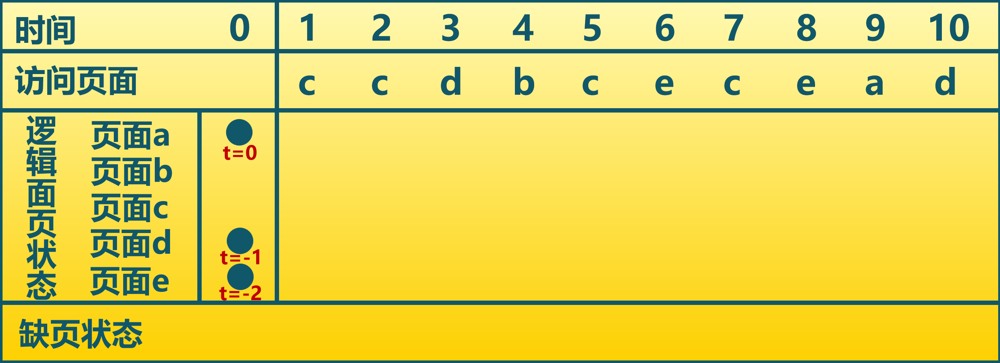

---

#### Working Set Replacement Algorithm Example

$\tau=4$

---

#### Working Set Replacement Algorithm Example

$\tau=4$

---

#### Working Set Replacement Algorithm Example

$\tau=4$

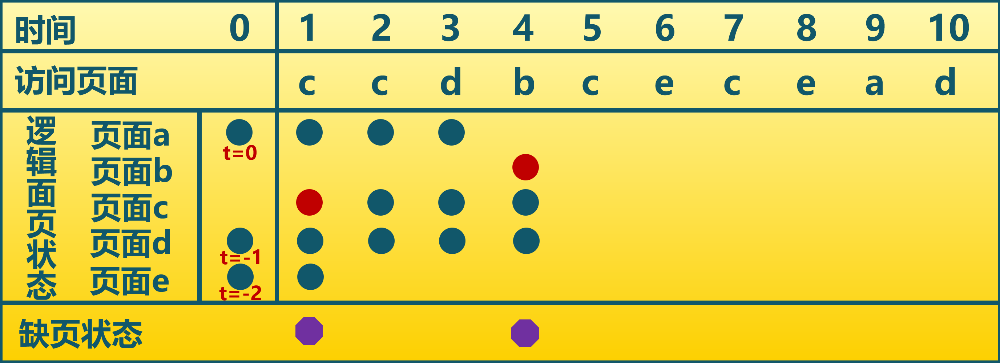

---

#### Working Set Replacement Algorithm Example

$\tau=4$

---

#### Working Set Replacement Algorithm Example

$\tau=4$

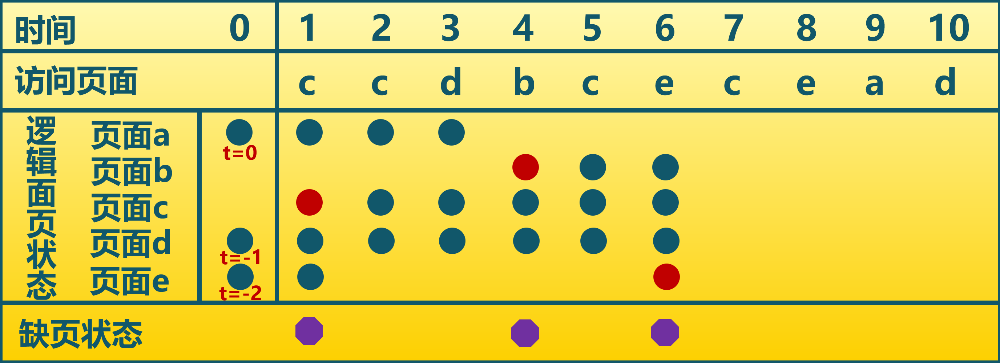

---

#### Working Set Replacement Algorithm Example

$\tau=4$

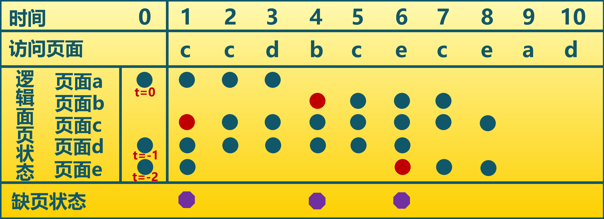

---

#### Working Set Replacement Algorithm Example

$\tau=4$

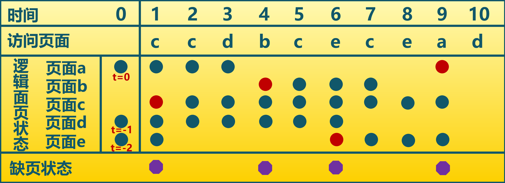

---

#### Working Set Replacement Algorithm Example

$\tau=4$

---

**Outline**

1. Definition of Global Page Replacement Algorithm
2. Working Set Page Replacement Algorithm
### 3. Page replacement algorithm for page fault rate

---

#### Page Fault Rate (Page-Fault-Frequency, Page Fault Rate)

Number of Page Faults / **Number of Memory Accesses** or Reciprocal of Page Fault Average Time **Interval**

- Factors Affecting Page Fault Rate
   - Page replacement algorithm
   - Number of physical pages allocated to the process
   - page size
   - How to write programs

---
#### Page fault rate replacement algorithm

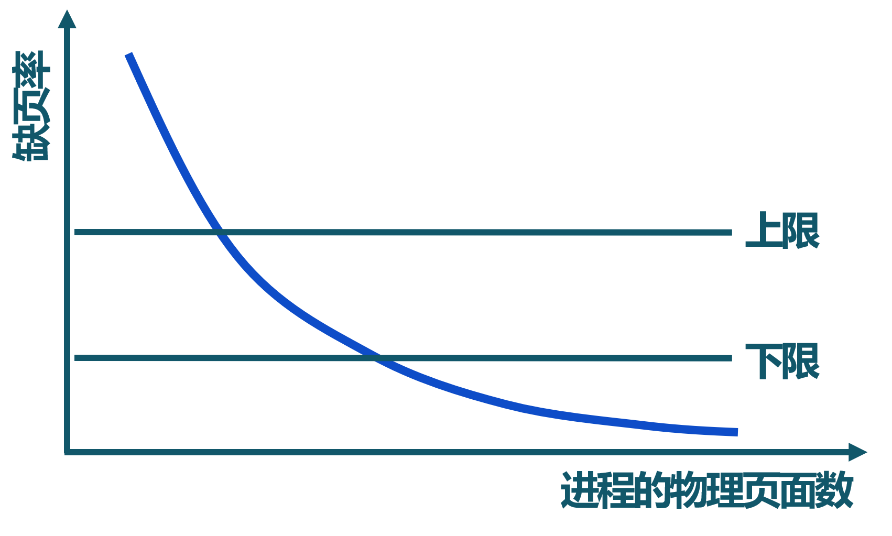

Keep the **page fault rate** of each process within a reasonable range by adjusting the **resident set size**
- If the page fault rate of the process is too high, increase the resident set to allocate more physical pages
- If the page fault rate of the process is too low, reduce the resident set to reduce its number of physical pages

---
#### Fault rate page replacement algorithm
- When accessing memory, **set** the reference bit flag
- When there is a page fault, **calculate** the **time interval** from the last page fault time $t_{last}$ to the current $t_{current}$
   - If $t_{current} – t_{last}>T$ (tolerated page fault window), then **replace** all unreferenced in $[t_{last} , t_{current} ]$ time Page
   - If $t_{current} – t_{last} \le T$, then **add** missing pages to the resident set

---

#### Example of Page Fault Rate Replacement Algorithm

Assuming a window size of 2

---

#### Example of Page Fault Rate Replacement Algorithm

Assuming a window size of 2
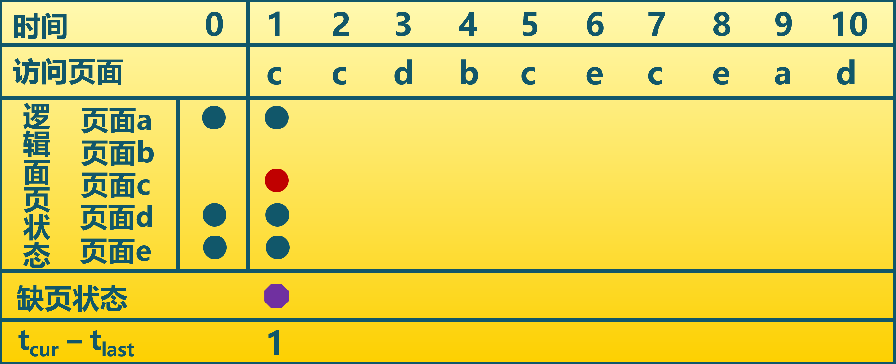

---

#### Example of Page Fault Rate Replacement Algorithm

Assuming a window size of 2
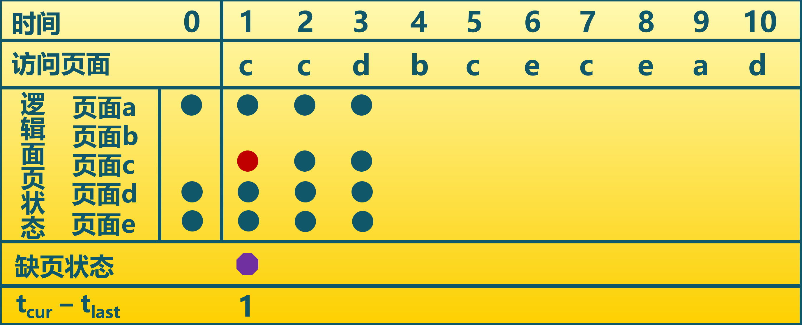

---

#### Example of Page Fault Rate Replacement Algorithm

Assuming a window size of 2

---

#### Example of Page Fault Rate Replacement Algorithm

Assuming a window size of 2
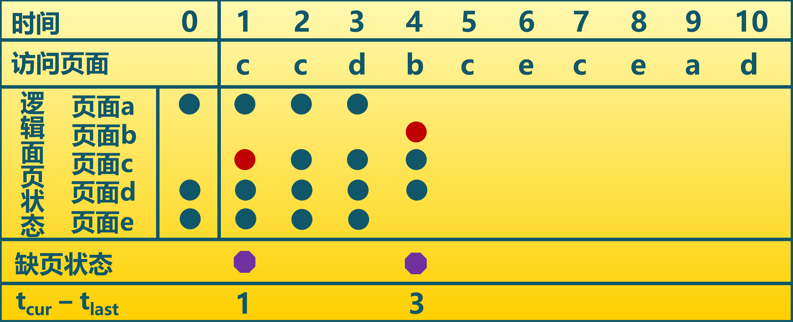

---

#### Example of Page Fault Rate Replacement Algorithm

Assuming a window size of 2

---

#### Example of Page Fault Rate Replacement Algorithm

Assuming a window size of 2
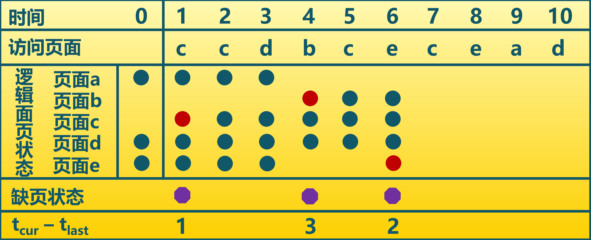

---

#### Example of Page Fault Rate Replacement Algorithm

Assuming a window size of 2

---

#### Example of Page Fault Rate Replacement Algorithm

Assuming a window size of 2
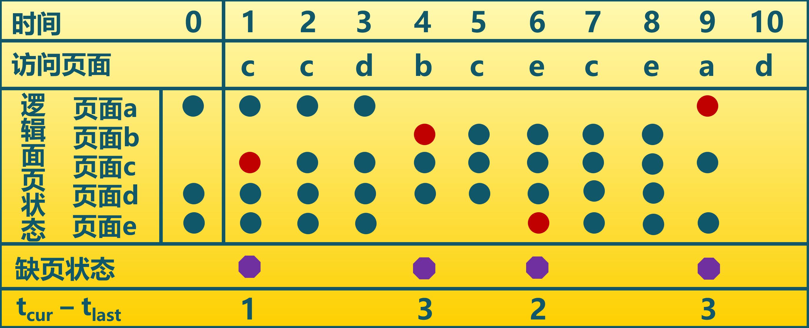

---

#### Example of Page Fault Rate Replacement Algorithm

Assuming a window size of 2
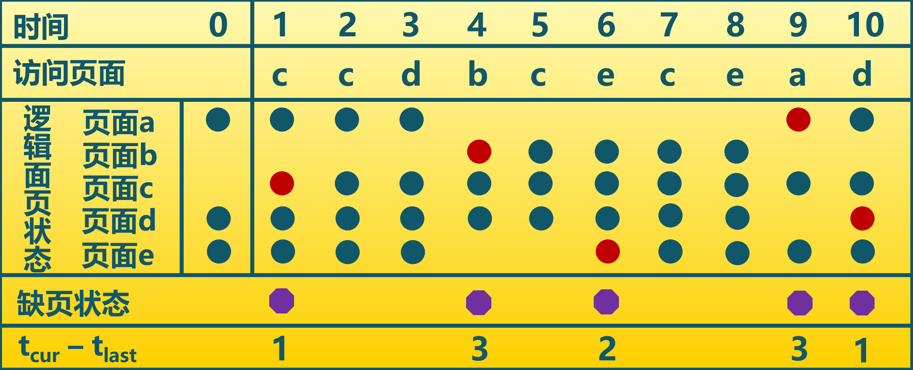

---
#### Thrashing
- jitter
   - Process **too few physical pages** to contain working set
   - Cause **a large number of page faults**, frequent replacement
   - Process **runs slower**

- Causes of jitter
    - As the number of **processes** in resident memory increases, the number of physical pages allocated to each process decreases, and the page fault rate continues to rise
- The operating system needs to **reach a balance** between the concurrency level and the **page fault rate**
    - Choose an appropriate number of processes and the number of physical pages required by the process

---

### Course Experiment 2

* Chapter 4: Address Space -> Chapter4 Exercises ->
     * [rCore](https://learningos.github.io/rCore-Tutorial-Guide-2022A/chapter4/7exercise.html)
     * [uCore](https://learningos.github.io/uCore-Tutorial-Guide-2022A/chapter4/7exercise.html)
* Experimental tasks
     * Rewrite the kernel function for obtaining system time and process control block information
     * Implement system calls for applying and canceling virtual memory mapping
* Experiment submission requirements
     * The 11th day after the task is assigned (October 30, 2022);

---

### Lecture 5 Summary of Virtual Storage Management

* Section 1 Virtual storage concept
     * Requirements, coverage, swapping, concepts of virtual storage, page fault exceptions
* Section 2 Partial Page Replacement Algorithm
     * The concept of page replacement algorithm, OPT, FIFO, LRU, Clock, improved clock page replacement algorithm, LFU, Belady phenomenon
* Section 3 Global Page Replacement Algorithm
     * Global page replacement algorithm, working set replacement algorithm, page fault rate replacement algorithm