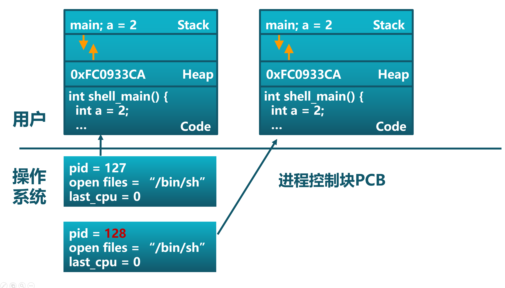
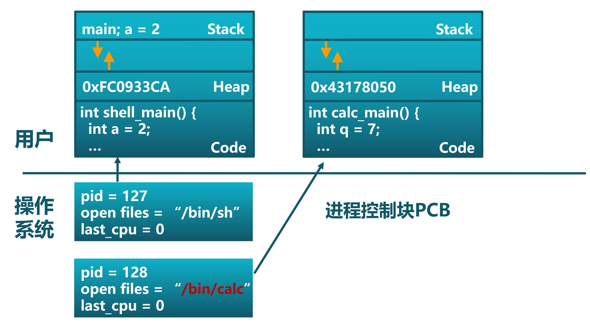
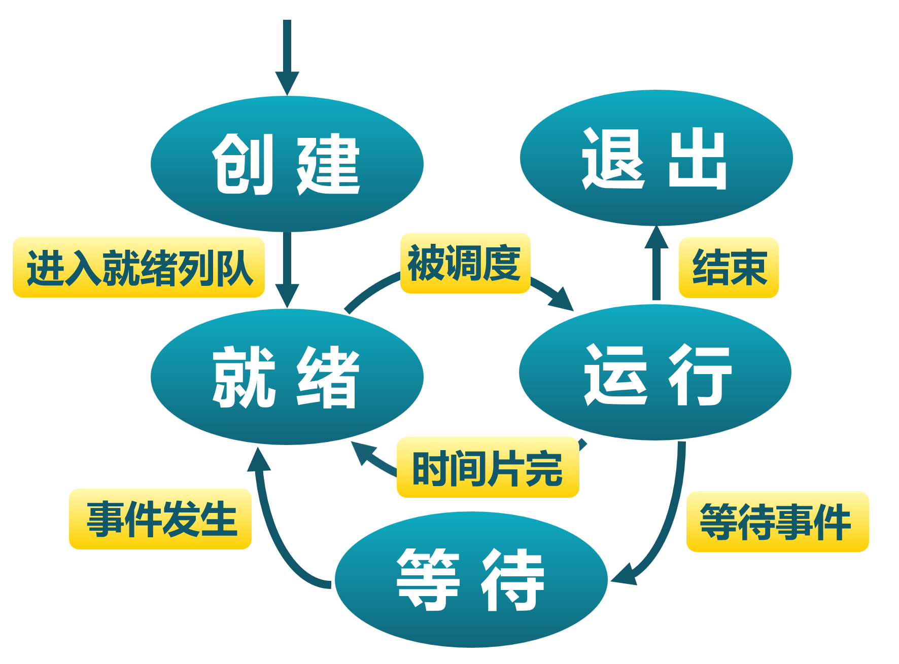
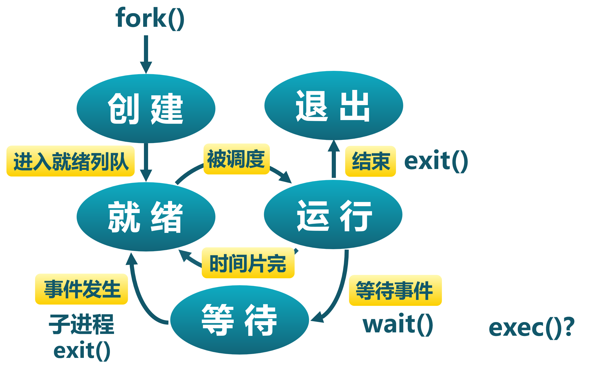
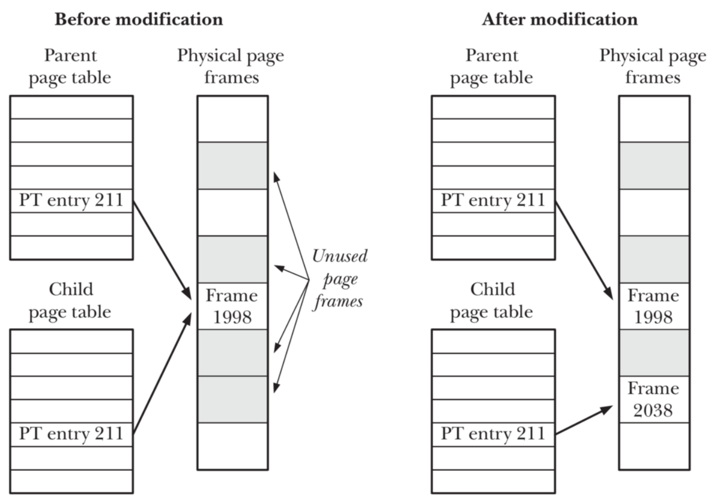
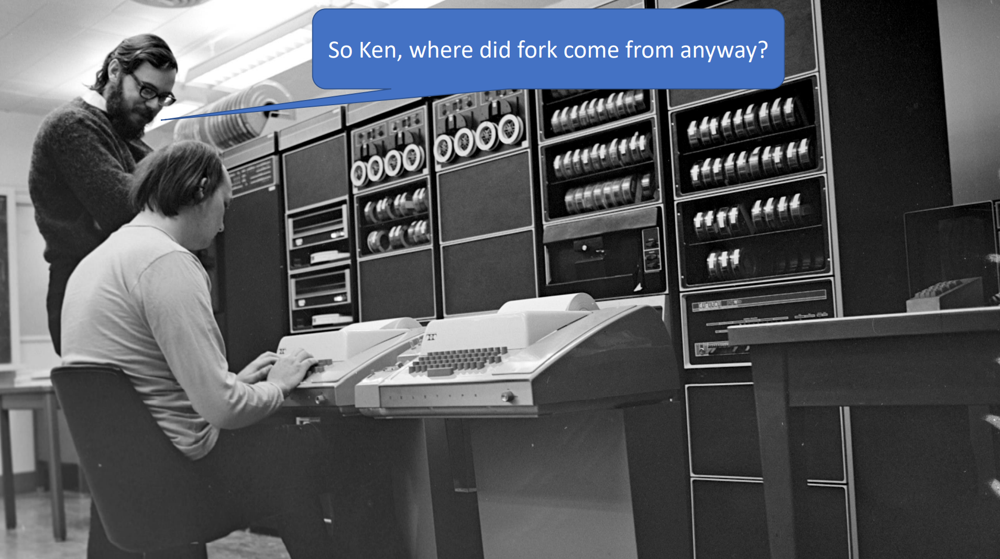
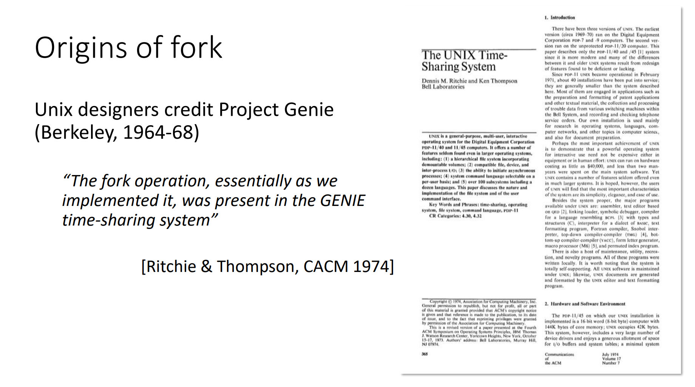

	
<!-- theme: gaia -->
<!-- _class: lead -->

# Lecture 7 Process Management and Single Processor Scheduling
## Section 1 Process Management

<br>
<br>

Xiang Yong Chen Yu Li Guoliang

Fall 2022

---

**Outline**

### 1. Basic concept of process
- Requirements background for process management
- The concept of process
- Processes and tasks
2. Process management
3. Thoughts on Fork()

---
<style scoped>
{
  font-size: 30px
}
</style>

#### Requirements background for process management

- Background
  - **Hardware** is getting more and more powerful
    - Faster CPU with MMU/TLB/Cache
    - Larger memory and external storage
    - Richer peripherals
  - Developers want more **dynamic interaction and control** on the computer
  - Users need more **convenient** computer interaction capabilities
  
- Target
  - **Improve development efficiency and execution efficiency**

---
<style scoped>
{
  font-size: 30px
}
</style>

#### Requirements background for process management

- The OS needs an interface/interface that **interacts with the user**
- **Command Line** Interface (CLI)
- The user enters commands directly through the keyboard
-Shell
- **Graphical** interface (GUI)
- User enters commands via mouse/window etc.


---
<style scoped>
{
  font-size: 30px
}
</style>
#### Requirements background for process management

- User needs to **dynamically manage and control application execution**
- During the execution of the application, the user actively sends a **request** to the operating system through the interface to **create and execute** a new application program, **pause or stop** the execution of the application program, etc.


---

#### The purpose of introducing the concept of Process
- Clearly **characterize** the dynamic internal laws of program operation in the operating system system
- Efficient **manage and schedule** the execution of multiple programs and the use of resources


---
<style scoped>
{
  font-size: 32px
}
</style>
#### The abstraction provided by the process to the application

- From an application point of view, the **key abstraction** provided by the process to the application
  - Separate logical **control flow**: as if own program exclusively uses the processor
  - Private **address space**: as if your own program exclusively uses the memory system
  


---
<style scoped>
{
  font-size: 32px
}
</style>
#### Looking at the process from the perspective of implementation

From an implementation point of view, a process is a **data structure** related to process management during the establishment of a program by the operating system, and a **dynamic operation** process on the data structure


---
<style scoped>
{
  font-size: 30px
}
</style>
#### Look at the process from the perspective of resources

- From the perspective of resources, a process is a collection of **occupied resources** during program execution
  - Shared resources vs exclusive resources
  - processor, time
  - memory, address space
  - File, I/O, ...
  


---
<style scoped>
{
  font-size: 30px
}
</style>
#### What is a process?

- Simple definition
  - The execution **process** of a program
  - An **instance** of a running program
- Detailed definition: A dynamic process of **execution and resource usage** of a program with certain **independent functions** on a certain **data set**
  - Execute program logic and read and write data
  - create and execute a new process
  - Working with shared resources: files, etc.


---
<style scoped>
{
  font-size: 30px
}
</style>
#### Tasks and Processes

Analysis from two aspects of **resource occupation** and **execution process**

Same point:
- From the user's point of view, both tasks and processes represent running programs
- From the perspective of the operating system, both tasks and processes are represented as the execution process of a program
- From a resource usage perspective
  - Both can be interrupted by the operating system and time-share CPU resources by switching
  - Both need address space to place code and data

---
<style scoped>
{
  font-size: 32px
}
</style>
#### Tasks and Processes

Analysis from two aspects of **resource occupation** and **execution process**

Same point:
- From the point of view of the execution process
  - have a **lifecycle** that runs from start to finish like this
    - Task lifecycle --> Process lifecycle
    - Three-state model for tasks --> Three-state model for processes
    - Task switching --> Process switching
    - task context --> process context


---
<style scoped>
{
  font-size: 30px
}
</style>
#### Tasks and Processes

Analysis from two aspects of **resource occupation** and **execution process**

difference:
- Tasks are the **primary stage** of the process mentioned here, and do not have the following functions:
  - A process can create child processes and overwrite existing program content with new program content during running
  - The process becomes the carrier of dynamic application/use/release of various resources during program execution

The dynamic function of the process can make the operation of the program more flexible.

---

#### Process is an important concept in computer science

**Process** is one of the deepest and most successful concepts in computer science (from CSAPP)


---

**Outline**

1. The basic concept of the process
### 2. Process management
- Process management system calls
- Process control block PCB
- Process creation and program loading
- Process wait and exit
3. Thoughts on Fork()

---

#### Process management system call generation background

- How can an application **easily and dynamically execute other applications**?
  - process_id = execute(app_name)?
- How do I let an app **know if other apps** it started have ended?
  - Other applications that were started exit(status)?
  - Initiated main application wait(process_id)?

So various OS (UNIX/Windows...) have designed various **system calls** similar to the above process management class

---

#### Process management system calls

| system call name| meaning|
| -------------------------- | ------ |
| ``int fork()`` | **Create** a process and return the PID of the child process. |
| ``int exec(char *file)`` | **Load** a file and execute it; return only on error. |
| ``int exit(int status)`` | **Terminate** itself; report `status` to the parent process executing the waitpid() syscall. |
| ``int waitpid(int pid, int *status)`` | **Wait for **`pid` child process to exit, get its ``*status`` exit status. |
| ``int getpid()`` | **Get** the PID of the current process. |


---

#### Process management application example: ``getpid()``

```rust
//usr/src/bin/hello_world.rs
pub fn main() -> i32 {
// show own PID
println!("pid {}: Hello world from user mode program!", getpid());
0 // exit code returned
}
```

---
<style scoped>
{
  font-size: 30px
}
</style>
#### Process management application example: ``fork()`` and ``exec()``

```rust
//usr/src/bin/forkexec.rs
pub fn main() -> i32 {
println!("pid {}: parent start forking ...", getpid());
let pid = fork(); // create child process
if pid == 0 {
// child process
println!("pid {}: forked child start executing hello_world app ... ", getpid());
exec("hello_world"); // execute hello_world program
100
} else {
// parent process
let mut exit_code: i32 = 0;
println!("pid {}: ready waiting child ...", getpid());
assert_eq!(pid, wait(&mut exit_code)); //Confirm the waiting child process PID
assert_eq!(exit_code, 0); //Confirm that the exit code is 0
        println!("pid {}: got child info:: pid {}, exit code: {}", getpid() , pid, exit_code);
        0
    }
}
```

---

#### Process management application example: ``fork()`` and ``exec()``

Execution result
```
Rust user shell
>> forkexec
pid 2: parent start forking ...
pid 2: ready waiting child ...
pid 3: forked child start execing hello_world app ...
pid 3: Hello world from user mode program!
pid 2:  got child info:: pid 3, exit code: 0
Shell: Process 2 exited with code 0
>> QEMU: Terminated

```

---

**Outline**

1. The basic concept of the process
2. Process management
- Process management system calls
### Process Control Block PCB
- Process creation and program loading
- Process wait and exit
1. Thoughts on Fork()

---

#### Process Control Block PCB


---

#### The shell executes user input commands


---

#### Process control block in shell execution


---
<style scoped>
{
  font-size: 30px
}
</style>

#### Process switching

- Process switching process
  - **Pause** the current running process, change from running state to other state
  - **scheduling** another process from ready state to running state

- Requirements for process switching
  - Before switching, **save** the process context
  - After switching, **restore** the process context


---
<style scoped>
{
  font-size: 30px
}
</style>

#### Process Lifecycle

- Process switching
  - Suspend the currently running process from the running state to another state
  - Scheduling another process from the ready state to the running state

- Information about the process lifecycle
  - **registers** (PC, SP, …)
  - **CPU Status**
  - **Memory Address Space**

 
---

**Outline**

1. The basic concept of the process
2. Process management
- Process management system calls
- Process control block PCB
### Process creation and program loading
- Process wait and exit
1. Thoughts on Fork()

---

#### Windows process creation API: ``CreateProcess(filename)``

- Close all file descriptors in the child process on creation
- ``CreateProcess(filename, CLOSE_FD)``
- Change the environment of the child process when it is created
- ``CreateProcess(filename, CLOSE_FD, new_envp)``
 
---

#### Process creation/loading

- Unix process creation/loading system calls: fork/exec
- fork() copies a process into two processes
- parent (old PID), child (new PID)
- exec() overwrites the current process with a new program
- PID not changed


---

#### Example of creating a process with fork and exec

```C
int pid = fork(); 		// create child process
if(pid == 0) { 			// child process continues here
// Do anything (unmap memory, close net connections…)
exec("program", argc, argv0, argv1, ...);
}
```
- fork() creates an inherited child process
- **Copy** all variables and memory of the parent process
- **Copy** all CPU registers of the parent process (with one register **exception**)
   
 
---

#### Example of creating a process with fork and exec

```C
int pid = fork(); 		// create child process
if(pid == 0) { 			// child process continues here
// Do anything (unmap memory, close net connections…)
exec("program", argc, argv0, argv1, ...);
}
```
- The return value of fork()
- fork() of the child process returns 0
- The fork() of the parent process returns the child process identifier
- The return value of fork() is convenient for subsequent use, and the child process can use getpid() to obtain the PID

---

#### Process creation ``fork()`` execution process

- For the child process, fork() is a copy process of the parent process address space


---

#### Example of program loading and execution

- The system call exec( ) loads a new program to replace the current running process (is there a problem with the code???)
```C
main()
…
int pid = fork(); 			// create child process
if (pid == 0) { 			// child process continues here
exec_status = exec("calc", argc, argv0, argv1, ...);
printf("Why would I execute?"); // Can this line of code be executed???
} else { 				// parent process continues here
printf("Whose your daddy?");
…
child_status = wait(pid);
}

```

 
---

#### Example of program loading and execution

- The system call exec( ) loads a new program to replace the currently running process
```C
main()
…
int pid = fork(); 			// create child process
if (pid == 0) { 			// child process continues here
exec_status = exec("calc", argc, argv0, argv1, ...);
printf("Why would I execute?");
} else { 				// parent process continues here
printf("Whose your daddy?");
…
child_status = wait(pid);
}
if (pid < 0) { /* error occurred */
```


 
---

#### The process of program loading and execution

Load the calculator after calling fork() in the shell


 
 
---

#### The process of program loading and execution

Load the calculator after calling fork() in the shell


 
 
---

#### The process of program loading and execution

Load the calculator after calling fork() in the shell


  
---

#### The process of program loading and execution

Load the calculator after calling fork() in the shell


 
 
---

#### The process of program loading and execution

Load the calculator after calling fork() in the shell



 
 
---

#### The process of program loading and execution

Load the calculator after calling fork() in the shell




---

#### 进程管理应用示例：``fork()``

```C
int  main()
{
     pid_t  pid;
      int  i;

      for  (i=0;  i<LOOP;  i++)
      {
           /* fork  another  process  */
           pid = fork();
           if  (pid < 0) { /*error  occurred  */
                fprintf(stderr, “Fork Failed”);
                exit(-1);
           }
           else if (pid == 0) { /* child process */
                fprintf(stdout,  “i=%d,  pid=%d,  parent  pid=%d\n”,I,      
                             getpid() ,getppid());
           }   
}
wait(NULL);
exit(0);
}

```


---

#### Process management application example: ``fork()``


---

**Outline**

1. The basic concept of the process
2. Process management
- Process management system calls
- Process control block PCB
- Process creation and program loading
### Process waiting and exiting
3. Thoughts on Fork()

---
<style scoped>
{
  font-size: 30px
}
</style>

#### The parent process waits for the child process

- The wait() system call is used by the parent process to wait for the end of the child process
  - When the child process ends, return a value to the parent process through exit()
  - The parent process accepts and processes the return value through wait()
- Function of the wait() system call
  - When a child process is alive, the parent process enters the waiting state, waiting for the return result of the child process
  - When a child process calls exit(), wake up the parent process, and use the return value of exit() as the return value of wait in the parent process

---

#### Zombie process and orphan process

- Zombie process: A child process that has executed the sys_exit system call, but **has not** been reclaimed by the parent process through the sys_wait system call to its process control block.
  - When waiting for a zombie child process, wait() immediately returns one of these values
- Orphan process: a child process whose **parent process exits** first.
  - The orphan process is responsible for waiting and recycling by the root process

---
<style scoped>
{
  font-size: 30px
}
</style>

#### Process exit ``exit()``

- Call exit() when the process finishes executing to complete process resource recovery
  - Function of the exit() system call
  - Pass the call arguments as the "result" of the process
  - Close all open files, etc. occupying resources
  - Free memory
  - Free most process-related kernel data structures
  - Keep the value of the result, check if the parent process is alive
    - If not alive, set the parent process to be the Root process
  - Enter the zombie (zombie/defunct) state, waiting for the parent process to recycle

---
<style scoped>
{
  font-size: 32px
}
</style>

#### Other related system calls for process management

- Priority control
  - nice() specifies the initial priority of the process
  - Process priority decays with execution time in Unix systems
- Process debugging
  - ptrace() allows one process to control the execution of another process
  - Set breakpoints and view registers, etc.
- Timing
  - sleep() allows the process to wait for the specified timer in the waiting queue


---

#### The relationship between process management and process status

System calls related to process management may affect the state of the process


 
---

#### The relationship between process management and process status




 
---

**Outline**

1. The basic concept of the process
2. Process management
### 3. Thoughts on Fork()
- Fork() overhead?
- Rethink fork

---

#### Fork () overhead?

- Implementation overhead of fork()
  - Allocate memory to the child process
  - Copy the memory and CPU registers of the parent process to the child process
  - Expensive!!


---

#### Fork () overhead?

- In 99% of cases, we call exec() after calling fork()
  - Memory copying has no effect in the fork() operation --why?
  - Child processes will likely close open files and network connections? --why?


---

#### Fork () overhead?

- When vfork() creates a process, it no longer creates the same memory image
  - Lightweight fork()
  - The child process should call exec() almost immediately
  - Now using Copy on Write (COW) technology

---

#### Rethinking forks

[Andrew Baumann, etc., A fork() in the road, HotOS 2019](https://www.microsoft.com/en-us/research/publication/a-fork-in-the-road/)


---

#### Rethinking forks

The fork system call is one of Unix's great ideas.
-- https://cs61.seas.harvard.edu/site/2018/WeensyOS/

- It's simple: no parameters!
- It's elegant: fork is orthogonal to exec
- It eased concurrency


---

#### Rethinking forks

But!
- Fork is no longer simple
  - Fork encourages memory overcommit
  - Fork is incompatible with a single address space
  - Fork is incompatible with heterogeneous hardware
  - Fork infects an entire system


---

#### Rethinking forks

But!


---

#### Rethinking forks




---

#### Rethinking forks




---

#### 重新思考fork

For implementation expedience [Ritchie, 1979]
- fork was 27 lines of PDP-7 assembly
   - One process resident at a time
   - Copy parent’s memory out to swap
   - Continue running child
-  exec didn’t exist – it was part of the shell
   - Would have been more work to combine them  

<!--
https://www.infoq.cn/article/BYGiWI-fxHTNvSohEUNW
When Unix was rewritten for the PDP-11 computer (which had memory translation hardware that allowed multiple processes to remain resident), it was already inefficient to copy a process's entire memory just to drop a process in exec. We suspect that in the early days of Unix, fork survived primarily because programs and memory were small (only eight 8 KiB pages on the PDP-11), memory access was fast relative to instruction execution, And it provides a reasonable abstraction. There are two important points here: -->

---

#### Rethinking forks

Conclusions:
- Fork is not an inspired design, but an accident of history
- Only Unix implemented it this way
- We may be stuck with fork for a long time to co me
- But, let's not pretend that it's still a good idea today!

**Please, stop teaching students that fork is good design**
- Begin with spawn
- Teach fork, but include historical context

---

### Summary

1. The basic concept of the process
2. Process management
3. Thoughts on Fork()
- Fork() overhead?
- Rethink fork