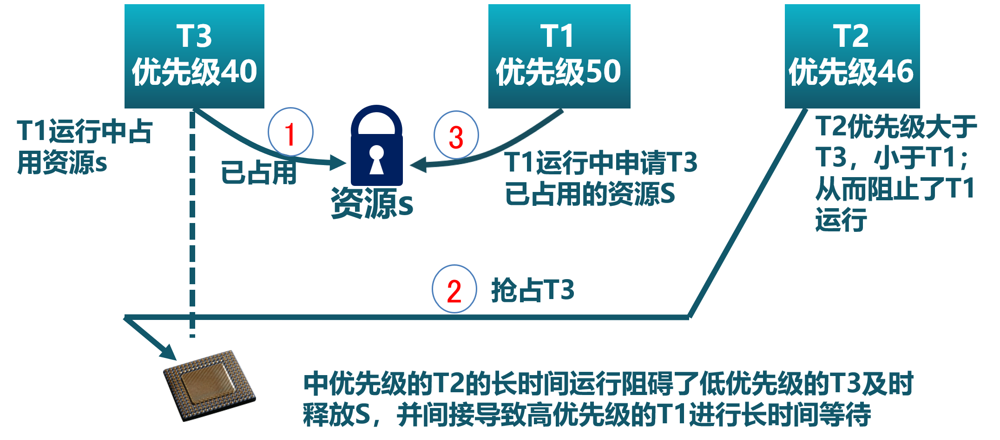
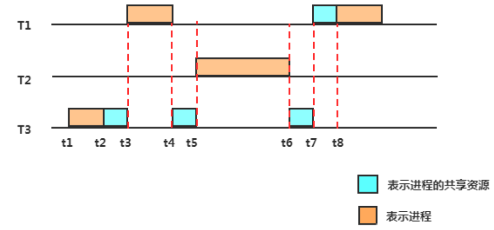
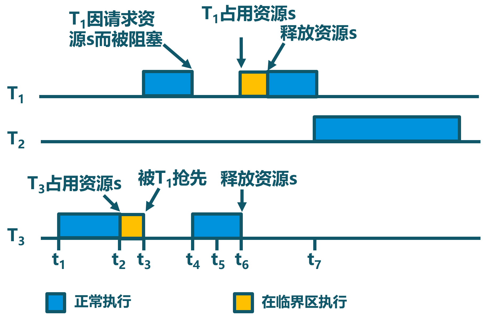

<!-- theme: gaia -->
<!-- _class: lead -->

# Lecture 7 Process Management and Single Processor Scheduling
### Section 3 Real-time Scheduling

 
 

Xiang Yong Chen Yu Li Guoliang

Fall 2022

---

**Outline**

### 1. Real-time operating system
- Definition of real-time operating system
- Real-time tasks
2. Real-time scheduling
3. Priority inversion

---
#### Definition of real-time operating system
- Definition of real-time operating system
   - Operating system whose correctness depends on both its timing and capabilities
- Performance metrics for real-time operating systems
    - Timeliness of time constraints (deadlines)
    - Speed and average performance are relatively unimportant
- Characteristics of real-time operating systems
   - Predictability of time constraints

---
#### Real-Time Operating System Classification
- Hard/hard real-time operating system
    - It is required that important tasks must be completed within the specified time
- weak/soft RTOS
   - Important processes have high priority and are required to be completed as much as possible but not necessarily

---
#### Real-time tasks
- Task (unit of work)
   - One calculation, one file read, one message transfer, etc.
- Task properties
   - The resources needed to complete the task
   - Timing parameters

---
#### Periodic real-time tasks
- Periodic real-time tasks: a series of similar tasks
   - Quests repeat regularly
   - period p = task request interval (0 <p)
   - execution time e = maximum execution time (0 < e < p)
   - Utilization U = e/p

- Schedulable: if $\sum_{p_i} \frac{e_i}{p_i}\leq 1$; otherwise not schedulable

---
#### Soft time limit and hard time limit
- Hard deadline
   - Missing mission deadlines can have catastrophic or very serious consequences
   - It must be verified that the time limit can be met in the worst case
- Soft deadline
   - Usually meets mission deadlines
   - Reduce requirements if sometimes not met
   - Do your best to meet the task time limit

---
#### Schedulability
- Schedulable means that an RTOS can meet task deadlines
    - Need to determine the execution order of real-time tasks
    - **Static** priority scheduling: **will not** change the priority of the task during task execution
    - **Dynamic** priority scheduling: **will** change the priority of tasks during task execution

---

**Outline**

1. Real-time operating system
### 2. Real-time scheduling
- Rate monotonic scheduling algorithm
- Earliest deadline first algorithm
- Lowest slack first algorithm
3. Priority inversion

---

#### Real-time scheduling
- **Static** Priority Scheduling: Rate Monotonic Scheduling Algorithm (RM, Rate Monotonic)
   - Prioritize by cycle
   - The shorter the period, the higher the priority
   - Execute the task with the shortest period

- **Dynamic** Priority Scheduling: Earliest Deadline First Algorithm (EDF, Earliest Deadline First)
   - The earlier the deadline, the higher the priority
   - Execute the task closest to the deadline

If there is **shared resource occupation** between tasks, high priority tasks may be delayed!

---
#### Rate Monotonic Scheduling Algorithm (RM, Rate Monotonic)

- Determine the task priority according to the task period (the shorter the period, the higher the priority, preemptive)

- Process P1: e=20 p=50
- Process P2: e=35 p=100

---
#### Rate Monotonic Scheduling Algorithm (RM, Rate Monotonic)

- Determine the task priority according to the task period (the shorter the period, the higher the priority, preemptive)

- Process P1: e=25 p=50
- Process P2: e=35 p=80

---

#### Earliest Deadline First Algorithm (EDF, Earliest Deadline First)

- Fixed priority issue: some tasks could miss the deadline

- Process P1: e=10 p=20
- Process P2: e=25 p=50

---

#### Earliest Deadline First Algorithm (EDF, Earliest Deadline First)

- Fixed priority issue: some tasks could miss the deadline

- Process P1: e=10 p=20
- Process P2: e=25 p=50

---

#### Earliest Deadline First Algorithm (EDF, Earliest Deadline First)

- Fixed priority issue: some tasks could miss the deadline

- Process P1: e=10 p=20
- Process P2: e=25 p=50

---

#### Earliest Deadline First Algorithm (EDF, Earliest Deadline First)

- The priority of the task is dynamically assigned according to the deadline of the task. The shorter the deadline, the higher the priority.

- Process P1: e=10 p=20
- Process P2: e=25 p=50

---

#### Lowest Laxity First Algorithm (LLF)

- Determine task priority according to **task urgency or slack level**

- The higher the urgency of the task, the higher the priority

- Slack = must complete time - itself still needs to run time - current time

- Process P1: e=10 p=20; Process P2: e=25 p=50

---

**Outline**

1. Real-time operating system
2. Real-time scheduling
### 3. Priority inversion
- priority inheritance
- Priority Ceiling Agreement

---
#### Priority Inversion

The phenomenon that a high-priority process waits for a long time for resources occupied by a low-priority process

- There is a priority inversion problem in the priority-based preemptive scheduling algorithm
Priority: T1>T2>T3

---
#### Priority Inversion

The phenomenon that a high-priority process waits for a long time for resources occupied by a low-priority process

- There is a priority inversion problem in the priority-based preemptive scheduling algorithm
Priority: T1>T2>T3

---
#### Priority Inheritance
- Low-priority processes that occupy resources inherit the priority of high-priority processes that request resources
- Raise the priority of the resource-holding process only when the low-priority process holding the resource is blocked

---

#### Priority Inheritance
- Low-priority processes that occupy resources inherit the priority of high-priority processes that apply for resources**
- Raise the priority of the resource-holding process only when the low-priority process holding the resource is blocked

Note: Critical section: a code fragment that mutually exclusive accesses shared resources

---

#### Priority Inheritance
- Low-priority processes that occupy resources inherit the priority of high-priority processes that request resources
- Raise the priority of the resource-holding process only when the low-priority process holding the resource is blocked

Note: Critical section: a code fragment that mutually exclusive accesses shared resources

---

#### Priority Inheritance
- Low-priority processes that occupy resources inherit the priority of high-priority processes that request resources
- Raise the priority of the resource-holding process only when the low-priority process holding the resource is blocked

Note: Critical section: a code fragment that mutually exclusive accesses shared resources

---
#### Priority Inheritance
- Low-priority processes that occupy resources inherit the priority of high-priority processes that request resources
- Raise the priority of the resource-holding process only when the low-priority process holding the resource is blocked

Note: Critical section: a code fragment that mutually exclusive accesses shared resources

---
#### Priority Inheritance
- Low-priority processes that occupy resources inherit the priority of high-priority processes that request resources
- Raise the priority of the resource-holding process only when the low-priority process holding the resource is blocked

Note: Critical section: a code fragment that mutually exclusive accesses shared resources

---
#### Priority Inheritance
- Low-priority processes that occupy resources inherit the priority of high-priority processes that request resources
- Raise the priority of the resource-holding process only when the low-priority process holding the resource is blocked

Note: Critical section: a code fragment that mutually exclusive accesses shared resources

---
#### Priority ceiling protocol
- The priority of the resource-occupied process is the same as the highest priority of all processes that may apply for the resource
   - Regardless of whether waiting occurs or not, the priority of resource-occupied processes is increased
   - The priority is higher than the priority upper limit of all locked resources in the system, and the task will not be blocked when executing the critical section

---

### Summary

1. Real-time operating system
- Definition of real-time operating system, real-time tasks
2. Real-time scheduling
- Rate monotonic scheduling algorithm, earliest deadline first algorithm, lowest slack first algorithm
3. Priority inversion
- Priority inheritance, priority ceiling protocol