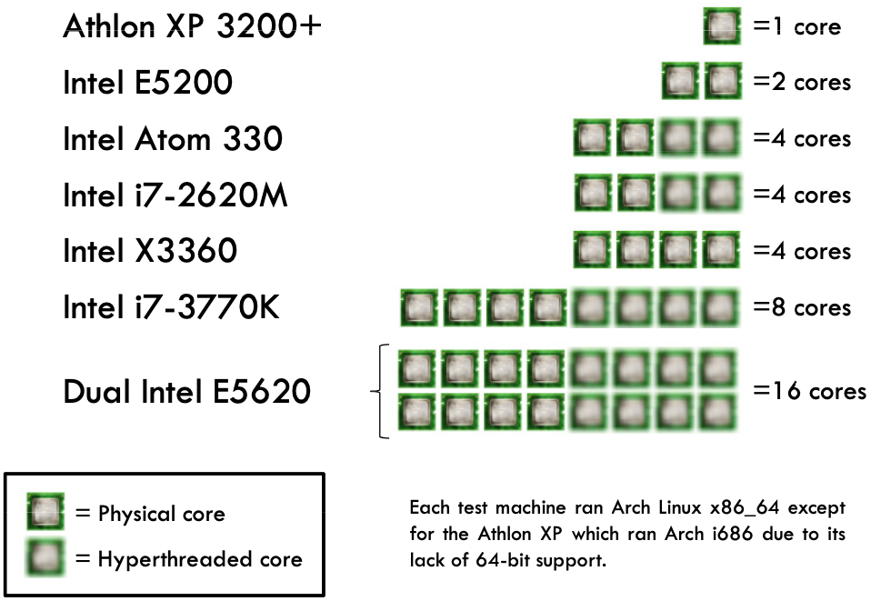

<!-- theme: gaia -->
<!-- _class: lead -->

# Lecture 8 Multiprocessor Scheduling

## Section 5 Linux/FreeBSD BFS Scheduling

-- From [Analysis of the BFS Scheduler in FreeBSD](http://vellvisher.github.io/papers_reports/doc/BFS_FreeBSD.pdf)

<br>
<br>

Xiang Yong Chen Yu Li Guoliang

Fall 2022

---

**Outline**

### 1. BFS scheduler
2. Performance comparison of BFS and CFS (2012)

---

#### The idea of BFS
Full name of BFS: Brain Fuck Scheduler, Brain Fuck Scheduler
- The BFS scheduling algorithm is a variant of the time slice round-robin algorithm.
- Use single ready queue (doubly linked list) in multiprocessor
   - Increased overhead for queue mutex access
   - Reduced load balancing algorithm overhead

---
#### BFS process priority

- Process has 103 priority
   - 100 static real-time priorities;
   - 3 normal priorities
       - SCHED_ISO (isochronous) : interactive tasks
       - SCHED_NORMAL : normal tasks
       - SCHED_IDLEPRIO : low priority tasks


---
#### BFS ready queue

- Ready queue
   - All CPUs share a **single ready queue** with a doubly linked list structure;
   - All processes are queued by priority;
   - Each process of the same priority has a time slice length and a virtual deadline;

---
<style scoped>
{
  font-size: 30px
}
</style>
#### BFS time slice
- Time slice size: specified by the algorithm parameters, which can be selected from 1ms to 1000ms, and the default setting is 6ms;
- Virtual Deadline (Virtual Deadline): The ranking of processes in the ready queue waiting for the CPU for the longest time is not the real deadline;
   - When the process **time slice is used up**, recalculate the virtual deadline;
   - When **event wait ends**, the virtual deadline remains unchanged to preempt ready processes of the same priority;
   - In order for the process to run on the **last running CPU** (affinity), different CPUs add a weight to the virtual deadline of the process;


---
<style scoped>
{
  font-size: 30px
}
</style>
#### Virtual Deadline Calculation for BFS
- Calculated based on current time, process priority and time slice settings;
```
offset = niffies + (prioratio ∗ rr_interval)
Priority increases by 10% for every nice level
```
- Niffies is the current time; prio_ratios[priority] is a constant array, and different priorities correspond to different prio_ratios[priority]; rr_interval is the timeslice, which is the time slice allocated by the CPU to each task and is a constant

- Virtual deadline calculation results: https://wikimili.com/en/Brain_Fuck_Scheduler


---
#### BFS Scheduling Ideas
Using the **bitmap** concept in the O(1) scheduler, all processes are arranged into 103 queues, and each process is not arranged according to priority but according to the priority interval. Each interval Have a queue.
<!-- https://www.cnblogs.com/dragonsuc/p/7144265.html -->


---
#### BFS Scheduling Ideas
According to the method of the O(1) scheduler, first search for the queue that is not 0 in the bitmap, and then perform an O(n) search in the queue, find the process with the smallest virtual deadline and put it into execution.


---

#### BFS ready queue insertion

- The time slice is used up: after resetting the virtual deadline, insert into the ready queue;
- Waiting for an event to occur: the virtual deadline remains the same, preempting a low-priority process or inserting into the ready queue;

---

**Outline**

1. BFS scheduler
### 2. Performance comparison of BFS and CFS (2012)

---
<style scoped>
{
  font-size: 30px
}
</style>
#### [Performance Comparison] of BFS and CFS (http://repo-ck.com/bench/cpu_schedulers_compared.pdf) (2012)
Test case set
- GCC **compilation** of Linux kernel v3.6.2.2
- lrzip **compression** of the Linux kernel v3.6.2 kernel source tree
- MPEG2 video from 720p to 360p ffmpeg **compression**



---
#### BFS vs. CFS Performance: Compression Test


---
#### BFS vs. CFS Performance: Test Compilation


---

#### Performance Comparison of BFS and CFS: Video Encoding Test


---

### References
- http://repo-ck.com/bench/cpu_schedulers_compared.pdf
- https://zhuanlan.zhihu.com/p/351876567
- https://blog.csdn.net/dog250/article/details/7459533
- https://www.cnblogs.com/dragonsuc/p/7144265.html