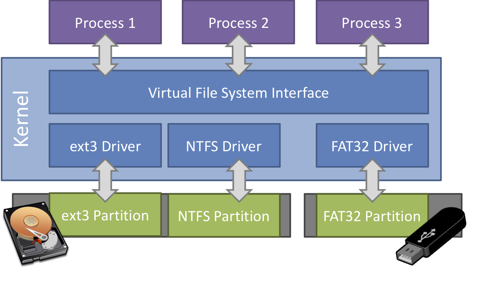
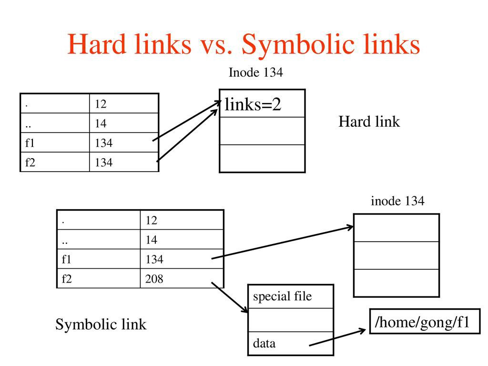
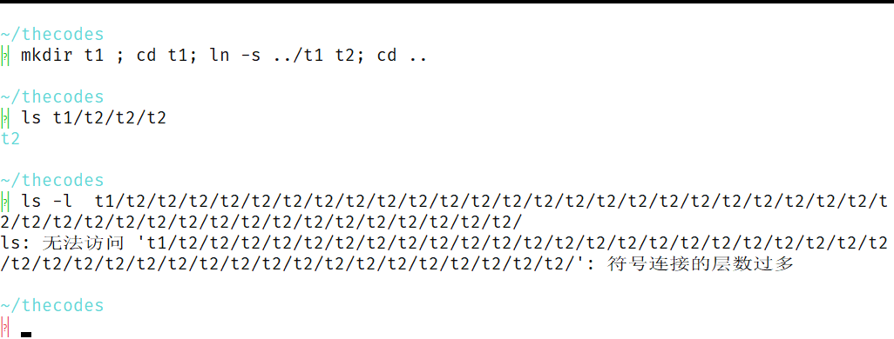
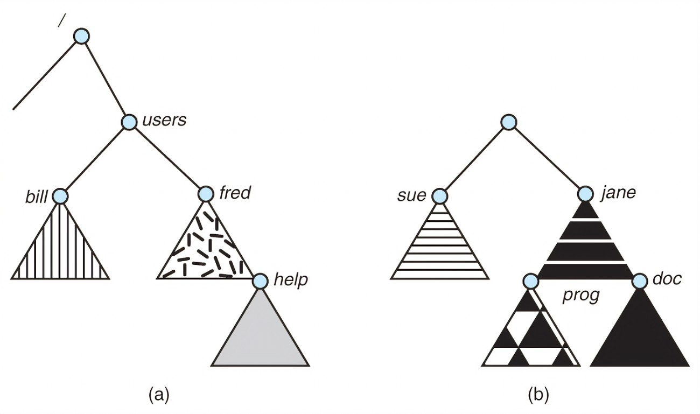

<!-- theme: gaia -->
<!-- _class: lead -->

# Lecture 9 File System

## Section 1 Files and Filesystems


<br>
<br>

Xiang Yong Chen Yu Li Guoliang

Fall 2022

---

**Outline**

### 1. Files
- The concept of files
- File operations
- file descriptor
2. File system and file organization

---

#### What is a file system?

* [File system](https://blog.csdn.net/wsmzyzdw/article/details/82908736) is a **method** and **data structure** for organizing files on storage devices.


---

#### What is a file system?

* [File system](https://blog.csdn.net/wsmzyzdw/article/details/82908736) is a **method** and **data structure** for organizing files on storage devices.
* [File system](https://chinese.freecodecamp.org/news/file-systems-architecture-explained/) is the **subsystem** in the operating system responsible for file naming, storage, and retrieval.



---
#### What is a file?
- A file is a **collection of data items** with a symbolic name consisting of a sequence of bytes
   - A file is the basic data unit of a file system
   - The filename is the identifier for the file

- File Header: **File Information** in filesystem metadata
   - File properties: name, type, location, creation time, ...
   - File storage location and order

---
#### Everything is a file
- A design philosophy of UNIX-like operating systems: **everything is a file**
   - Ordinary files, directory files
   - character device files (like keyboard, mouse...)
   - block device files (eg hard disk, CD-ROM...)
   - network files (socket...) etc.
- Everything is abstracted into a file, providing a **unified interface** for easy application calling

---
#### File View

- **User's file view**
   - Persistent data structures
   - System call interface: collection of **byte sequences** (UNIX)
- **OS file view** view
   - A collection of **DataBlocks**
   - A data block is a logical storage unit, while a sector is a physical storage unit

---

#### The internal structure of the data in the file

- Related to the application
   - Unstructured: text files
   - Simple structure: CSV, JSON and other formatted files
   - Complex structures: Word files, ELF executable files

---

**Outline**

1. Documentation
- The concept of files
### File Operations
- File descriptor
2. File system and file organization

---

#### Basic operation of files

- Process **read file**
   - Get the data block where the file is located
   - Return the corresponding part in the data block
- Process **WRITE FILE**
   - get data block
   - Modify the corresponding part of the data block
   - write back data block


---

#### The basic operation unit of the file

- The basic unit of operation in the file system is **data block**
   - For example, getc() and putc() need to cache 4096 bytes of target data even if they only access 1 byte of data each time

---
#### File access mode
- **Sequential access**: read byte by byte sequentially
   - Map one-dimensional data to a file
- **Random Access**: read and write from any location
   - Map a complex structure (matrix) into a file
- **Index access**: Index based on data characteristics
   - Database access is an index-based access

---

#### File Access Control

- File sharing is necessary in a multi-user operating system
- Access control
   - User access rights to files
   - read, write, execute, delete
- File Access Control List (ACL-Access Control List)
   - <file entity, permissions>

---

#### File Access Control

- UNIX mode
   - <user|group|everyone, read|write|executable>
   - User ID
   - Group ID


---

#### Shared access to files

How can multiple processes access shared files at the same time?
- The file is a shared resource
   - Requires exclusive access
   - Adopt similar synchronous mutual exclusion technique (follow-up)
     - read-write lock

---

#### Shared access to files

UNIX File System (UFS) Semantics
- Writes to an open file are immediately visible to other users who have the same file open
- Shared file pointers allow multiple users to read and write files simultaneously

---

**Outline**

1. Documentation
- The concept of files
- File operations
### file descriptor
2. File system and file organization

---

#### How do applications access files?
- Before the application can access the file data, it must first "open" the file, **obtain the file descriptor**
- Further read and write files through the file descriptor (File Descriptor, fd)**
```C
fd = open(name, flag);
read(fd, ...);
close(fd);
```

---
<style scoped>
{
  font-size: 30px
}
</style>
#### File descriptor

When an application program requests the kernel to open/create a new file, the kernel returns a file descriptor for **corresponding to the opened/new file**.
- Formally, a file descriptor is a **non-negative integer**
- In fact, the file descriptor is an **index value**, pointing to the record table of the open file of the process maintained by the kernel for each process


---

#### Open file table

- The kernel **tracks** all files opened by a process
   - The operating system maintains a table of open file descriptors for each process
   - A system-wide table of open files
   - The i-node table points to the specific file content


---

#### Open file table

- The kernel **maintains** open file status and information in the open file table
   - **File Pointer**
      - last read/write position
      - Each process maintains its own open file pointer


---
<style scoped>
{
  font-size: 32px
}
</style>
#### Open file table

- The kernel **maintains** open file status and information in the open file table
   - **File Open Count**
      - The number of times the file is currently opened
      - When the last process closes the file, remove it from the open file table


---
<style scoped>
{
  font-size: 32px
}
</style>
#### Open file table

- Open file status and information maintained by the operating system in the open file table
   - **Disk location of the file**
      - Cache data access information
   - **access permission**
     - File access pattern information for each process


---

**Outline**

1. Documentation
### 2. File system and file organization
- Features of the file system
- Table of contents

---
#### Filesystem type
- Disk file system: FAT, NTFS, ext2/3, ISO9660, etc.
- Network/distributed file systems: NFS, SMB, AFS, GFS
- Special file systems: procfs, sysfs

---

#### Virtual File System (VFS)


---

#### File system functions
- The file system is the subsystem **managing persistent data** in the operating system, providing data **file naming, storage and retrieval** functions.
   - Organize, retrieve, read and write access data
   - Most computer systems have a file system

---
#### Filesystem Features
- Allocate file disk space
   - Manage file blocks (position and order)
   - Manage free space (location)
   - Allocation algorithm (strategy)

---
#### Filesystem Features
- Manage file collections
   - Organization: Control structures and data structures that organize files
   - Naming: Give the file a name
   - Locating: Find files and their contents by name

---
#### Filesystem Features
- Data is reliable and secure
   - Security: multi-level protection of data security
   - Reliable
     - Save files persistently
     - Avoid system crashes, data loss, etc.
 
---
#### File system organization
**Hierarchical file system**
- Files are organized in directories
- Directories are a special class of files
- The content of the directory is the file index table <filename, pointer to the file>


 
---

**Outline**

1. Documentation
2. File system and file organization
- Features of the file system
###  Table of contents

---

#### Directory Operations

Applications operate on directories through system calls
- Search files Create files
- Delete file list directory
- Rename file Rename file


 
---
#### directory implementation
- A linear list of filenames, containing pointers to data blocks
   - Simple to program, time consuming to execute
- Hash Table – a linear table of hash data structures
   - Reduced directory search time
   - possible conflict - two filenames have the same hash

---
#### Traversing directory paths
Example: parse `./fs/inode.rs`
- Read the data in the current directory file `.`
- Find the `fs` item and read the data content of the directory file `fs`
- Find the `inode.rs` item and read the data content of the general file `inode.rs`


---
<style scoped>
{
  font-size: 30px
}
</style>
#### File Aliases
Multiple filenames associated with the same file
- **hard link**(hard link)
   - multiple file entries pointing to a single file
- **soft link**(soft link, symbolic link)
   - Point to other files by storing file names

Inode: the structure that manages file data




---
#### How to avoid loops not forming in directories?
   - Only links to files are allowed, links to subdirectories are not allowed
   - When adding links, use the cycle detection algorithm to determine whether it is reasonable
   - Limit the number of paths to traverse file directories

  

  ---
#### File system mount
   - The filesystem needs to be mounted before it can be accessed
  
 
  ---

### Summary

1. Documentation
- The concept of files
- File operations
- File descriptor
2. File system and file organization
- Features of the file system
- Table of contents