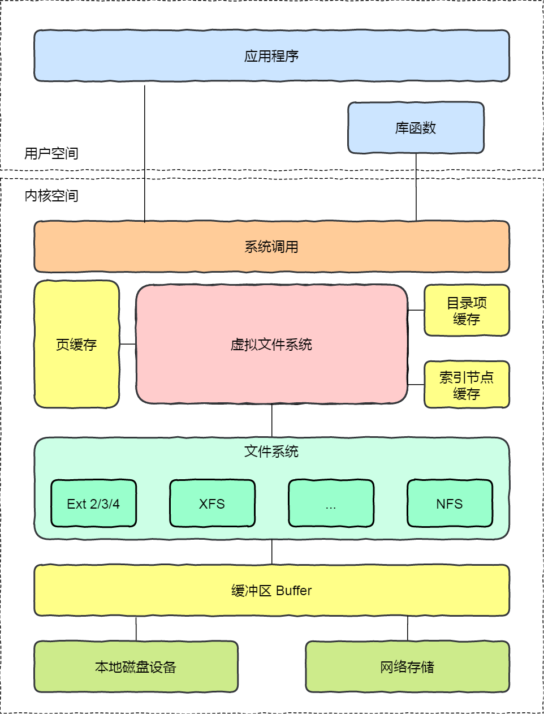
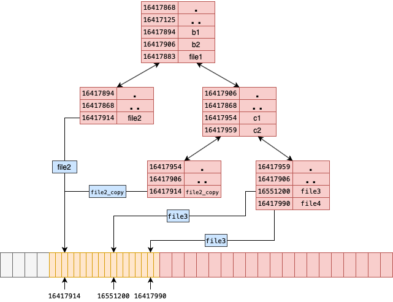
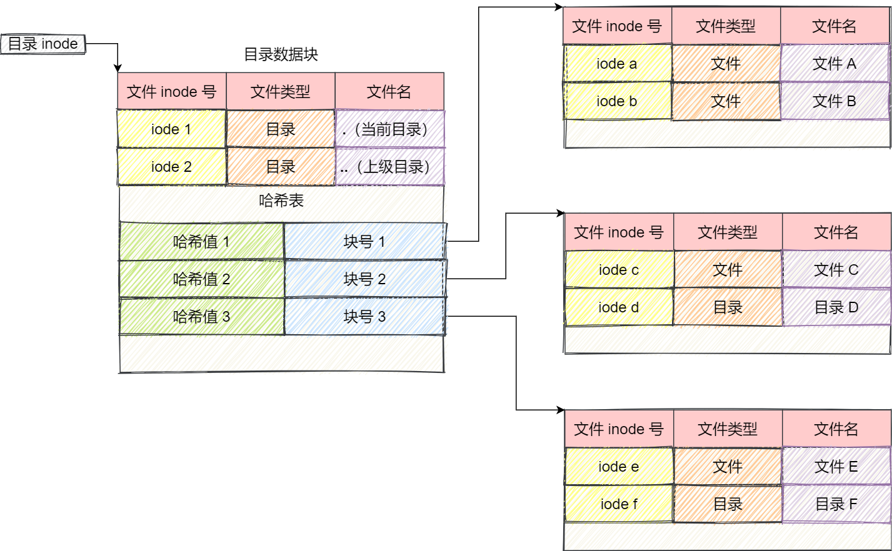
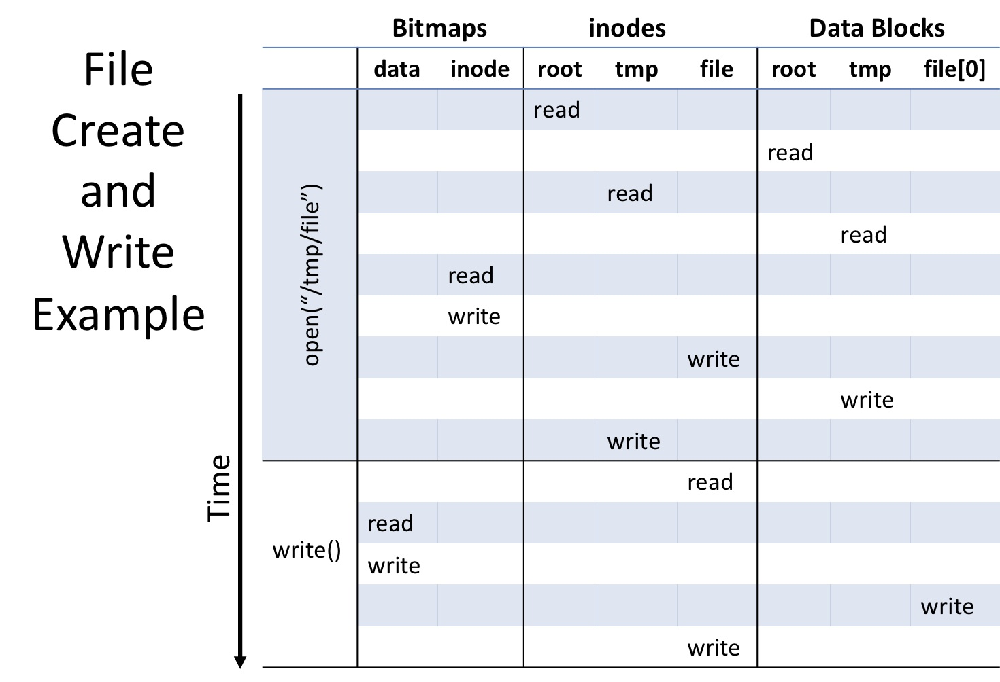
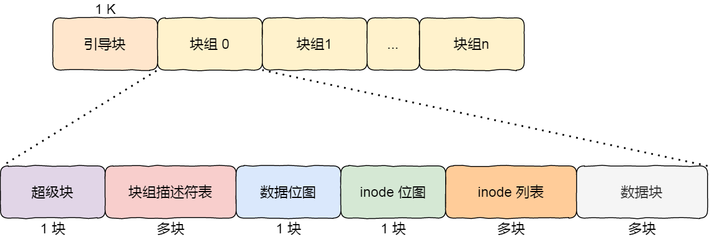

<!-- theme: gaia -->
<!-- _class: lead -->

# Lecture 9 File System

## Section 2 Design and Implementation of File System

 
 

Xiang Yong Chen Yu Li Guoliang

Fall 2022

---

**Outline**

### 1 Overview
2. The basic data structure of the file system
3. File caching
4. File distribution
5. Example of file access process

---
#### The location of the file system in the kernel

---

#### Hierarchical structure of the file system

---
#### The hierarchical structure of the file system in the computer system

---

#### User view and kernel view of the file system

---

#### Virtual file system

(Virtual File System, VFS)

- Defines a set of data structures and standard interfaces supported by all file systems.
- Disk file system: directly store data in the disk, such as Ext 2/3/4, XFS.
- In-memory filesystems: in-memory auxiliary data structures - such as directory entries.

---
#### Virtual file system function
- Purpose: Abstraction of all the different filesystems
- Features
   - Provides the same file and filesystem interface
   - Manages all file and file system associated data structures
   - Efficient query routines, traversing the file system
   - Interaction with specific filesystem modules

---
#### The virtual file system unifies the access interfaces of different file systems

---

**Outline**

1 Overview
### 2. The basic data structure of the file system
3. File caching
4. File distribution
5. Example of file access process

---

#### Storage view of the file system
- File volume control block (`superblock`)
- File control blocks ( `inode`/`vnode`)
- directory entry (`dir_entry`)
- Data block (`data block`)

---

#### Organizational view of the file system

---

#### The basic data structure of the file system

---

#### Volume control block (`superblock`)

One file volume control block per file system
- File system details
- Block size, number of free blocks, etc.
- Total number of blocks and inodes, unused and used
- Filesystem mount time, last write time, last check disk (fsck) time

---

#### File control block inode
Each file has a file control block inode (`inode`/`vnode`)
   - Size, data block location (pointing to one or more datablocks)
   - Access mode (read/write/excute)
   - Owner and group (owner/group)
   - Time information: time of establishment or state change, last read time/modified time
   - **Filename is in the datablock of the directory**
<!---->

---
#### Bitmap block
Bitmap block ( `bitmap inode/dnode`)
- Inode used or unused flag
- Dnode use or not use flag

---
#### Data block dnode( `data node`)
- Data blocks for directories and files
     - Put directory and file content
     - Determine the fixed size of the data block when formatting
     - Each block has a number to facilitate inode records
     - Inode is generally 128B
     - The data block is generally 4KB

---
#### Data blocks for directories

---

#### Directory Entry (`dir_entry`)
- Directory entries are generally cached in memory
   - one per directory entry (directory and file)
   - Encode directory entry data structure and tree layout into a tree data structure
   - points to file control blocks, parent directories, subdirectories, etc.

---

**Outline**

1 Overview
2. The basic data structure of the file system
### 3. File cache
4. File distribution
5. Example of file access process

---

#### Various disk cache locations

---

#### Data block cache
- Data blocks **on-demand read** into memory
   - Provide read() operation
   - Read ahead: read the following data blocks in advance
- Data blocks are **cached** after use
   - Assuming the data will be used again
   - Write operations may be cached and delayed
 
  Page cache: Unified cache of data blocks and memory pages

---
#### Virtual page storage -- page cache

In the virtual address space, virtual pages can be mapped to local external memory files
  

<!--
---
#### Design and implementation of the file system -- cache
Virtual page storage -- page cache
- Virtual pages in the virtual address space can be mapped to local external memory files
- Page cache for file data blocks
   - File data blocks are mapped into pages in virtual memory
   - File read/write operations are converted to memory accesses
   - May result in page faults and/or dirty pages
   - Problem: The page replacement algorithm needs to coordinate the number of pages between the virtual storage and the page cache
-->

---
#### Virtual page storage -- page cache

In the virtual address space, virtual pages can be mapped to local external memory files
- Page cache for file data blocks
   - File data blocks are mapped into pages in virtual memory
   - File read/write operations are converted to memory accesses
   - May result in page faults and/or dirty pages
- Problem: The page replacement algorithm needs to coordinate the number of pages between the virtual storage and the page cache

---
#### File descriptor
- Each opened file has a file descriptor
- As an index, it points to the corresponding file status information

---
#### Open file table
- One process open file table per process
- A system open file table

---
#### File Lock
Some file systems provide file locks for coordinating file access by multiple processes
- Mandatory – Deny access based on lock hold and access requirements
- Advisory - Processes can look up the state of the lock to decide what to do

---

**Outline**

1 Overview
2. The basic data structure of the file system
3. File caching
### 4. File allocation
5. Example of file access process

---

#### File size
- Most files are small
   - need to support small files
   - The data block space cannot be too large
- Some files are very large
   - Can support large files
   - Efficient reading and writing

---

#### File Allocation

Allocate file data blocks
- Allocation
    - continuous allocation
    - chain allocation
    - index assignment
- Evaluation indicators
   - Storage efficiency: external fragmentation, etc.
   - Read and write performance: access speed

---

#### Continuous Allocation
The file header specifies the starting block and length

- Assignment strategy: first match, best match, ...
- advantage: 
   - Efficient sequential and random read access
- Shortcoming
   - Frequent allocation will bring fragmentation; adding file content is expensive

---
#### Chain allocation
Data blocks are stored in a linked list

- Pros: easy to create, grow, shrink; almost no fragmentation
- Shortcoming:
    - Low random access efficiency; poor reliability;
    - Breaking a chain, the following data blocks are lost

---
#### Chain allocation

   - Explicit link
   - Implicit connection

---

#### Index Assignment

- The file header contains the index data block pointer
- The index in the index data block is a pointer to the file data block

- Advantage
   - Easy to create, grow, shrink; almost no fragmentation; supports direct access
- Shortcoming
   - When the file is small, the overhead of storing the index is relatively large

How to handle large files?

---
#### Index Assignment

- Chained index blocks (IB+IB+…)

- Multi-level index blocks (IB*IB *…)

---
#### Index Assignment

---
#### Multi-level index allocation

---

#### Multi-level index allocation

- The file header contains 13 pointers
   - 10 pointers to data blocks
   - The 11th pointer points to the index block
   - The 12th pointer points to the secondary index block
   - The 13th pointer points to the third-level index block

Large files require a lot of queries when accessing data blocks

---
#### Comparison of file allocation methods

---

#### Free space management
Tracking unallocated data blocks in a file volume: data structure?
- Bitmap: Use a bitmap to represent the list of free data blocks
   - 11111111001110101011101111...
   - $D_i = 0$ indicates that the data block $i$ is free, otherwise, it means allocated
   - 160GB disk --> 40M data block --> 5MB bitmap
   - assuming free space is evenly distributed across the disk,
       - scan n/r before finding "0"
         - n = total number of data blocks on disk; r = number of free blocks

---
#### Free space management
- linked list

- index

 

---

**Outline**

1 Overview
2. The basic data structure of the file system
3. File caching
4. File distribution
### 5. Example of file access process

---

#### File system organization example

---
#### File read operation process

---
#### File write operation process

---
#### File system partition
- Most disks are divided into one or more partitions, each with a separate file system.

---

### Summary

1 Overview
2. The basic data structure of the file system
3. File caching
4. File distribution
5. Example of file access process